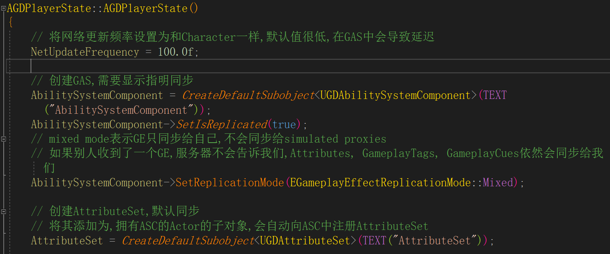
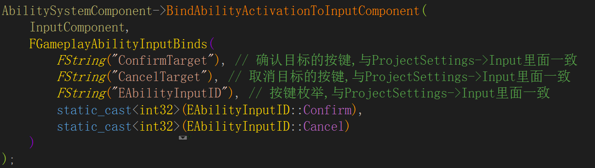
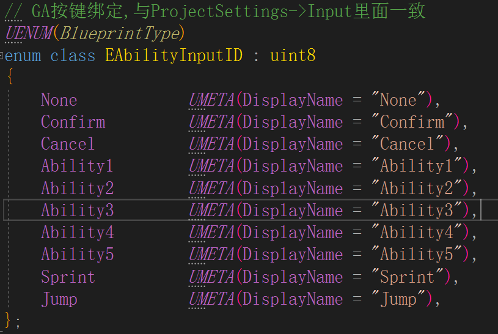

# GAS 02 ASC
## 初始化


```
AGDPlayerState::AGDPlayerState()
{
	// 将网络更新频率设置为和Character一样,默认值很低,在GAS中会导致延迟
	NetUpdateFrequency = 100.0f;

	// 创建GAS,需要显示指明同步
	AbilitySystemComponent = CreateDefaultSubobject<UGDAbilitySystemComponent>(TEXT("AbilitySystemComponent"));
	AbilitySystemComponent->SetIsReplicated(true);
	// mixed mode表示GE只同步给自己,不会同步给simulated proxies
	// 如果别人收到了一个GE,服务器不会告诉我们,Attributes, GameplayTags, GameplayCues依然会同步给我们
	AbilitySystemComponent->SetReplicationMode(EGameplayEffectReplicationMode::Mixed);

	// 创建AttributeSet,默认同步
	// 将其添加为,拥有ASC的Actor的子对象,会自动向ASC中注册AttributeSet
	AttributeSet = CreateDefaultSubobject<UGDAttributeSet>(TEXT("AttributeSet"));

	DeadTag = FGameplayTag::RequestGameplayTag(FName("State.Dead"));
}
```

```
// 设置OwnerActor,AvatarActor
// AGDPlayerCharacter
AbilitySystemComponent->InitAbilityActorInfo(PS, this);
```

## 按键绑定




```
AbilitySystemComponent->BindAbilityActivationToInputComponent(
        InputComponent,
        FGameplayAbilityInputBinds(
            FString("ConfirmTarget"), // 确认目标的按键,与ProjectSettings->Input里面一致
            FString("CancelTarget"), // 取消目标的按键,与ProjectSettings->Input里面一致
            FString("EAbilityInputID"), // 按键枚举,与ProjectSettings->Input里面一致
            static_cast<int32>(EAbilityInputID::Confirm),
            static_cast<int32>(EAbilityInputID::Cancel)
        )
    );
```

在赋予技能时`UAbilitySystemComponent::GiveAbility(const FGameplayAbilitySpec& Spec)`  
参数`FGameplayAbilitySpec`的构造函数中指明了一个技能的InputID


```
// GA按键绑定,与ProjectSettings->Input里面一致
UENUM(BlueprintType)
enum class EAbilityInputID : uint8
{
	None			UMETA(DisplayName = "None"),
	Confirm			UMETA(DisplayName = "Confirm"),
	Cancel			UMETA(DisplayName = "Cancel"),
	Ability1		UMETA(DisplayName = "Ability1"),
	Ability2		UMETA(DisplayName = "Ability2"),
	Ability3		UMETA(DisplayName = "Ability3"),
	Ability4		UMETA(DisplayName = "Ability4"),
	Ability5		UMETA(DisplayName = "Ability5"),
	Sprint			UMETA(DisplayName = "Sprint"),
	Jump			UMETA(DisplayName = "Jump"),
};
```
