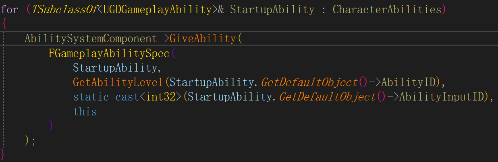
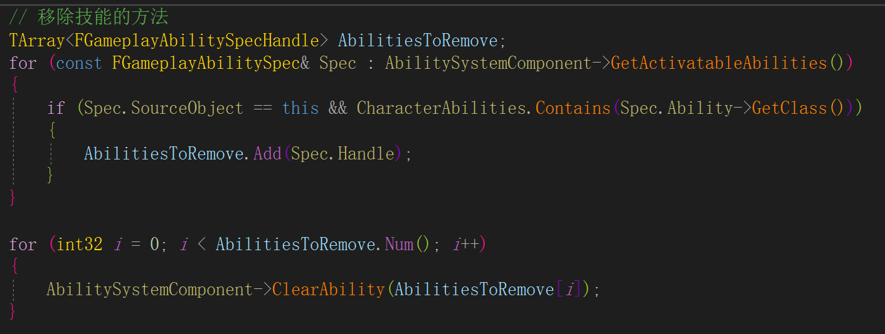

# GAS 03 GA 01
## 赋予技能


```
for (TSubclassOf<UGDGameplayAbility>& StartupAbility : CharacterAbilities)
{
    AbilitySystemComponent->GiveAbility(
        FGameplayAbilitySpec(
            StartupAbility,
            GetAbilityLevel(StartupAbility.GetDefaultObject()->AbilityID),
            static_cast<int32>(StartupAbility.GetDefaultObject()->AbilityInputID),
            this
        )
    );
}
```

## 移除技能


```
TArray<FGameplayAbilitySpecHandle> AbilitiesToRemove;
for (const FGameplayAbilitySpec& Spec : AbilitySystemComponent->GetActivatableAbilities())
{
    if (Spec.SourceObject == this && CharacterAbilities.Contains(Spec.Ability->GetClass()))
    {
        AbilitiesToRemove.Add(Spec.Handle);
    }
}

for (int32 i = 0; i < AbilitiesToRemove.Num(); i++)
{
    AbilitySystemComponent->ClearAbility(AbilitiesToRemove[i]);
}
```

### 延迟生成Actor的方法
```
// 生成指定类并返回指针,不会执行BP构造函数
// 给调用者机会,来提前设置参数
// 调用者负责手动调用构造函数,通过调用 UGameplayStatics::FinishSpawningActor
// (see AActor::OnConstruction)
AGDProjectile* Proj = GetWorld()->SpawnActorDeferred<AGDProjectile>(...);
Proj->DamageEffectSpecHandle = GEHandle_Damage;
Proj->Range = Range;
Proj->FinishSpawning(MuzzleTrans);
```