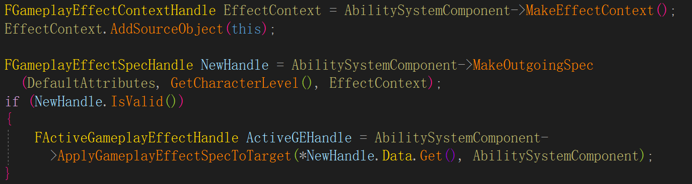

# GAS 04 GE
## C++应用GE


```
FGameplayEffectContextHandle EffectContext = AbilitySystemComponent->MakeEffectContext();
EffectContext.AddSourceObject(this);

FGameplayEffectSpecHandle NewHandle = AbilitySystemComponent->MakeOutgoingSpec(DefaultAttributes, GetCharacterLevel(), EffectContext);
if (NewHandle.IsValid())
{
    FActiveGameplayEffectHandle ActiveGEHandle = AbilitySystemComponent->ApplyGameplayEffectSpecToTarget(*NewHandle.Data.Get(), AbilitySystemComponent);
}
```

## 蓝图中应用GE
> `UGameplayAbility::BP_ApplyGameplayEffectToOwner`  

## 蓝图中移除GE
> `void UGameplayAbility::BP_RemoveGameplayEffectFromOwnerWithHandle`  
