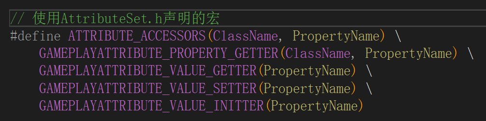
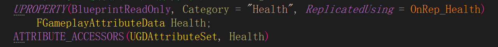

# GAS 06 Attribute 01
## 创建AttributeSet
```
AGDPlayerState::AGDPlayerState()
{
	NetUpdateFrequency = 100.0f;

	AbilitySystemComponent = CreateDefaultSubobject<UGDAbilitySystemComponent>(TEXT("AbilitySystemComponent"));
	AbilitySystemComponent->SetIsReplicated(true);
	AbilitySystemComponent->SetReplicationMode(EGameplayEffectReplicationMode::Mixed);

	// 创建AttributeSet,默认同步
	// 将其添加为,拥有ASC的Actor的子对象,会自动向ASC中注册AttributeSet
	AttributeSet = CreateDefaultSubobject<UGDAttributeSet>(TEXT("AttributeSet"));
}
```

## 声明宏


```
// 使用AttributeSet.h声明的宏
#define ATTRIBUTE_ACCESSORS(ClassName, PropertyName) \
	GAMEPLAYATTRIBUTE_PROPERTY_GETTER(ClassName, PropertyName) \
	GAMEPLAYATTRIBUTE_VALUE_GETTER(PropertyName) \
	GAMEPLAYATTRIBUTE_VALUE_SETTER(PropertyName) \
	GAMEPLAYATTRIBUTE_VALUE_INITTER(PropertyName)
```

## 声明Attribute


```
UPROPERTY(BlueprintReadOnly, Category = "Health", ReplicatedUsing = OnRep_Health)
    FGameplayAttributeData Health;
ATTRIBUTE_ACCESSORS(UGDAttributeSet, Health)

UFUNCTION()
	virtual void OnRep_Health(const FGameplayAttributeData& OldHealth);
```

## 同步Attribute
```
virtual void GetLifetimeReplicatedProps(TArray<FLifetimeProperty>& OutLifetimeProps) const override;

void UGDAttributeSet::GetLifetimeReplicatedProps(TArray<FLifetimeProperty>& OutLifetimeProps) const
{
	Super::GetLifetimeReplicatedProps(OutLifetimeProps);

	DOREPLIFETIME_CONDITION_NOTIFY(UGDAttributeSet, Health, COND_None, REPNOTIFY_Always);
}

void UGDAttributeSet::OnRep_Health(const FGameplayAttributeData& OldHealth)
{
	GAMEPLAYATTRIBUTE_REPNOTIFY(UGDAttributeSet, Health, OldHealth);
}
```

