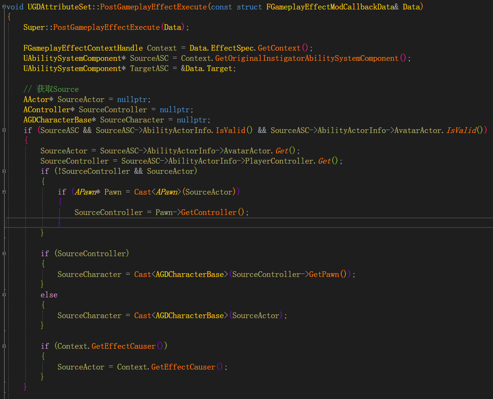
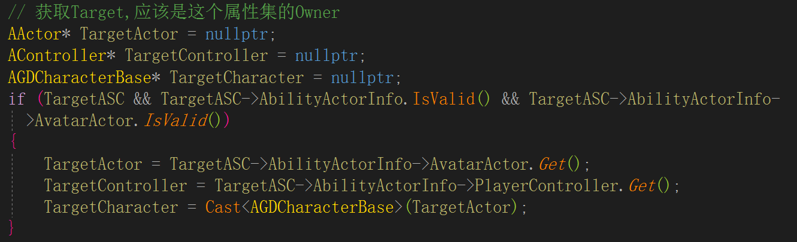

# GAS 06 Attribute 01
## 属性改变堆栈
```
FActiveGameplayEffectsContainer::InternalExecuteMod()
{
	...
	// 在这里可以return false来取消修改
	if (AttributeSet->PreGameplayEffectExecute(ExecuteData))
	{
		// 这里修改了属性值
		ApplyModToAttribute(...);

		AttributeSet->PostGameplayEffectExecute(ExecuteData);
	}
}
```

## PostGameplayEffectExecute处理属性改变




```
void UGDAttributeSet::PostGameplayEffectExecute(const struct FGameplayEffectModCallbackData& Data)
{
	Super::PostGameplayEffectExecute(Data);

	FGameplayEffectContextHandle Context = Data.EffectSpec.GetContext();
	UAbilitySystemComponent* SourceASC = Context.GetOriginalInstigatorAbilitySystemComponent();
	UAbilitySystemComponent* TargetASC = &Data.Target;

	// 获取Source
	AActor* SourceActor = nullptr;
	AController* SourceController = nullptr;
	AGDCharacterBase* SourceCharacter = nullptr;
	if (SourceASC && SourceASC->AbilityActorInfo.IsValid() && SourceASC->AbilityActorInfo->AvatarActor.IsValid())
	{
		SourceActor = SourceASC->AbilityActorInfo->AvatarActor.Get();
		SourceController = SourceASC->AbilityActorInfo->PlayerController.Get();
		if (!SourceController && SourceActor)
		{
			if (APawn* Pawn = Cast<APawn>(SourceActor))
			{
				SourceController = Pawn->GetController();
			}
		}

		if (SourceController)
		{
			SourceCharacter = Cast<AGDCharacterBase>(SourceController->GetPawn());
		}
		else
		{
			SourceCharacter = Cast<AGDCharacterBase>(SourceActor);
		}

		if (Context.GetEffectCauser())
		{
			SourceActor = Context.GetEffectCauser();
		}
	}

	// 获取Target,应该是这个属性集的Owner
	AActor* TargetActor = nullptr;
	AController* TargetController = nullptr;
	AGDCharacterBase* TargetCharacter = nullptr;
	if (TargetASC && TargetASC->AbilityActorInfo.IsValid() && TargetASC->AbilityActorInfo->AvatarActor.IsValid())
	{
		TargetActor = TargetASC->AbilityActorInfo->AvatarActor.Get();
		TargetController = TargetASC->AbilityActorInfo->PlayerController.Get();
		TargetCharacter = Cast<AGDCharacterBase>(TargetActor);
	}

    ...
    else if (Data.EvaluatedData.Attribute == GetHealthAttribute())
	{
		float TempHealth = FMath::Clamp(GetHealth(), 0.0f, GetMaxHealth());
		SetHealth(TempHealth);
	}
}
```