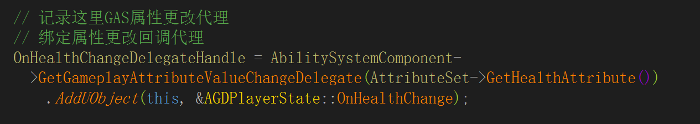
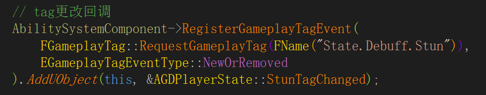

# GAS 07 代理
## 监听Attribute


```
FDelegateHandle OnHealthChangeDelegateHandle;

// 属性更改回调
virtual void OnHealthChange(const FOnAttributeChangeData& Data);

OnHealthChangeDelegateHandle = AbilitySystemComponent->GetGameplayAttributeValueChangeDelegate(AttributeSet->GetHealthAttribute())
			.AddUObject(this, &AGDPlayerState::OnHealthChange);
```

## 监听Tag


```
// tag更改回调
AbilitySystemComponent->RegisterGameplayTagEvent(
        FGameplayTag::RequestGameplayTag(FName("State.Debuff.Stun")),
        EGameplayTagEventType::NewOrRemoved
    ).AddUObject(this, &AGDPlayerState::StunTagChanged);

// tag更改回调
virtual void StunTagChanged(const FGameplayTag CallbackTag, int32 NewCount);
```

## 监听Event
```
// 绑定事件回调
EventHandle = GDAbilitySystemComponent->AddGameplayEventTagContainerDelegate(
    EventTags,
    FGameplayEventTagMulticastDelegate::FDelegate::CreateUObject(
        this,
        &UGDAT_PlayMontageAndWaitForEvent::OnGameplayEvent
    )
);

void OnGameplayEvent(FGameplayTag EventTag, const FGameplayEventData* Payload);
```

## 监听 Cancel Ability
```
// 取消回调
CancelledHandle = Ability->OnGameplayAbilityCancelled.AddUObject(
    this, &UGDAT_PlayMontageAndWaitForEvent::OnAbilityCancelled
);

void OnAbilityCancelled();
```

## 监听蒙太奇 Blend Out
```
// 蒙太奇混出回调
BlendingOutDelegate.BindUObject(
    this, &UGDAT_PlayMontageAndWaitForEvent::OnMontageBlendingOut);
AnimInstance->Montage_SetBlendingOutDelegate(BlendingOutDelegate, MontageToPlay);

void OnMontageBlendingOut(UAnimMontage* Montage, bool bInterrupted);
```

## 监听蒙太奇结束
```
// 蒙太奇结束回调
MontageEndedDelegate.BindUObject(
    this, &UGDAT_PlayMontageAndWaitForEvent::OnMontageEnded
);
AnimInstance->Montage_SetEndDelegate(MontageEndedDelegate, MontageToPlay);

void OnMontageEnded(UAnimMontage* Montage, bool bInterrupted);
```