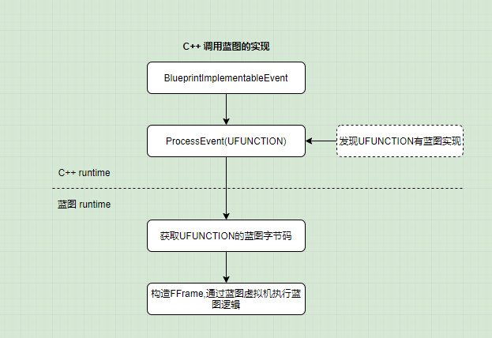
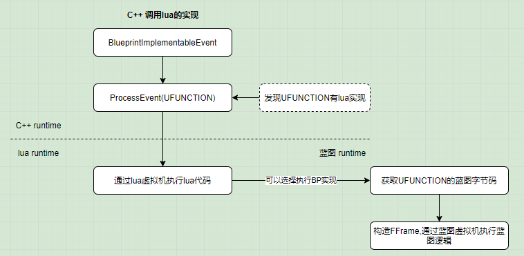

# slua_unreal 01 LuaActor
原文链接 https://zhuanlan.zhihu.com/p/83605037

## UE4原生反射系统 BlueprintImplementableEvent
BlueprintNativeEvent, BlueprintImplementableEvent 调用流程相同  
调用流程:  

0. 自己声明 NativeFunc  
自己实现 NativeFunc_Implementation  
UHT声明 execNativeFunc, NativeFunc_Implementation  
UHT实现 NativeFunc, execNativeFunc  
1. 调用自定义函数 NativeFunc  
2. `FindFunctionChecked` 根据函数名找到 execNativeFunc  
3. `ProcessEvent`(execNativeFunc)  
4. execNativeFunc 调用 NativeFunc_Implementation  

+ .h, .cpp  
```
UFUNCTION(BlueprintNativeEvent, Category = "Hello")
    void NativeFunc();

void UMyClass::NativeFunc_Implementation(){...}
```

+ .generated.h  
```
static void execNativeFunc();

virtual void NativeFunc_Implementation();
```

+ .gen.cpp  
```
void UMyClass::NativeFunc()
{
    // 根据函数名找到exec函数
    // 注册函数部分代码: { "NativeFunc", &UMyClass::execNativeFunc }
    ProcessEvent(FindFunctionChecked(FName(TEXT("NativeFunc")),NULL);
}

void UMyClass::execNativeFunc()
{
    NativeFunc_Implementation();
}
```

C++调用蓝图的实现  


C++调用lua的实现  


## LuaActor

+ LUABASE_BODY 宏  

通过重写`ProcessEvent`,将BP函数转换为lua函数  
```
#define LUABASE_BODY(NAME)

virtual void BeginPlay() override 
{
    if (!init(this, #NAME, LuaStateName, LuaFilePath)) 
        return;
    Super::BeginPlay();
}

virtual void ProcessEvent(UFunction* func, void* params) override 
{
    if (luaImplemented(func, params))
        return;
    Super::ProcessEvent(func, params);
}
```

+ ALuaActor  
```
class ALuaActor: public AActor, public LuaBase
{
    LUABASE_BODY(LuaActor)

    // 在BP中设置lua文件的路径
    UPROPERTY(BlueprintReadOnly, EditAnywhere, Category = "slua") 
	FString LuaFilePath;

    // C++调用lua函数
    UFUNCTION(BlueprintCallable, Category = "slua")
	FLuaBPVar CallLuaMember(FString FunctionName, const TArray<FLuaBPVar>& Args) {
		return callMember(FunctionName, Args);
	}
}
```

## LuaActor C++对象与lua表绑定
每个LuaActor实例在lua中都有一张对应的表,这张lua表里面实现前面所说的lua函数  
在C++中,在LuaActor创建时,会在lua中同步创建这张表  

在BP中设置`ALuaActor::LuaFilePath`,即可将LuaActor与表关联起来  
LuaActor的BeginPlay中调用了init,主要做下面几件事  

1. LuaActor得到指定lua文件中的表  
`LuaState::doFile`可以加载指定路径的lua文件,并执行里面的lua代码  
得到表后将表存于`LuaVar LuaBase::luaSelfTable;`  
LuaActor通过luaSelfTable获取lua中对应的表  

2. 将LuaActor指针传递给lua表  
lua中不会直接使用LuaActor的指针,lua表上有一个键,名为"__cppinst",类型为userdata  
在C++中定义如下  
```
template<class T>
struct UserData : public UDBase 
{
    // ud是一个指针,指向真正的LuaActor对象
    T ud; 
};
```
lua表通过"__cppinst"获取真正的LuaActor对象  

3. 设置lua表的Super方法  
通过这个步骤,lua表只要在函数中调用`self.Super`,就会调用覆写的蓝图方法  

4. 设置lua表的元表  
创建一张元表,配置__index等方法,当lua表获取actor上的属性时,就会通过__cppinst获取  
```
int LuaBase::__index(NS_SLUA::lua_State * L)
{
    lua_pushstring(L, "__cppinst");
    lua_rawget(L, 1);
    void* ud = lua_touserdata(L, -1);
    UObject* obj = (UObject*)ud;
    LuaObject::push(L, obj, true);

    // push key
    lua_pushvalue(L, 2);
    // get field from real actor
    lua_gettable(L, -2);
}
```

+ init  
```
// ptrT: this指针
template<typename T>
bool init(T* ptrT, const char* typeName, const FString& stateName, const FString& luaPath)
{
    auto ls = LuaState::get(getGameInstance(ptrT));

    luaSelfTable = ls->doFile(TCHAR_TO_UTF8(*luaPath));

    lua_pushlightuserdata(L, ptrT);
	lua_setfield(L, -2, "__cppinst");

    LuaObject::pushType(L, new LuaSuper(this), "LuaSuper", supermt, genericGC<LuaSuper>);
	lua_setfield(L, -2, "Super");

    lua_pushcfunction(L, __index);
	lua_setfield(L, -2, "__index");
}
```