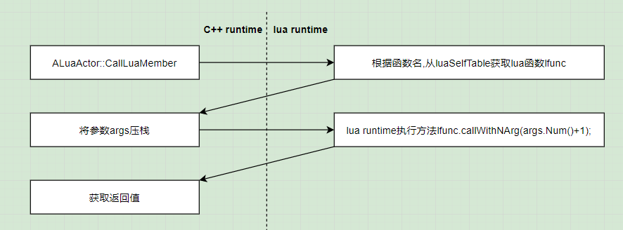
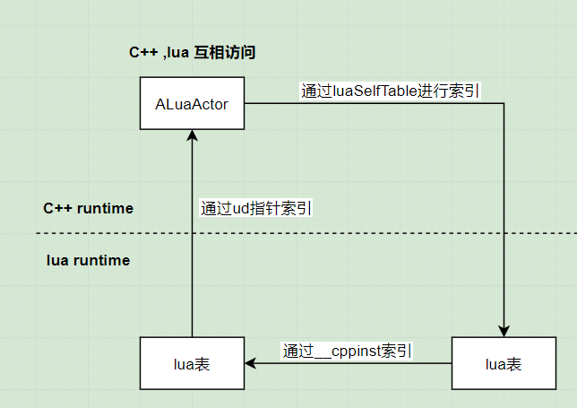

# slua_unreal 02 LuaActor与lua表互访
## LuaActor访问lua表
+ `ALuaActor::CallLuaMember`  
支持在C++和BP中调用lua定义的方法,需要传入函数名和参数列表  

```
UFUNCTION(BlueprintCallable, Category = "slua")
FLuaBPVar CallLuaMember(FString FunctionName, const TArray<FLuaBPVar>& Args) {
    return callMember(FunctionName, Args);
}
```

C++根据函数名调用lua函数  


## lua表访问LuaActor
C++和lua用栈进行数据传递,将一个UObject指针传给lua时,slua会做一些中间处理  
真正压入栈的是UserData结构,lua可以使用UserData来索引LuaActor  

LuaActor初始化,把自己指针压栈时,会执行  
猜测是init中的函数指针调用到这里  
```
int LuaObject::push(lua_State* L, UObject* obj, bool rawpush, bool ref) {
    return pushGCObject<UObject*>(L, obj, "UObject", setupInstanceMT, gcObject, ref);
}
```

pushGCObject创建UserData并传递给lua,obj是该UObject的指针  
setupInstanceMT设置元表方法的指针  

setupInstanceMT真正实现了lua到UObject属性/方法的访问  
```
int LuaObject::setupInstanceMT(lua_State* L) {
    lua_pushcfunction(L,instanceIndex);
    lua_setfield(L, -2, "__index");
    lua_pushcfunction(L,newinstanceIndex);
    lua_setfield(L, -2, "__newindex");
    lua_pushcfunction(L, objectToString);
    lua_setfield(L, -2, "__tostring");
    return 0;
}
```
__index实现值获取功能,__newIndex实现赋值功能  

+ instanceIndex  

在lua中写类似"self.name"时就会用到此方法,会把self和name都压栈  
然后instanceIndex方法就会根据这两个参数来获取name值  

大致流程:  
从UserData的ud属性获取UObject  
尝试从slua的缓存中获取属性,如果获取到就直接返回  
尝试从slua的缓存中获取函数,如果获取到就直接返回  
尝试获取BP中的属性/函数并返回  

+ newinstanceIndex  

用于修改LuaActor的属性值,如"self.name = akuya"  

C++lua互相访问  

