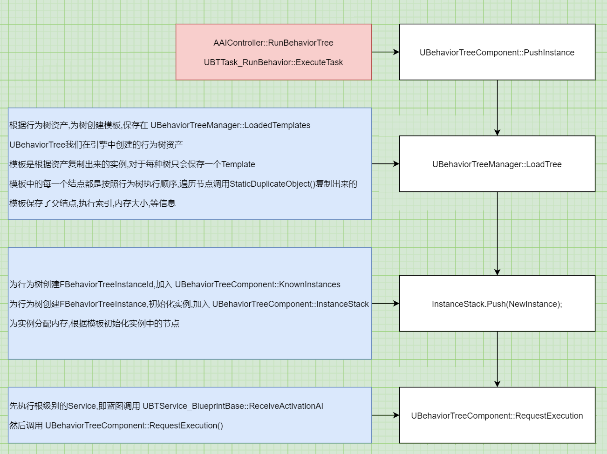

# AI 02 运行行为树-加载树
## 目录
[TOC]

## 参考
@左未 [【图解UE4源码】AI行为树系统 其一 行为树节点的单例设计](https://zhuanlan.zhihu.com/p/369100301)  
@左未 [【图解UE4源码】AI行为树系统 其二 一棵行为树是怎么被运行起来的](https://zhuanlan.zhihu.com/p/370452770)  

## 运行行为树
两种方式运行行为树:
1. `AAIController::RunBehaviorTree` 直接运行行为树的蓝图节点  
2. `UBTTask_RunBehavior::ExecuteTask` 行为树资源内运行一颗子树的Task节点  

两种方式都会调用`UBehaviorTreeComponent::PushInstance`,先加载树  
加载完成后`UBehaviorTreeComponent::RequestExecution`请求运行行为树  


<center>图片-加载行为树</center>

### 行为树开始代理
```
bool UBehaviorTreeComponent::PushInstance(UBehaviorTree& TreeAsset)
{
    FBehaviorTreeDelegates::OnTreeStarted.Broadcast(*this, TreeAsset);
}
```

## 行为树节点的内存
1. 每种行为树资源只有一个模板,存于 UBehaviorTreeManager::LoadedTemplates  
    每个节点只有一个实例,存于模板中,自定义节点多棵树共享一个实例(会导致数据错乱)
    蓝图 bCreateNodeInstance = true,不存在此问题

2. 行为树的实例大小为所有结点UBTNode::GetInstanceMemorySize的和

3. 运行一颗行为树时,会先创建一个模板(即为每个节点创建一个实例),存于 UBehaviorTreeManager::LoadedTemplates
    然后为树创建运行实例(并不是创建节点,而是分配内存),分配2块等大内存,分别存于 UBehaviorTreeComponent::KnownInstances(用于备份数据), UBehaviorTreeComponent::InstanceStack

4. 对于自定义节点,应重写UBTNode::GetInstanceMemorySize,返回sizeof(自定义结构体)
    配合UBTNode::InitializeMemory(), T* CastInstanceNodeMemory()初始化/读取自定义节点的数据

5. uint8* UBehaviorTreeComponent::GetNodeMemory(UBTNode* Node, int32 InstanceIdx)
    Node是UBehaviorTreeManager::LoadedTemplates里面的指针,返回的是UBehaviorTreeComponent::KnownInstances里面的指针

## 压入行为树实例
`bool UBehaviorTreeComponent::PushInstance(UBehaviorTree& TreeAsset)`

函数功能:
1. 根据行为树资源创建行为树模板

2. 为行为树创建FBehaviorTreeInstanceId,加入KnownInstances

3. 为行为树创建FBehaviorTreeInstance,初始化实例,加入InstanceStack

4. 开始根级别的Service  
    对于蓝图,执行UBTService_BlueprintBase::ReceiveActivationAI

5. 请求运行行为树 UBehaviorTreeComponent::RequestExecution()

```
bool UBehaviorTreeComponent::PushInstance(UBehaviorTree& TreeAsset)
{
    UBTCompositeNode* RootNode = NULL;
	uint16 InstanceMemorySize = 0;

	const bool bLoaded = BTManager->LoadTree(TreeAsset, RootNode, InstanceMemorySize);
    if (bLoaded)
	{
        FBehaviorTreeInstance NewInstance;
        NewInstance.InstanceIdIndex = UpdateInstanceId(&TreeAsset, ActiveNode, InstanceStack.Num() - 1);

        // 分配内存 FBehaviorTreeInstanceId
        FBehaviorTreeInstanceId& InstanceInfo = KnownInstances[NewInstance.InstanceIdIndex];
        const bool bFirstTime = (InstanceInfo.InstanceMemory.Num() != InstanceMemorySize);
		if (bFirstTime)
		{
			InstanceInfo.InstanceMemory.AddZeroed(InstanceMemorySize);
		}

        // 分配内存 FBehaviorTreeInstance
        NewInstance.SetInstanceMemory(InstanceInfo.InstanceMemory);
        NewInstance.Initialize(*this, *RootNode, NodeInstanceIndex, bFirstTime ? EBTMemoryInit::Initialize : EBTMemoryInit::RestoreSubtree);

        InstanceStack.Push(NewInstance);

        RequestExecution(RootNode, ActiveInstanceIdx, RootNode, 0, EBTNodeResult::InProgress);
    }
}
```

## 根据行为树资源创建行为树模板
```
bool UBehaviorTreeComponent::PushInstance(UBehaviorTree& TreeAsset)
{
	UBTCompositeNode* RootNode = NULL;
	uint16 InstanceMemorySize = 0;

	const bool bLoaded = BTManager->LoadTree(TreeAsset, RootNode, InstanceMemorySize);
}

bool UBehaviorTreeManager::LoadTree(UBehaviorTree& Asset, UBTCompositeNode*& Root, uint16& InstanceMemorySize)
```

行为树的Template保存在 UBehaviorTreeManager::LoadedTemplates  
模板是根据行为树资源复制出来的实例,而不是树资源本身,对于每种树只会保存一个Template  

函数功能:
1. 如果存在模板,直接返回  

2. (按照行为树执行顺序)遍历树资源,复制每一个节点,创建初始化结构体,加入初始化列表中  
    复制出的节点引用的Service,Decorator,ChildComposite,ChildTask,也是新复制出的节点  
    初始化结构体定义了节点的父结点,执行索引,内存大小,树的深度

3. 遍历初始化列表中的节点,初始化每一个节点(父结点,执行索引,相对于Template内存偏移)

4. 累加所有节点的内存为模板的内存大小,将模板加入LoadedTemplates

### (按照行为树执行顺序)遍历树资源,复制每一个节点,创建初始化结构体,加入初始化列表中
```
bool UBehaviorTreeManager::LoadTree(UBehaviorTree& Asset, UBTCompositeNode*& Root, uint16& InstanceMemorySize)
{
    TArray<FNodeInitializationData> InitList;
    uint16 ExecutionIndex = 0;
    InitializeNodeHelper(NULL, TemplateInfo.Template, 0, ExecutionIndex, InitList, Asset, this);
}

static void InitializeNodeHelper(
    UBTCompositeNode* ParentNode, // 对于新树,为null
    UBTNode* NodeOb, // Root节点(已经是复制出来的节点)
	uint8 TreeDepth, // 0
    uint16& ExecutionIndex, // 0
    TArray<FNodeInitializationData>& InitList, // 输出的初始化列表
	UBehaviorTree& TreeAsset,
    UObject* NodeOuter)
{}
```

函数功能:
1. 按照行为树执行顺序遍历每一个结点

2. 对每一个结点进行如下操作:
    (1)StaticDuplicateObject()复制这个节点

    (2)为复制的节点创建初始化结构体FNodeInitializationData,然后加入初始化列表InitList  
    节点初始化结构体中,定义了节点的父结点,执行索引,内存大小,树的深度  
    内存大小调用UBTNode::GetInstanceMemorySize()获得,对于自定义节点,需要重写这个函数,返回自己定义的结构体的大小  
    这个是由行为树节点单例设计理念决定的
    
    (3)每遍历一个节点,执行索引+1  
    遍历的过程中设置了:辅助节点设置了在父结点中的索引  
    复合节点设置了子分支中最后一个节点的执行索引  

3. 节点遍历顺序,即实际执行顺序  
```
先加入Root节点(根节点是UBTCompositeNode)  
    遍历Services  
    遍历子节点,可能是复合节点或Task,他们都有Decorators  
        遍历Decorators,装饰器的父结点是上一层的复合节点  
        if 子节点是UBTTask_RunBehavior(运行子树)  
            遍历子树的RootDecorators,将它合并到Decorators中,并标记为bIsInjected  
        if 子节点是Task,遍历它的Services,父结点同样是上一层的复合节点(Service不能在Task里遍历)  
        对子节点递归调用InitializeNodeHelper
```

### 遍历初始化列表中的节点,初始化每一个节点(父结点,执行索引,相对于Template内存偏移)
```
uint16 MemoryOffset = 0;
for (int32 Index = 0; Index < InitList.Num(); Index++)
{
    InitList[Index].Node->InitializeNode(
        InitList[Index].ParentNode, 
        InitList[Index].ExecutionIndex, 
        InitList[Index].SpecialDataSize + MemoryOffset, 
        InitList[Index].TreeDepth);
    MemoryOffset += InitList[Index].DataSize;
}

void UBTNode::InitializeNode(UBTCompositeNode* InParentNode, uint16 InExecutionIndex, uint16 InMemoryOffset, uint8 InTreeDepth)
```

## 为行为树创建FBehaviorTreeInstanceId,加入KnownInstances
```
uint8 UBehaviorTreeComponent::UpdateInstanceId(UBehaviorTree* TreeAsset, const UBTNode* OriginNode, int32 OriginInstanceIdx)
{
    FBehaviorTreeInstanceId InstanceId;
	InstanceId.TreeAsset = TreeAsset;

    const int32 NewIndex = KnownInstances.Add(InstanceId);
    return NewIndex;
}
```

## 为行为树创建FBehaviorTreeInstance,初始化实例,加入InstanceStack
```
NewInstance.Initialize(*this, *RootNode, NodeInstanceIndex, bFirstTime ? EBTMemoryInit::Initialize : EBTMemoryInit::RestoreSubtree);

void FBehaviorTreeInstance::Initialize(
    UBehaviorTreeComponent& OwnerComp, 
    UBTCompositeNode& Node, // 根节点
    // 引用参数,表示当前是第几个要实例化的节点
    // 初始值是树的第一个结点在 TArray<UBTNode*> UBehaviorTreeComponent::NodeInstances 中的索引
    int32& InstancedIndex, 
    EBTMemoryInit::Type InitType) // EBTMemoryInit::Initialize
{}
```
1. 遍历传入的树的所有结点,为 每个节点创建节点实例或对节点内存赋值

2. 遍历顺序:
```
Services
传入的Node
子节点的Decorators
如果子节点是复合节点,递归
如果子节点是Task
    遍历子节点的Services
    遍历子节点本身
```

### 创建节点实例或对节点内存赋值
如果是不需要实例的,直接对内存进行赋值  
如果是需要创建实例的,复制节点后加入UBehaviorTreeComponent::NodeInstances  

```
void UBTNode::InitializeInSubtree(
    UBehaviorTreeComponent& OwnerComp, 
    uint8* NodeMemory, 
    int32& NextInstancedIndex, // 引用参数,表示当前是第几个要实例化的节点
     EBTMemoryInit::Type InitType)
{
    if (bCreateNodeInstance)
    {
        if (NodeInstance == NULL)
		{
			NodeInstance = (UBTNode*)StaticDuplicateObject(this, &OwnerComp);
            OwnerComp.NodeInstances.Add(NodeInstance);
		}
        NodeInstance->InitializeMemory(OwnerComp, NodeMemory, InitType);
        NextInstancedIndex++;
    }
    else
    {
        // 自己重写的,初始化自定义节点,一般CastInstanceNodeMemory<自定义结构>(NodeMemory)
        InitializeMemory(OwnerComp, NodeMemory, InitType);
    }
}
```

## 开始根级别的Service
```
bool UBehaviorTreeComponent::PushInstance(UBehaviorTree& TreeAsset)
{
		for (int32 ServiceIndex = 0; ServiceIndex < RootNode->Services.Num(); ServiceIndex++)
		{
			UBTService* ServiceNode = RootNode->Services[ServiceIndex];
			
            // 蓝图调用 UBTService_BlueprintBase::ReceiveSearchStartAI
			ServiceNode->NotifyParentActivation(SearchData);

            // 蓝图调用 UBTService_BlueprintBase::ReceiveActivationAI
			ServiceNode->WrappedOnBecomeRelevant(*this, NodeMemory);
		}
}
```

## 请求运行行为树 UBehaviorTreeComponent::RequestExecution()
