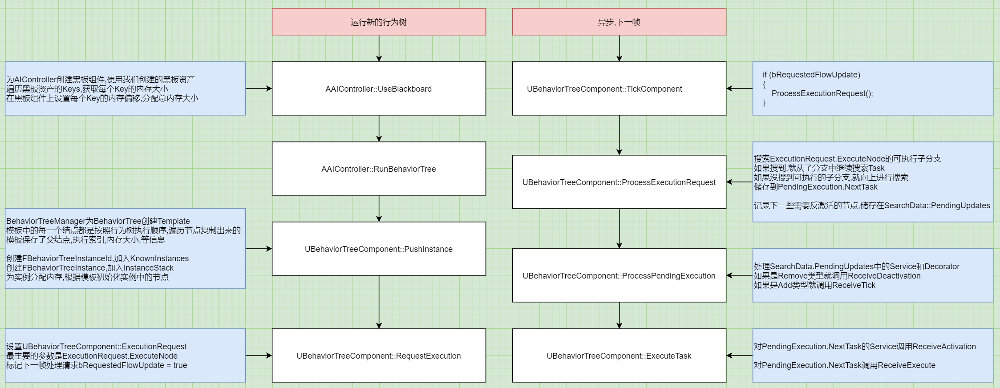

# AI_01_运行行为树_整体流程
## 目录
- [AI_01_运行行为树_整体流程](#ai_01_运行行为树_整体流程)
    - [目录](#目录)
    - [流程图](#流程图)
    - [各节链接](#各节链接)
    - [TODO](#todo)

## 流程图

运行行为树-整体流程

## 各节链接
[AI_02_运行行为树-使用黑板](AI_02_运行行为树-使用黑板.md)   
[AI_03_运行行为树-加载树](AI_03_运行行为树-加载树.md)   
[AI_04_运行行为树-请求执行](AI_04_运行行为树-请求执行.md)   
[AI_05_运行行为树-处理请求](AI_05_运行行为树-处理请求.md)   
[AI_06_运行行为树-运行Task](AI_06_运行行为树-运行Task.md)   

## TODO
1. `UBehaviorTreeComponent::OnTaskFinished`
2. `FindCommonParent`