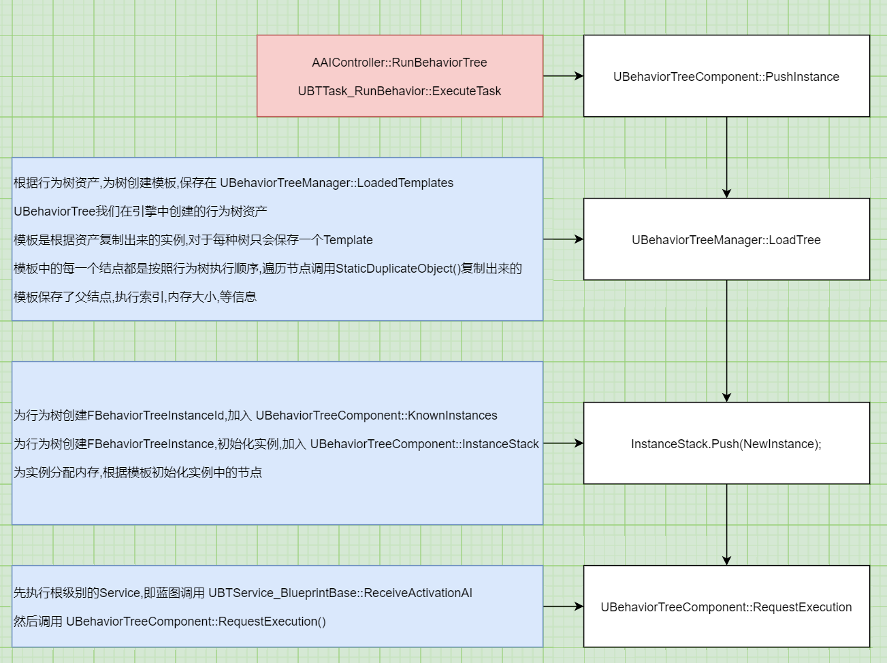

# AI_03_运行行为树-加载树
## 目录
- [AI_03_运行行为树-加载树](#ai_03_运行行为树-加载树)
    - [目录](#目录)
    - [参考](#参考)
    - [运行行为树](#运行行为树)
        - [行为树开始代理](#行为树开始代理)
    - [行为树节点的内存](#行为树节点的内存)
    - [压入行为树实例](#压入行为树实例)
    - [根据行为树资源创建行为树模板](#根据行为树资源创建行为树模板)
        - [(按照行为树执行顺序)遍历树资源,复制每一个节点,创建初始化结构体,加入初始化列表中](#按照行为树执行顺序遍历树资源复制每一个节点创建初始化结构体加入初始化列表中)
        - [遍历初始化列表中的节点,初始化每一个节点(父结点,执行索引,相对于Template内存偏移)](#遍历初始化列表中的节点初始化每一个节点父结点执行索引相对于template内存偏移)
    - [为行为树创建FBehaviorTreeInstanceId,加入KnownInstances](#为行为树创建fbehaviortreeinstanceid加入knowninstances)
    - [为行为树创建FBehaviorTreeInstance,初始化实例,加入InstanceStack](#为行为树创建fbehaviortreeinstance初始化实例加入instancestack)
        - [创建节点实例或对节点内存赋值](#创建节点实例或对节点内存赋值)
    - [开始根级别的Service](#开始根级别的service)
    - [请求运行行为树 UBehaviorTreeComponent::RequestExecution()](#请求运行行为树-ubehaviortreecomponentrequestexecution)

## 参考
@左未 [【图解UE4源码】AI行为树系统 其一 行为树节点的单例设计](https://zhuanlan.zhihu.com/p/369100301)  
@左未 [【图解UE4源码】AI行为树系统 其二 一棵行为树是怎么被运行起来的](https://zhuanlan.zhihu.com/p/370452770)  

## 运行行为树
两种方式运行行为树:
1. `AAIController::RunBehaviorTree` 直接运行行为树的蓝图节点  
2. `UBTTask_RunBehavior::ExecuteTask` 行为树资源内运行一颗子树的Task节点  

两种方式都会调用`UBehaviorTreeComponent::PushInstance`,先加载树  
加载完成后`UBehaviorTreeComponent::RequestExecution`请求运行行为树  


<center>图片-加载行为树</center>

### 行为树开始代理
```
bool UBehaviorTreeComponent::PushInstance(UBehaviorTree& TreeAsset)
{
    FBehaviorTreeDelegates::OnTreeStarted.Broadcast(*this, TreeAsset);
}
```

## 行为树节点的内存
1. 每种行为树资源只有一个模板,存于 UBehaviorTreeManager::LoadedTemplates  
    每个节点只有一个实例,存于模板中,自定义节点多棵树共享一个实例(会导致数据错乱)
    蓝图 bCreateNodeInstance = true,不存在此问题

2. 行为树的实例大小为所有结点UBTNode::GetInstanceMemorySize的和

3. 运行一颗行为树时,会先创建一个模板(即为每个节点创建一个实例),存于 UBehaviorTreeManager::LoadedTemplates
    然后为树创建运行实例(并不是创建节点,而是分配内存),分配2块等大内存,分别存于 UBehaviorTreeComponent::KnownInstances(用于备份数据), UBehaviorTreeComponent::InstanceStack

4. 对于自定义节点,应重写UBTNode::GetInstanceMemorySize,返回sizeof(自定义结构体)
    配合UBTNode::InitializeMemory(), T* CastInstanceNodeMemory()初始化/读取自定义节点的数据

5. uint8* UBehaviorTreeComponent::GetNodeMemory(UBTNode* Node, int32 InstanceIdx)
    Node是UBehaviorTreeManager::LoadedTemplates里面的指针,返回的是UBehaviorTreeComponent::KnownInstances里面的指针

## 压入行为树实例
`bool UBehaviorTreeComponent::PushInstance(UBehaviorTree& TreeAsset)`

函数功能:
1. 根据行为树资源创建行为树模板

2. 为行为树创建FBehaviorTreeInstanceId,加入KnownInstances

3. 为行为树创建FBehaviorTreeInstance,初始化实例,加入InstanceStack

4. 开始根级别的Service  
    对于蓝图,执行UBTService_BlueprintBase::ReceiveActivationAI

5. 请求运行行为树 UBehaviorTreeComponent::RequestExecution()

```
bool UBehaviorTreeComponent::PushInstance(UBehaviorTree& TreeAsset)
{
    UBTCompositeNode* RootNode = NULL;
	uint16 InstanceMemorySize = 0;

	const bool bLoaded = BTManager->LoadTree(TreeAsset, RootNode, InstanceMemorySize);
    if (bLoaded)
	{
        FBehaviorTreeInstance NewInstance;
        NewInstance.InstanceIdIndex = UpdateInstanceId(&TreeAsset, ActiveNode, InstanceStack.Num() - 1);

        // 分配内存 FBehaviorTreeInstanceId
        FBehaviorTreeInstanceId& InstanceInfo = KnownInstances[NewInstance.InstanceIdIndex];
        const bool bFirstTime = (InstanceInfo.InstanceMemory.Num() != InstanceMemorySize);
		if (bFirstTime)
		{
			InstanceInfo.InstanceMemory.AddZeroed(InstanceMemorySize);
		}

        // 分配内存 FBehaviorTreeInstance
        NewInstance.SetInstanceMemory(InstanceInfo.InstanceMemory);
        NewInstance.Initialize(*this, *RootNode, NodeInstanceIndex, bFirstTime ? EBTMemoryInit::Initialize : EBTMemoryInit::RestoreSubtree);

        InstanceStack.Push(NewInstance);

        RequestExecution(RootNode, ActiveInstanceIdx, RootNode, 0, EBTNodeResult::InProgress);
    }
}
```

## 根据行为树资源创建行为树模板
```
bool UBehaviorTreeComponent::PushInstance(UBehaviorTree& TreeAsset)
{
	UBTCompositeNode* RootNode = NULL;
	uint16 InstanceMemorySize = 0;

	const bool bLoaded = BTManager->LoadTree(TreeAsset, RootNode, InstanceMemorySize);
}

bool UBehaviorTreeManager::LoadTree(UBehaviorTree& Asset, UBTCompositeNode*& Root, uint16& InstanceMemorySize)
```

行为树的Template保存在 UBehaviorTreeManager::LoadedTemplates  
模板是根据行为树资源复制出来的实例,而不是树资源本身,对于每种树只会保存一个Template  

函数功能:
1. 如果存在模板,直接返回  

2. (按照行为树执行顺序)遍历树资源,复制每一个节点,创建初始化结构体,加入初始化列表中  
    复制出的节点引用的Service,Decorator,ChildComposite,ChildTask,也是新复制出的节点  
    初始化结构体定义了节点的父结点,执行索引,内存大小,树的深度

3. 遍历初始化列表中的节点,初始化每一个节点(父结点,执行索引,相对于Template内存偏移)

4. 累加所有节点的内存为模板的内存大小,将模板加入LoadedTemplates

### (按照行为树执行顺序)遍历树资源,复制每一个节点,创建初始化结构体,加入初始化列表中
```
bool UBehaviorTreeManager::LoadTree(UBehaviorTree& Asset, UBTCompositeNode*& Root, uint16& InstanceMemorySize)
{
    TArray<FNodeInitializationData> InitList;
    uint16 ExecutionIndex = 0;
    InitializeNodeHelper(NULL, TemplateInfo.Template, 0, ExecutionIndex, InitList, Asset, this);
}

static void InitializeNodeHelper(
    UBTCompositeNode* ParentNode, // 对于新树,为null
    UBTNode* NodeOb, // Root节点(已经是复制出来的节点)
	uint8 TreeDepth, // 0
    uint16& ExecutionIndex, // 0
    TArray<FNodeInitializationData>& InitList, // 输出的初始化列表
	UBehaviorTree& TreeAsset,
    UObject* NodeOuter)
{}
```

函数功能:
1. 按照行为树执行顺序遍历每一个结点

2. 对每一个结点进行如下操作:
    (1)StaticDuplicateObject()复制这个节点

    (2)为复制的节点创建初始化结构体FNodeInitializationData,然后加入初始化列表InitList  
    节点初始化结构体中,定义了节点的父结点,执行索引,内存大小,树的深度  
    内存大小调用UBTNode::GetInstanceMemorySize()获得,对于自定义节点,需要重写这个函数,返回自己定义的结构体的大小  
    这个是由行为树节点单例设计理念决定的
    
    (3)每遍历一个节点,执行索引+1  
    遍历的过程中设置了:辅助节点设置了在父结点中的索引  
    复合节点设置了子分支中最后一个节点的执行索引  

3. 节点遍历顺序,即实际执行顺序  
```
先加入Root节点(根节点是UBTCompositeNode)  
    遍历Services  
    遍历子节点,可能是复合节点或Task,他们都有Decorators  
        遍历Decorators,装饰器的父结点是上一层的复合节点  
        if 子节点是UBTTask_RunBehavior(运行子树)  
            遍历子树的RootDecorators,将它合并到Decorators中,并标记为bIsInjected  
        if 子节点是Task,遍历它的Services,父结点同样是上一层的复合节点(Service不能在Task里遍历)  
        对子节点递归调用InitializeNodeHelper
```

### 遍历初始化列表中的节点,初始化每一个节点(父结点,执行索引,相对于Template内存偏移)
```
uint16 MemoryOffset = 0;
for (int32 Index = 0; Index < InitList.Num(); Index++)
{
    InitList[Index].Node->InitializeNode(
        InitList[Index].ParentNode, 
        InitList[Index].ExecutionIndex, 
        InitList[Index].SpecialDataSize + MemoryOffset, 
        InitList[Index].TreeDepth);
    MemoryOffset += InitList[Index].DataSize;
}

void UBTNode::InitializeNode(UBTCompositeNode* InParentNode, uint16 InExecutionIndex, uint16 InMemoryOffset, uint8 InTreeDepth)
```

## 为行为树创建FBehaviorTreeInstanceId,加入KnownInstances
```
uint8 UBehaviorTreeComponent::UpdateInstanceId(UBehaviorTree* TreeAsset, const UBTNode* OriginNode, int32 OriginInstanceIdx)
{
    FBehaviorTreeInstanceId InstanceId;
	InstanceId.TreeAsset = TreeAsset;

    const int32 NewIndex = KnownInstances.Add(InstanceId);
    return NewIndex;
}
```

## 为行为树创建FBehaviorTreeInstance,初始化实例,加入InstanceStack
```
NewInstance.Initialize(*this, *RootNode, NodeInstanceIndex, bFirstTime ? EBTMemoryInit::Initialize : EBTMemoryInit::RestoreSubtree);

void FBehaviorTreeInstance::Initialize(
    UBehaviorTreeComponent& OwnerComp, 
    UBTCompositeNode& Node, // 根节点
    // 引用参数,表示当前是第几个要实例化的节点
    // 初始值是树的第一个结点在 TArray<UBTNode*> UBehaviorTreeComponent::NodeInstances 中的索引
    int32& InstancedIndex, 
    EBTMemoryInit::Type InitType) // EBTMemoryInit::Initialize
{}
```
1. 遍历传入的树的所有结点,为 每个节点创建节点实例或对节点内存赋值

2. 遍历顺序:
```
Services
传入的Node
子节点的Decorators
如果子节点是复合节点,递归
如果子节点是Task
    遍历子节点的Services
    遍历子节点本身
```

### 创建节点实例或对节点内存赋值
如果是不需要实例的,直接对内存进行赋值  
如果是需要创建实例的,复制节点后加入UBehaviorTreeComponent::NodeInstances  

```
void UBTNode::InitializeInSubtree(
    UBehaviorTreeComponent& OwnerComp, 
    uint8* NodeMemory, 
    int32& NextInstancedIndex, // 引用参数,表示当前是第几个要实例化的节点
     EBTMemoryInit::Type InitType)
{
    if (bCreateNodeInstance)
    {
        if (NodeInstance == NULL)
		{
			NodeInstance = (UBTNode*)StaticDuplicateObject(this, &OwnerComp);
            OwnerComp.NodeInstances.Add(NodeInstance);
		}
        NodeInstance->InitializeMemory(OwnerComp, NodeMemory, InitType);
        NextInstancedIndex++;
    }
    else
    {
        // 自己重写的,初始化自定义节点,一般CastInstanceNodeMemory<自定义结构>(NodeMemory)
        InitializeMemory(OwnerComp, NodeMemory, InitType);
    }
}
```

## 开始根级别的Service
```
bool UBehaviorTreeComponent::PushInstance(UBehaviorTree& TreeAsset)
{
		for (int32 ServiceIndex = 0; ServiceIndex < RootNode->Services.Num(); ServiceIndex++)
		{
			UBTService* ServiceNode = RootNode->Services[ServiceIndex];
			
            // 蓝图调用 UBTService_BlueprintBase::ReceiveSearchStartAI
			ServiceNode->NotifyParentActivation(SearchData);

            // 蓝图调用 UBTService_BlueprintBase::ReceiveActivationAI
			ServiceNode->WrappedOnBecomeRelevant(*this, NodeMemory);
		}
}
```

## 请求运行行为树 UBehaviorTreeComponent::RequestExecution()
