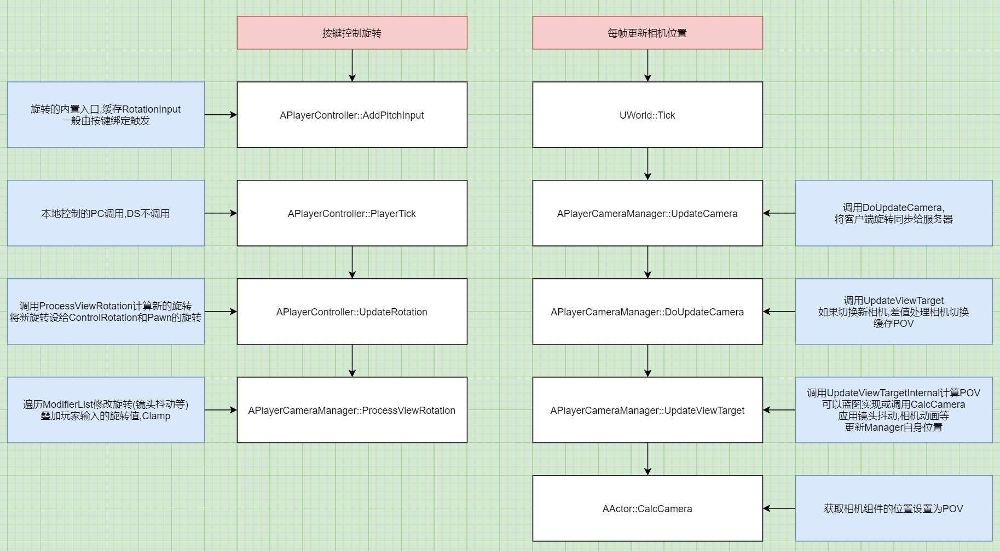
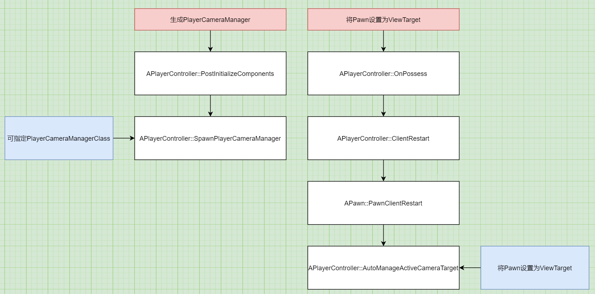

# Camera_02_PlayerCameraManager
## 目录
- [Camera_02_PlayerCameraManager](#camera_02_playercameramanager)
    - [目录](#目录)
    - [参考](#参考)
    - [简介](#简介)
    - [每帧计算相机位置](#每帧计算相机位置)
        - [1.`APlayerCameraManager::UpdateCamera`每帧调用,计算像机位置](#1aplayercameramanagerupdatecamera每帧调用计算像机位置)
        - [2.`APlayerCameraManager::DoUpdateCamera`计算相机位置](#2aplayercameramanagerdoupdatecamera计算相机位置)
        - [3.`APlayerCameraManager::UpdateViewTarget`根据ViewTarget计算POV](#3aplayercameramanagerupdateviewtarget根据viewtarget计算pov)
        - [4.作为ViewTarget时,调用`AActor::CalcCamera`来计算POV](#4作为viewtarget时调用aactorcalccamera来计算pov)
    - [按键控制旋转](#按键控制旋转)
        - [1.按键绑定`APlayerController::AddPitchInput`,更改`APlayerController::RotationInput`](#1按键绑定aplayercontrolleraddpitchinput更改aplayercontrollerrotationinput)
        - [2.客户端每帧调用`APlayerController::UpdateRotation`,通过`APlayerController::PlayerCameraManager`叠加`RotationInput`,并更新旋转](#2客户端每帧调用aplayercontrollerupdaterotation通过aplayercontrollerplayercameramanager叠加rotationinput并更新旋转)
        - [3.`APlayerCameraManager::ProcessViewRotation`叠加玩家输入的旋转](#3aplayercameramanagerprocessviewrotation叠加玩家输入的旋转)
    - [初始化PlayerCameraManager](#初始化playercameramanager)
        - [生成Manager](#生成manager)
        - [将Pawn设为ViewTarget](#将pawn设为viewtarget)

## 参考
@Jerish [《Exploring in UE4》摄像机系统解析[经验总结]](https://zhuanlan.zhihu.com/p/34897458)

## 简介
POV: PointOfView,视点(一般是相机)的位置  
UE4通过`APlayerCameraManager::ViewTarget`来定义渲染屏幕的相机  
里面有两个变量`AActor* Target`,用于计算POV; `FMinimalViewInfo POV`描述相机的位置等信息  

控制相机就是设置`ViewTarget`变量  

  
<center>更新相机位置</center>

## 每帧计算相机位置
### 1.`APlayerCameraManager::UpdateCamera`每帧调用,计算像机位置
```
void UWorld::Tick( ELevelTick TickType, float DeltaSeconds )
{
    for( FConstPlayerControllerIterator Iterator = GetPlayerControllerIterator(); Iterator; ++Iterator )
    {
        if (APlayerController* PlayerController = Iterator->Get())
        {
            // 转发APlayerCameraManager::UpdateCamera
            PlayerController->UpdateCameraManager(DeltaSeconds);
        }
    }
}

void APlayerCameraManager::UpdateCamera(float DeltaTime)
{
    DoUpdateCamera(DeltaTime);

    if (bShouldSendClientSideCameraUpdate && IsNetMode(NM_Client))
    {
        // 同步相关,如果更新时间超过预定值,或位移超过预定值,就发送RPC同步给服务器
    }
}
```

### 2.`APlayerCameraManager::DoUpdateCamera`计算相机位置
```
void APlayerCameraManager::DoUpdateCamera(float DeltaTime)
{
    FMinimalViewInfo NewPOV = ViewTarget.POV;

    // 根据ViewTarget计算新的POV
    UpdateViewTarget(ViewTarget, DeltaTime);

    NewPOV = ViewTarget.POV;

    // 处理相机切换
    if (PendingViewTarget.Target != NULL)
    {
        BlendTimeToGo -= DeltaTime;

        UpdateViewTarget(PendingViewTarget, DeltaTime);

        // 按照时间比例差值混合
        if (BlendTimeToGo > 0)
        {
            NewPOV = ViewTarget.POV;
            NewPOV.BlendViewInfo(PendingViewTarget.POV, BlendPct);
        }
        else
        {
            ViewTarget = PendingViewTarget;
            PendingViewTarget.Target = NULL;
            BlendTimeToGo = 0;
            NewPOV = PendingViewTarget.POV;
        }
    }

    // 缓存POV,可能渲染就是使用这里的缓存数据
    FillCameraCache(NewPOV);
}
```

### 3.`APlayerCameraManager::UpdateViewTarget`根据ViewTarget计算POV
```
void APlayerCameraManager::UpdateViewTarget(FTViewTarget& OutVT, float DeltaTime)
{
    FMinimalViewInfo OrigPOV = OutVT.POV;

    if (ACameraActor* CamActor = Cast<ACameraActor>(OutVT.Target))
    {
        // 获取相机组件的位置,旋转,FOV等属性
        CamActor->GetCameraComponent()->GetCameraView(DeltaTime, OutVT.POV);
    }
    else
    {
        // 这里内置了一些类型,如第一人称,第三人称等
        // 基本是根据ViewTarget的位置旋转加个偏移
        // 3P还做了从玩家位置到相机位置的盒体检测,避免撞墙
        // 一般用不到,不考虑
        if (CameraStyle == 内置类型)
        {

        }
        else
        {
            // 一般调用此函数获取POV
            UpdateViewTargetInternal(OutVT, DeltaTime);
        }
    }

    // 镜头抖动,相机动画等
    ApplyCameraModifiers(DeltaTime, OutVT.POV);

    // 更新Manager自身的位置
    SetActorLocationAndRotation(OutVT.POV.Location, OutVT.POV.Rotation, false);
}
```

### 4.作为ViewTarget时,调用`AActor::CalcCamera`来计算POV
```
void APlayerCameraManager::UpdateViewTargetInternal(FTViewTarget& OutVT, float DeltaTime)
{
    // 先检测蓝图实现
    if (BlueprintUpdateCamera(OutVT.Target, OutLocation, OutRotation, OutFOV))
    {
        OutVT.POV.Location = OutLocation;
    }
    else
    {
        OutVT.Target->CalcCamera(DeltaTime, OutVT.POV);
    }
}

void AActor::CalcCamera(float DeltaTime, FMinimalViewInfo& OutResult)
{
    GetComponents<UCameraComponent>(/*out*/ Cameras);

    // 优先获取相机组件的位置
    for (UCameraComponent* CameraComponent : Cameras)
    {
        CameraComponent->GetCameraView(DeltaTime, OutResult);
        return;
    }

    // 获取Actor位置
    GetActorEyesViewPoint(OutResult.Location, OutResult.Rotation);
}
```

## 按键控制旋转
### 1.按键绑定`APlayerController::AddPitchInput`,更改`APlayerController::RotationInput`  

### 2.客户端每帧调用`APlayerController::UpdateRotation`,通过`APlayerController::PlayerCameraManager`叠加`RotationInput`,并更新旋转  

UpdateRotation由`APlayerController::PlayerTick`调用,仅在本地控制的PC上运行,DS的旋转同步貌似由MovementComponent进行,这里不确定  

```
void APlayerController::UpdateRotation( float DeltaTime )
{
    // 按键输入的旋转
    FRotator DeltaRot(RotationInput);
    FRotator ViewRotation = GetControlRotation();

    // 叠加按键输入的旋转
    PlayerCameraManager->ProcessViewRotation(DeltaTime, ViewRotation, DeltaRot);

    // 更新ControlRotation,并旋转RootComponent
    SetControlRotation(ViewRotation);

    APawn* const P = GetPawnOrSpectator();
    if (P)
	{
        // 如果使用PC的旋转,就更新Pawn的旋转
		P->FaceRotation(ViewRotation, DeltaTime);
	}
}
```

### 3.`APlayerCameraManager::ProcessViewRotation`叠加玩家输入的旋转

```
void APlayerCameraManager::ProcessViewRotation(float DeltaTime, FRotator& OutViewRotation, FRotator& OutDeltaRot)
{
    // 处理镜头抖动等修改
    for( int32 ModifierIdx = 0; ModifierIdx < ModifierList.Num(); ModifierIdx++ )
    {
        ModifierList[ModifierIdx]->ProcessViewRotation(ViewTarget.Target, DeltaTime, OutViewRotation, OutDeltaRot)
    }

    OutViewRotation += OutDeltaRot;

    // 根据配置,限制3个轴向的旋转
    LimitViewPitch( OutViewRotation, ViewPitchMin, ViewPitchMax );
}
```

## 初始化PlayerCameraManager
  
<center>初始化相机</center>

### 生成Manager
可以指定`APlayerController::PlayerCameraManagerClass`  

```
void APlayerController::PostInitializeComponents()
{
    SpawnPlayerCameraManager();
}

void APlayerController::SpawnPlayerCameraManager()
{
    if (PlayerCameraManagerClass != NULL)
	{
		PlayerCameraManager = GetWorld()->SpawnActor<APlayerCameraManager>(PlayerCameraManagerClass, SpawnInfo);
	}
	else
	{
		PlayerCameraManager = GetWorld()->SpawnActor<APlayerCameraManager>(SpawnInfo);
	}
}
```

### 将Pawn设为ViewTarget
```
void APawn::PawnClientRestart()
{
    PC->AutoManageActiveCameraTarget(this);
}

void APlayerController::AutoManageActiveCameraTarget(AActor* SuggestedTarget)
{
    // 先检查自动激活的相机,这里不考虑

    SetViewTarget(SuggestedTarget);
}
```