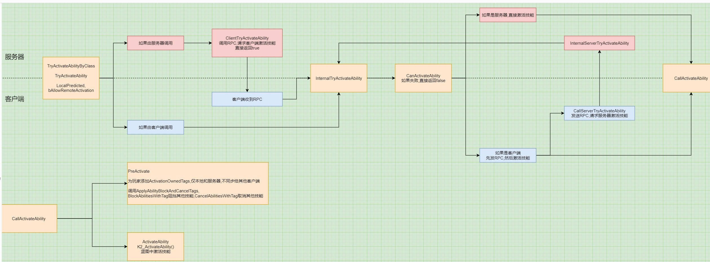

# GAS_03_GA
## 目录
- [GAS_03_GA](#gas_03_ga)
	- [目录](#目录)
	- [激活GA的流程](#激活ga的流程)
		- [客户端激活GA](#客户端激活ga)
			- [按下技能绑定按键](#按下技能绑定按键)
		- [服务器激活GA](#服务器激活ga)
		- [Standaolne模式激活GA](#standaolne模式激活ga)
		- [总结](#总结)
	- [`CanActivateAbility`](#canactivateability)
		- [1.`CheckCooldown`检测技能CD](#1checkcooldown检测技能cd)
		- [2.`CheckCost`检测技能费用](#2checkcost检测技能费用)
		- [3.`DoesAbilitySatisfyTagRequirements`检测Tag](#3doesabilitysatisfytagrequirements检测tag)
		- [4.`K2_CanActivateAbility`蓝图检测是否能激活](#4k2_canactivateability蓝图检测是否能激活)
	- [GA激活时`UGameplayAbility::CallActivateAbility`](#ga激活时ugameplayabilitycallactivateability)
	- [GA结束时`UGameplayAbility::EndAbility`](#ga结束时ugameplayabilityendability)

## 激活GA的流程
调用`TryActivateAbilityByClass`,激活一个技能时,对于LocalPredicted,bAllowRemoteActivation为true的情况  

  
<center>激活GA的流程</center>

### 客户端激活GA
先调用`CanActivateAbility`判断是否满足激活条件  

+ 如果不满足,直接返回false  

+ 如果满足  
1. 调用`CallServerTryActivateAbility`,发送RPC,让服务器尝试激活技能  
服务器收到RPC后,调用`CanActivateAbility`判断能否激活,然后激活技能  

2. 客户端激活技能  

#### 按下技能绑定按键
在客户端`UPlayerInput::ProcessInputStack`每帧调用,检测到技能按键按下后  
调用`UAbilitySystemComponent::AbilityLocalInputPressed`,遍历ActivatableAbilities  
如果有InputID匹配的技能,就调用`TryActivateAbility`,之后的流程和上面一样  

### 服务器激活GA
1. 调用`ClientTryActivateAbility`,发送RPC,让客户端尝试激活技能  
客户端收到RPC后,执行和上面一样的逻辑  

2. 直接返回true  

### Standaolne模式激活GA
流程和由客户端调用类似,只是不调用`CallServerTryActivateAbility`  

### 总结
无论是由服务器,还是客户端,发起请求激活的命令(LocalPredicted, bAllowRemoteActivation)  
都会先在客户端判断能否激活,如果客户端不满足激活条件,服务器和客户端都不会执行技能  
如果客户端满足激活条件,客户端会执行技能,并且发送RPC到服务器,让服务器自己判断能否激活技能  

所以,服务器从调用TryActivateAbilityByClass,到技能激活,是一个异步的过程  

## `CanActivateAbility`
尝试激活一个技能时,调用此函数,判断技能能否被激活  

检测步骤:  
1. `CheckCooldown`检测技能CD  
2. `CheckCost`检测技能费用  
3. `DoesAbilitySatisfyTagRequirements`检测Tag  
4. `K2_CanActivateAbility`蓝图检测是否能激活  

失败时会调用`NotifyAbilityFailed`,参数OptionalRelevantTags会标识失败原因  
里面的Tag由`UAbilitySystemGlobals`预定义  

```
InternalTryActivateAbility()
{
	if(!CanActivateAbility(..., OptionalRelevantTags))
	{
		NotifyAbilityFailed(..., OptionalRelevantTags);
		return false;
	}
	
	// 技能激活
	CallActivateAbility();
}
```

### 1.`CheckCooldown`检测技能CD
+ 获取CD tag  
调用`GetCooldownTags`,实际上获取GA蓝图中设置的CooldownGameplayEffectClass,里面的GrantedTags
+ 判断技能组件是否含有这些tag  

OptionalRelevantTags: Ability.Fail.Cooldown  

### 2.`CheckCost`检测技能费用
+ 获取GA蓝图中设置的CostGameplayEffectClass  
+ 调用CanApplyAttributeModifiers,遍历GE中的Modifiers修改的FGameplayAttribute  
如果修改类型为Add,并且 CurrentValue + CostValue < 0,返回false  

OptionalRelevantTags: Ability.Fail.Cost  

### 3.`DoesAbilitySatisfyTagRequirements`检测Tag
在满足下列3点时返回true  
1. GA自身的AbilityTags 没有被 其它的GA的BlockAbilitiesWithTag 所阻挡  
	这些tag存于 FGameplayTagContainer  AbilitySystemComponent::BlockedAbilityTags::ExplicitTags  
2. activating actor/component 没有 ActivationBlockedTags  
3. activating actor/component 有全部的 ActivationRequiredTags  

这里我理解为 activating actor/component 就是玩家自身的 AbilitySystemComponent  

OptionalRelevantTags: Ability.Fail.TagsBlocked (对于上面1和2)  
OptionalRelevantTags: Ability.Fail.TagsMissing (对于上面3)  

### 4.`K2_CanActivateAbility`蓝图检测是否能激活
蓝图中判断技能是否可以激活,如果前面的CD,Cost,Tag检测失败,这里不会被执行  

## GA激活时`UGameplayAbility::CallActivateAbility`
```
void UGameplayAbility::CallActivateAbility(...)
{
	// 添加ActivationOwnedTags,技能结束时移除,这个只会在服务器和所属的客户端加,其它客户端不会加
	Comp->AddLooseGameplayTags(ActivationOwnedTags);

	// ASC广播技能激活代理
	UAbilitySystemComponent::AbilityActivatedCallbacks.Broadcast(Ability);

	// BlockAbilitiesWithTag阻挡其他技能,技能结束时取消阻挡
	// CancelAbilitiesWithTag取消其他技能
	Comp->ApplyAbilityBlockAndCancelTags(AbilityTags, this, true, BlockAbilitiesWithTag, true, CancelAbilitiesWithTag);

	// 最后执行蓝图节点
	K2_ActivateAbility();
}
```

## GA结束时`UGameplayAbility::EndAbility`
```
void UGameplayAbility::EndAbility(
	..., 
	bool bReplicateEndAbility, // 是否向远端RPC发送结束技能指令,如果是被RPC通知结束技能的,值为false,避免无限循环
	bool bWasCancelled
	)
{
	// 先执行蓝图节点
	K2_OnEndAbility(bWasCancelled);

	// 移除异步函数和定时器
	MyWorld->GetLatentActionManager().RemoveActionsForObject(this);
	MyWorld->GetTimerManager().ClearAllTimersForObject(this);

	// 结束所有AbilityTask
	for (int32 TaskIdx = ActiveTasks.Num() - 1; TaskIdx >= 0 && ActiveTasks.Num() > 0; --TaskIdx)
	{
		UGameplayTask* Task = ActiveTasks[TaskIdx];
		Task->TaskOwnerEnded();
	}

	// RPC通知远端调用EndAbility
	if (bReplicateEndAbility)
	{
		AbilitySystemComponent->ReplicateEndOrCancelAbility(Handle, ActivationInfo, this, false);
	}

	// 移除ActivationOwnedTags
	AbilitySystemComponent->RemoveLooseGameplayTags(ActivationOwnedTags);

	// 取消对其它技能的阻挡,其实就是从ASC的BlockedAbilityTags中移除此GA的BlockAbilitiesWithTag
	AbilitySystemComponent->ApplyAbilityBlockAndCancelTags(AbilityTags, this, false, BlockAbilitiesWithTag, false, CancelAbilitiesWithTag);

	// ASC广播技能结束代理
	UAbilitySystemComponent::AbilityEndedCallbacks.Broadcast(Ability);
}
```