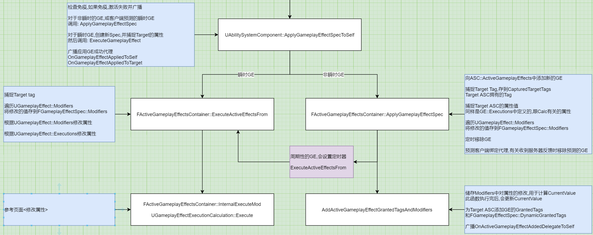

# GAS_04_GE_01_应用GE
## 目录
- [GAS_04_GE_01_应用GE](#gas_04_ge_01_应用ge)
    - [目录](#目录)
    - [简介](#简介)
    - [属性捕捉](#属性捕捉)
    - [应用GE](#应用ge)
        - [`MakeEffectContext`](#makeeffectcontext)
        - [`MakeOutgoingSpec`](#makeoutgoingspec)
        - [`ApplyGameplayEffectSpecToSelf`](#applygameplayeffectspectoself)
    - [应用GE的通用入口`ApplyGameplayEffectSpecToSelf`](#应用ge的通用入口applygameplayeffectspectoself)
        - [检测GE是否被免疫](#检测ge是否被免疫)
        - [应用非瞬时GE: `ApplyGameplayEffectSpec`,主要添加Tag](#应用非瞬时ge-applygameplayeffectspec主要添加tag)
            - [定时移除GE](#定时移除ge)
            - [周期性GE的执行](#周期性ge的执行)
            - [`CheckOngoingTagRequirements`激活持续性GE的核心函数,修改属性CurrentValue,为TargetASC添加Tag](#checkongoingtagrequirements激活持续性ge的核心函数修改属性currentvalue为targetasc添加tag)
                - [`FScopedAggregatorOnDirtyBatch`结构体的析构函数,根据Modifiers修改属性CurrentValue](#fscopedaggregatorondirtybatch结构体的析构函数根据modifiers修改属性currentvalue)
                - [`AddActiveGameplayEffectGrantedTagsAndModifiers`,存储Modifiers对属性的修改,为Target添加GE的Tag](#addactivegameplayeffectgrantedtagsandmodifiers存储modifiers对属性的修改为target添加ge的tag)
        - [应用瞬时GE: `ExecuteActiveEffectsFrom`,主要修改属性](#应用瞬时ge-executeactiveeffectsfrom主要修改属性)
            - [`InternalExecuteMod`,根据`UGameplayEffect::Modifiers`修改属性](#internalexecutemod根据ugameplayeffectmodifiers修改属性)
            - [`UGameplayEffectExecutionCalculation::Execute`根据`UGameplayEffect::Executions`修改属性](#ugameplayeffectexecutioncalculationexecute根据ugameplayeffectexecutions修改属性)

## 简介
`FActiveGameplayEffectsContainer UAbilitySystemComponent::ActiveGameplayEffects`储存所有GE  

各版本应用GE函数的通用入口`UAbilitySystemComponent::ApplyGameplayEffectSpecToSelf`  

+ GE的作用:  
1. 瞬时GE: 根据Modifiers和Executions修改属性的BaseValue和CurrentValue  
2. 周期性GE: 每次执行都可视为与瞬时GE相同,修改属性值  
3. 持续GE: 根据Modifiers修改属性的CurrentValue  
   并给TargetASC添加GE的GrantedTags和DynamicGrantedTags  

  

  


## 属性捕捉
参考GAS中文文档项目的`GDDamageExecCalculation.cpp`  

通过内置宏`DECLARE_ATTRIBUTE_CAPTUREDEF`和`DEFINE_ATTRIBUTE_CAPTUREDEF`来定义要捕捉的属性  
然后在构造函数中加入`RelevantAttributesToCapture`(应该是为了使CDO中包含这些属性)  

在创建GE时会遍历捕捉到的属性,将他们添加到`ASC::ActiveGameplayEffects::AttributeAggregatorMap`
   并复制到`CapturedRelevantAttributes`里面的`AttributeAggregator`  

捕捉到的属性BaseValue和ASC属性的BaseValue相同  

`bSnapshot`参数if true,`AttributeAggregator`是根据`AttributeAggregatorMap`复制的  
else `AttributeAggregator`直接引用`AttributeAggregatorMap`  

这里我理解的是:  
如果创建快照,用的就是复制出来的值,不会影响原始值,比如攻击者的伤害值  
如果不创建快照,用的就是引用的值,会影响原始值,比如被打的人的护甲  
无脑的为Source创建快照,Target不创建快照  

```
struct GDDamageStatics
{
    DECLARE_ATTRIBUTE_CAPTUREDEF(Armor);
    DECLARE_ATTRIBUTE_CAPTUREDEF(Damage);

    GDDamageStatics()
    {
        // 来自Source的Damage创建快照
        DEFINE_ATTRIBUTE_CAPTUREDEF(UGDAttributeSetBase, Damage, Source, true);

        // 来自Target的Armor不创建快照
        DEFINE_ATTRIBUTE_CAPTUREDEF(UGDAttributeSetBase, Armor, Target, false);
    }
}

static const GDDamageStatics& DamageStatics()
{
	static GDDamageStatics DStatics;
	return DStatics;
}

// 构造函数中,将定义好的要捕捉的属性加入RelevantAttributesToCapture
// 创建GE时,通过CDO获取捕捉的属性就会包含伤害值和护甲值,这里不确定
UGDDamageExecCalculation::UGDDamageExecCalculation()
{
	RelevantAttributesToCapture.Add(DamageStatics().DamageDef);
	RelevantAttributesToCapture.Add(DamageStatics().ArmorDef);
}
```

## 应用GE
### `MakeEffectContext`
+ 版本1: `UAbilitySystemComponent::MakeEffectContext()`  

`FGameplayEffectContext::Instigator`设置为OwnerActor  
`FGameplayEffectContext::EffectCauser`设置为AvatarActor  

+ 版本2: `UGameplayAbility::MakeEffectContext()`  

`FGameplayEffectContext::Instigator`设置为OwnerActor  
`FGameplayEffectContext::EffectCauser`设置为AvatarActor  
`FGameplayEffectContext::AbilityCDO`设置为this  
`FGameplayEffectContext::SourceObject`设置为`FGameplayAbilitySpec::SourceObject`  

### `MakeOutgoingSpec`
+ 版本1: `UAbilitySystemComponent::MakeOutgoingSpec()`  

1. 捕捉Attribute,存到`FGameplayEffectSpec::CapturedRelevantAttributes`  

    包括:  
    1. GE的持续时间相关属性  

    2. `UGameplayEffect::Modifiers`属性修改有关的属性  
    这里我们关心的计算方式ScalableFloat,SetByCaller中不需要捕捉属性  
    AttributeBased,CustomCalculationClass一般不用,而是用Execution替代,所以这里可以忽略  

    ```
    EGameplayEffectMagnitudeCalculation
    {
        ScalableFloat,
        AttributeBased,
        CustomCalculationClass,
        SetByCaller,
    };
    ```

    3. `UGameplayEffect::Executions` Calc有关的属性  
    即`UGameplayEffectCalculation::RelevantAttributesToCapture`  
    参考GAS中文文档项目的`GDDamageExecCalculation.cpp`,捕捉的属性既可以有来自`Source`的Damage,也可以有来自`Target`的Armor  

2. 捕捉Tag,存到`FGameplayEffectSpec::CapturedSourceTags`  

    包括:  
    1. GE自身的Tag  
    2. ASC拥有的Tag  

3. 遍历捕捉到的属性,将他们添加到`ASC::ActiveGameplayEffects::AttributeAggregatorMap`
   并复制到`CapturedRelevantAttributes`里面的`AttributeAggregator`  

    捕捉到的属性BaseValue和ASC属性的BaseValue相同  
    `bSnapshot`参数if true,`AttributeAggregator`是根据`AttributeAggregatorMap`复制的  
    else `AttributeAggregator`直接引用`AttributeAggregatorMap`  

---
+ 版本2: `UGameplayAbility::MakeOutgoingGameplayEffectSpec`  

    和版本1基本相同,`CapturedSourceTags`额外捕捉了GA自身的Tag  

### `ApplyGameplayEffectSpecToSelf`

## 应用GE的通用入口`ApplyGameplayEffectSpecToSelf`
```
FActiveGameplayEffectHandle UAbilitySystemComponent::ApplyGameplayEffectSpecToSelf(const FGameplayEffectSpec &Spec, FPredictionKey PredictionKey)
{
    // 检查免疫,如果免疫,激活失败并广播
    const FActiveGameplayEffect* ImmunityGE=nullptr;
	if (ActiveGameplayEffects.HasApplicationImmunityToSpec(Spec, ImmunityGE))
	{
		OnImmunityBlockGameplayEffectDelegate.Broadcast(Spec, ImmunityGE);
		return FActiveGameplayEffectHandle();
	}

    // 返回的Handle
    FActiveGameplayEffectHandle	MyHandle(INDEX_NONE);

    // 实际应用的GE
    FActiveGameplayEffect* AppliedEffect = nullptr;

    // 非瞬时GE:实际应用的Spec; 瞬时GE:新创建的Spec
    FGameplayEffectSpec* OurCopyOfSpec = nullptr;

    // 对于非瞬时的GE,或客户端预测的瞬时GE
    // bTreatAsInfiniteDuration: 客户端预测的瞬时GE设为true,可能是为了服务器验证失败时回滚
    if (Spec.Def->DurationPolicy != EGameplayEffectDurationType::Instant || bTreatAsInfiniteDuration)
    {
        AppliedEffect = ActiveGameplayEffects.ApplyGameplayEffectSpec(Spec, PredictionKey, bFoundExistingStackableGE);

        MyHandle = AppliedEffect->Handle;
		OurCopyOfSpec = &(AppliedEffect->Spec);
    }

    // 对于瞬时GE,创建新Spec,并捕捉Target的属性
    if (!OurCopyOfSpec)
    {
        OurCopyOfSpec = new FGameplayEffectSpec(Spec);
        OurCopyOfSpec->CaptureAttributeDataFromTarget(this);
    }

    // 激活GC,先不管

    // 对于瞬时GE
    if (Spec.Def->DurationPolicy == EGameplayEffectDurationType::Instant)
    {
        // 转发 ExecuteActiveEffectsFrom()
        ExecuteGameplayEffect(*OurCopyOfSpec, PredictionKey);
    }

    // 广播应用GE成功代理
    
    // OnGameplayEffectAppliedDelegateToSelf.Broadcast()
    OnGameplayEffectAppliedToSelf(InstigatorASC, *OurCopyOfSpec, MyHandle);

    // OnGameplayEffectAppliedDelegateToTarget.Broadcast()
    InstigatorASC->OnGameplayEffectAppliedToTarget(this, *OurCopyOfSpec, MyHandle);

    return MyHandle;
}
```

### 检测GE是否被免疫
`UGameplayEffect::GrantedApplicationImmunityTags`里面的RequireTags定义了提供免疫的Tag  
遍历所有激活的GE `ActiveGameplayEffects`,如果新应用的GE的`CapturedSourceTags`包含免疫的Tag,则GE被免疫  
即GE自身的Tag和ASC的Tag,只要包含任意已激活GE的免疫Tag,就会被免疫掉  

被免疫时广播`OnImmunityBlockGameplayEffectDelegate`  

### 应用非瞬时GE: `ApplyGameplayEffectSpec`,主要添加Tag
函数主要功能:  
1. 为TargetASC添加GE的Tag  
2. 定时移除GE  
3. 设置定时器执行周期性的GE  

这里不考虑堆栈  

```
FActiveGameplayEffect* FActiveGameplayEffectsContainer::ApplyGameplayEffectSpec(const FGameplayEffectSpec& Spec, FPredictionKey& InPredictionKey, bool& bFoundExistingStackableGE)
{
    // 返回的GE
    FActiveGameplayEffect* AppliedActiveGE = nullptr;

    FActiveGameplayEffectHandle NewHandle = FActiveGameplayEffectHandle::GenerateNewHandle(Owner);

    // 这里不确定条件分支流程是否正确
    // 重写了operator new(),在数组的最后一个位置创建新元素,即在所有的激活GE后面添加新GE
    AppliedActiveGE = new(GameplayEffects_Internal) FActiveGameplayEffect(NewHandle, Spec, GetWorldTime(), GetServerWorldTime(), InPredictionKey);

    FGameplayEffectSpec& AppliedEffectSpec = AppliedActiveGE->Spec;

    // 捕捉Target Tag
    Owner->GetOwnedGameplayTags(AppliedEffectSpec.CapturedTargetTags.GetActorTags());

    // 捕捉Target的ASC的属性值
    // 参考GAS中文文档项目的`GDDamageExecCalculation.cpp`
    // 捕捉的Target属性是在`UGameplayEffect::Executions`中定义的,在GE创建时被捕捉,如目标的Armor
    AppliedEffectSpec.CaptureAttributeDataFromTarget(Owner);

    // 遍历UGameplayEffect::Modifiers,将修改的值存到FGameplayEffectSpec::Modifiers
    AppliedEffectSpec.CalculateModifierMagnitudes();

    // 定时移除GE
    float DefCalcDuration = 0.f;
	if (AppliedEffectSpec.AttemptCalculateDurationFromDef(DefCalcDuration))
	{
		AppliedEffectSpec.SetDuration(DefCalcDuration, false);
	}
    FTimerDelegate Delegate = FTimerDelegate::CreateUObject(Owner, &UAbilitySystemComponent::CheckDurationExpired, AppliedActiveGE->Handle);
	TimerManager.SetTimer(AppliedActiveGE->DurationHandle, Delegate, FinalDuration, false);

    // 设置周期性执行的GE的定时器
    if ((AppliedEffectSpec.GetPeriod() > UGameplayEffect::NO_PERIOD))
    {
        FTimerDelegate Delegate = FTimerDelegate::CreateUObject(Owner, &UAbilitySystemComponent::ExecutePeriodicEffect, AppliedActiveGE->Handle);

        TimerManager.SetTimer(AppliedActiveGE->PeriodHandle, Delegate, AppliedEffectSpec.GetPeriod(), true);
    }

    // 预测客户端绑定代理,在收到服务器拒绝,或服务器认证成功同步GE时,移除客户端预测的GE
    if(预测客户端)
    {
        InPredictionKey.NewRejectOrCaughtUpDelegate(FPredictionKeyEvent::CreateUObject(Owner, &UAbilitySystemComponent::RemoveActiveGameplayEffect_NoReturn, AppliedActiveGE->Handle, -1));
    }

    // 调用激活持续性GE的核心函数 CheckOngoingTagRequirements()
    // 修改属性CurrentValue,为TargetASC添加Tag
    InternalOnActiveGameplayEffectAdded(*AppliedActiveGE);

    return AppliedActiveGE;
}
```

#### 定时移除GE
1. 创建GE时添加定时器移除GE  
```
FActiveGameplayEffect* FActiveGameplayEffectsContainer::ApplyGameplayEffectSpec(const FGameplayEffectSpec& Spec, FPredictionKey& InPredictionKey, bool& bFoundExistingStackableGE)
{
    // 计算GE的持续时间
    // Infinite返回-1,Instant返回0
    float DefCalcDuration = 0.f;
	if (AppliedEffectSpec.AttemptCalculateDurationFromDef(DefCalcDuration))
	{
		AppliedEffectSpec.SetDuration(DefCalcDuration, false);
	}

    // 定时移除GE
    FTimerDelegate Delegate = FTimerDelegate::CreateUObject(Owner, &UAbilitySystemComponent::CheckDurationExpired, AppliedActiveGE->Handle);
	TimerManager.SetTimer(AppliedActiveGE->DurationHandle, Delegate, FinalDuration, false);
}
```

#### 周期性GE的执行
`ApplyGameplayEffectSpec()`中定时器绑定的函数为`ExecutePeriodicEffect`,其内部转发`InternalExecutePeriodicGameplayEffect`  

```
void FActiveGameplayEffectsContainer::InternalExecutePeriodicGameplayEffect(FActiveGameplayEffect& ActiveEffect)
{
    // 这其实是瞬时GE执行的函数,主要作用是根据UGameplayEffect::Modifiers和Executions修改属性
    ExecuteActiveEffectsFrom(ActiveEffect.Spec);

    // 广播代理
    OnPeriodicGameplayEffectExecuteDelegateOnSelf.Broadcast();
    OnPeriodicGameplayEffectExecuteDelegateOnTarget.Broadcast();
}
```

#### `CheckOngoingTagRequirements`激活持续性GE的核心函数,修改属性CurrentValue,为TargetASC添加Tag
```
void FActiveGameplayEffect::CheckOngoingTagRequirements(const FGameplayTagContainer& OwnerTags, FActiveGameplayEffectsContainer& OwningContainer, bool bInvokeGameplayCueEvents)
{
     // 有关GE开关(GE可以被关闭,但它依然处于应用状态),不关心

     {
        // 结构体的析构函数修改了属性的CurrentValue
        FScopedAggregatorOnDirtyBatch	AggregatorOnDirtyBatcher;

        // 存储Modifiers对属性的修改,为TargetASC添加Tag
        OwningContainer.AddActiveGameplayEffectGrantedTagsAndModifiers(*this, bInvokeGameplayCueEvents);
     }
}
```

##### `FScopedAggregatorOnDirtyBatch`结构体的析构函数,根据Modifiers修改属性CurrentValue
放在下一节  

##### `AddActiveGameplayEffectGrantedTagsAndModifiers`,存储Modifiers对属性的修改,为Target添加GE的Tag
有持续时间的GE主要有如下功能:  
1. 将UFGameplayEffect::Modifiers中对属性的修改存入AttributeAggregatorMap里面的ModChannels,用于计算属性的CurrentValue  
2. 为Target添加GE的GrantedTags和FGameplayEffectSpec::DynamicGrantedTags  

```
void FActiveGameplayEffectsContainer::AddActiveGameplayEffectGrantedTagsAndModifiers(FActiveGameplayEffect& Effect, bool bInvokeGameplayCueEvents)
{
    // 将UFGameplayEffect::Modifiers中对属性的修改存入AttributeAggregatorMap里面的ModChannels
    for (int32 ModIdx = 0; ModIdx < Effect.Spec.Modifiers.Num(); ++ModIdx)
    {
        const FGameplayModifierInfo &ModInfo = Effect.Spec.Def->Modifiers[ModIdx];

        // 获取前面存储的计算后的属性修改值
        float EvaluatedMagnitude = Effect.Spec.GetModifierMagnitude(ModIdx, true);

        // 获取前面在AttributeAggregatorMap中存储的指定属性对应的FAggregator
        // 绑定OnDirty
        FAggregator* Aggregator = FindOrCreateAttributeAggregator(Effect.Spec.Def->Modifiers[ModIdx].Attribute).Get();

        // 将对属性的修改存入ModChannels
        // 有持续时间的GE影响属性的CurrentValue,而CurrentValue是基于BaseValue的
        // 叠加ModChannels中各通道对属性的修改,加上BaseValue就是CurrentValue
        Aggregator->AddAggregatorMod(EvaluatedMagnitude, ModInfo.ModifierOp, ModInfo.EvaluationChannelSettings.GetEvaluationChannel(), &ModInfo.SourceTags, &ModInfo.TargetTags, Effect.PredictionKey.WasLocallyGenerated(), Effect.Handle);
    }

    // 为Target添加GE的GrantedTags和FGameplayEffectSpec::DynamicGrantedTags
    Owner->UpdateTagMap(Effect.Spec.Def->InheritableOwnedTagsContainer.CombinedTags, 1);
	Owner->UpdateTagMap(Effect.Spec.DynamicGrantedTags, 1);

    // 有关免疫Tag的添加,先不考虑

    // 赋予技能,先不考虑

    // 执行UGameplayEffect::GameplayCues,先不考虑

    // 服务器和客户端都广播,有持续时间的GE执行(瞬时GE不广播)
    Owner->OnActiveGameplayEffectAddedDelegateToSelf.Broadcast(Owner, Effect.Spec, Effect.Handle);
}
```

### 应用瞬时GE: `ExecuteActiveEffectsFrom`,主要修改属性
主要根据`UGameplayEffect::Modifiers`和`UGameplayEffect::Executions`修改属性值  

```
void FActiveGameplayEffectsContainer::ExecuteActiveEffectsFrom(FGameplayEffectSpec &Spec, FPredictionKey PredictionKey)
{
    FGameplayEffectSpec& SpecToUse = Spec;

    // 捕捉Target tag
    Owner->GetOwnedGameplayTags(SpecToUse.CapturedTargetTags.GetActorTags());

    // 遍历UGameplayEffect::Modifiers,将修改的值存到FGameplayEffectSpec::Modifiers
    SpecToUse.CalculateModifierMagnitudes();

    // 根据UGameplayEffect::Modifiers修改属性
    bool ModifierSuccessfullyExecuted = false;

    for (int32 ModIdx = 0; ModIdx < SpecToUse.Modifiers.Num(); ++ModIdx)
	{
		const FGameplayModifierInfo& ModDef = SpecToUse.Def->Modifiers[ModIdx];
		
		FGameplayModifierEvaluatedData EvalData(ModDef.Attribute, ModDef.ModifierOp, SpecToUse.GetModifierMagnitude(ModIdx, true));
		ModifierSuccessfullyExecuted |= InternalExecuteMod(SpecToUse, EvalData);
	}

    // 根据UGameplayEffect::Executions修改属性
    for (const FGameplayEffectExecutionDefinition& CurExecDef : SpecToUse.Def->Executions)
    {
        // Calc Class
        const UGameplayEffectExecutionCalculation* ExecCDO = CurExecDef.CalculationClass->GetDefaultObject<UGameplayEffectExecutionCalculation>();

        // 传入参数,CalculationModifiers,中文文档项目为null
        FGameplayEffectCustomExecutionParameters ExecutionParams(SpecToUse, CurExecDef.CalculationModifiers, Owner, CurExecDef.PassedInTags, PredictionKey);

        // 引用参数,指明要修改哪些属性
        FGameplayEffectCustomExecutionOutput ExecutionOutput;

        // 核心计算函数
        ExecCDO->Execute(ExecutionParams, ExecutionOutput);

        // 遍历要修改的属性,使用和Modifiers一样的方式设置新值
        TArray<FGameplayModifierEvaluatedData>& OutModifiers = ExecutionOutput.GetOutputModifiersRef();

        for (FGameplayModifierEvaluatedData& CurExecMod : OutModifiers)
        {
            ModifierSuccessfullyExecuted |= InternalExecuteMod(SpecToUse, CurExecMod);
        }
    }
}
```

#### `InternalExecuteMod`,根据`UGameplayEffect::Modifiers`修改属性
放在下一节  

#### `UGameplayEffectExecutionCalculation::Execute`根据`UGameplayEffect::Executions`修改属性
放在下一节  
