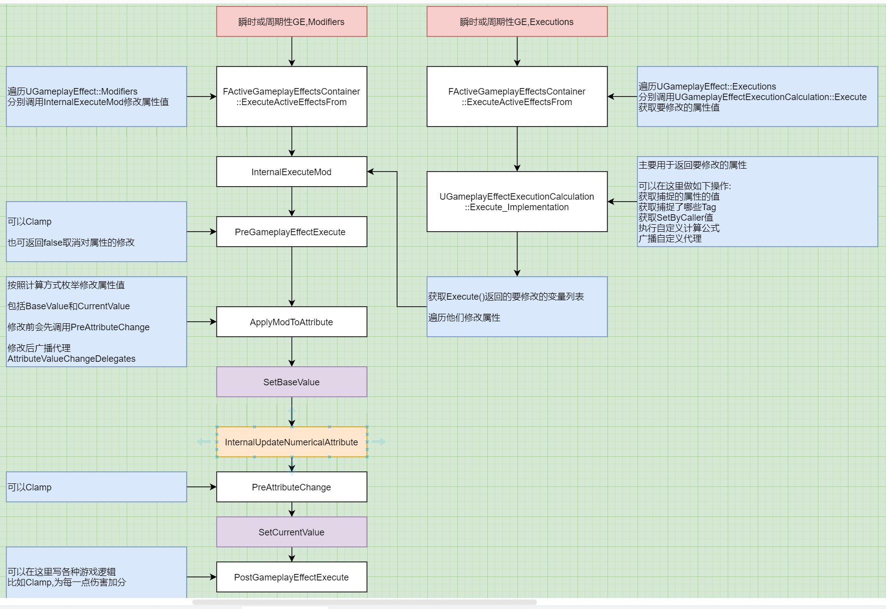
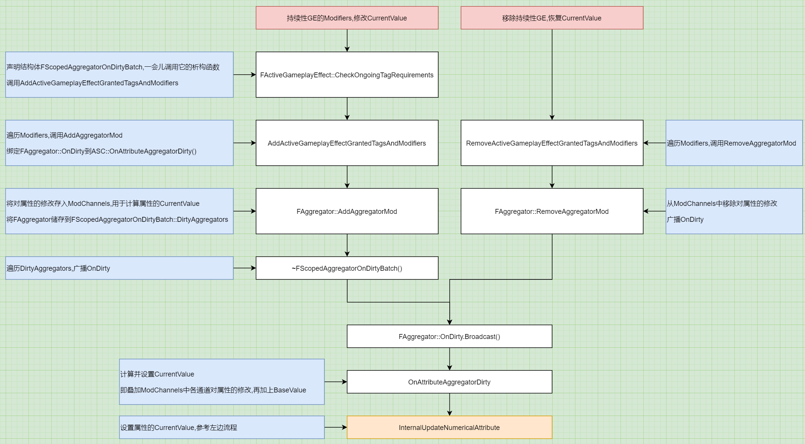

# GAS_04_GE_02_修改属性
## 目录
- [GAS_04_GE_02_修改属性](#gas_04_ge_02_修改属性)
    - [目录](#目录)
    - [简介](#简介)
    - [`InternalExecuteMod`,根据`UGameplayEffect::Modifiers`修改属性](#internalexecutemod根据ugameplayeffectmodifiers修改属性)
        - [`ApplyModToAttribute`按照计算方式枚举修改属性值](#applymodtoattribute按照计算方式枚举修改属性值)
            - [`SetAttributeBaseValue`修改属性的BaseValue,可能也修改CurrentValue](#setattributebasevalue修改属性的basevalue可能也修改currentvalue)
                - [`InternalUpdateNumericalAttribute`广播属性改变代理,设置CurrentValue](#internalupdatenumericalattribute广播属性改变代理设置currentvalue)
                    - [`SetNumericValueChecked`修改属性的CurrentValue](#setnumericvaluechecked修改属性的currentvalue)
    - [`UGameplayEffectExecutionCalculation::Execute`根据`UGameplayEffect::Executions`修改属性](#ugameplayeffectexecutioncalculationexecute根据ugameplayeffectexecutions修改属性)
        - [定义要捕捉哪些属性](#定义要捕捉哪些属性)
        - [Tag捕捉](#tag捕捉)
        - [获取捕捉的属性值](#获取捕捉的属性值)
        - [获取根据Tag动态设置的值](#获取根据tag动态设置的值)
        - [参数OutExecutionOutput返回要修改的属性,后面调用`InternalExecuteMod`修改属性值](#参数outexecutionoutput返回要修改的属性后面调用internalexecutemod修改属性值)
    - [持续性GE的Modifiers对属性CurrentValue的修改](#持续性ge的modifiers对属性currentvalue的修改)
        - [`FAggregator::Evaluate`计算属性的CurrentValue](#faggregatorevaluate计算属性的currentvalue)

## 简介
GE对属性的修改:  
1. 瞬时GE: 根据Modifiers和Executions修改属性的BaseValue和CurrentValue  
2. 周期性GE: 每次执行都可视为与瞬时GE相同,修改属性值  
3. 持续GE: 根据Modifiers修改属性的CurrentValue  

`UGameplayEffect::Modifiers`调用`InternalExecuteMod`修改属性  

`UGameplayEffect::Executions`调用`UGameplayEffectExecutionCalculation::Execute`获取要修改的属性  
再调用`InternalExecuteMod`修改这些属性  

一些生命周期(按执行顺序):  

+ `PreGameplayEffectExecute`: Clamp操作,也可返回false取消对属性的修改  
+ `PreAttributeChange`: Clamp操作  
+ `PostGameplayEffectExecute`: 可以在这里写各种游戏逻辑,比如Clamp,为每一点伤害加分  


<center>瞬时或周期性GE修改属性</center>


<center>持续GE修改属性</center>

## `InternalExecuteMod`,根据`UGameplayEffect::Modifiers`修改属性
```
bool FActiveGameplayEffectsContainer::InternalExecuteMod(FGameplayEffectSpec& Spec, FGameplayModifierEvaluatedData& ModEvalData)
{
    // 返回是否执行
    bool bExecuted = false;

    FGameplayEffectModCallbackData ExecuteData(Spec, ModEvalData, *Owner);

    // 调用UAttributeSet::PreGameplayEffectExecute()
    // 这里应该做Clamp操作
    // 也可以通过返回false取消修改属性,则UAttributeSet::PostGameplayEffectExecute不会调用
    if (AttributeSet->PreGameplayEffectExecute(ExecuteData))
    {
        // 按照计算方式枚举修改属性值
        ApplyModToAttribute(ModEvalData.Attribute, ModEvalData.ModifierOp, ModEvalData.Magnitude, &ExecuteData);

        // 可以在这里写各种游戏逻辑,比如Clamp,为每一点伤害加分
        AttributeSet->PostGameplayEffectExecute(ExecuteData);
    }

    return bExecuted;
}
```

### `ApplyModToAttribute`按照计算方式枚举修改属性值
```
void FActiveGameplayEffectsContainer::ApplyModToAttribute(
    const FGameplayAttribute &Attribute, 
    TEnumAsByte<EGameplayModOp::Type> ModifierOp, 
    float ModifierMagnitude, 
    const FGameplayEffectModCallbackData* ModData)
{
    float CurrentBase = GetAttributeBaseValue(Attribute);
    
    // 对当前的BaseValue按照计算方式枚举,进行加减乘除
    float NewBase = FAggregator::StaticExecModOnBaseValue(CurrentBase, ModifierOp, ModifierMagnitude);

    SetAttributeBaseValue(Attribute, NewBase);
}
```

#### `SetAttributeBaseValue`修改属性的BaseValue,可能也修改CurrentValue
```
void FActiveGameplayEffectsContainer::SetAttributeBaseValue(FGameplayAttribute Attribute, float NewBaseValue)
{
    Set->PreAttributeBaseChange(Attribute, NewBaseValue);

    DataPtr->SetBaseValue(NewBaseValue);

    FAggregatorRef* RefPtr = AttributeAggregatorMap.Find(Attribute);
    if (RefPtr)
    {
        // dirty回调链会实际修改CurrentValue
        RefPtr->Get()->SetBaseValue(NewBaseValue);
    }
    else
    {
        // 广播属性改变代理,设置CurrentValue
        InternalUpdateNumericalAttribute(Attribute, NewBaseValue, nullptr);
    }
}
```

##### `InternalUpdateNumericalAttribute`广播属性改变代理,设置CurrentValue
```
void FActiveGameplayEffectsContainer::InternalUpdateNumericalAttribute(
    FGameplayAttribute Attribute, 
    float NewValue, 
    const FGameplayEffectModCallbackData* ModData, 
    bool bFromRecursiveCall)
{
    // 存储旧的CurrentValue
    float OldValue = Owner->GetNumericAttribute(Attribute);

    // 设置新的CurrentValue
    Owner->SetNumericAttribute_Internal(Attribute, NewValue);

    // 如果有监听此属性的更改,就广播
    if (FOnGameplayAttributeValueChange* NewDelegate = AttributeValueChangeDelegates.Find(Attribute))
    {
        FOnAttributeChangeData CallbackData;
        CallbackData.NewValue = NewValue;
        CallbackData.OldValue = OldValue;
        NewDelegate->Broadcast(CallbackData);
    }
}
```

###### `SetNumericValueChecked`修改属性的CurrentValue
```
void FGameplayAttribute::SetNumericValueChecked(float& NewValue, class UAttributeSet* Dest) const
{
    // 调用 UAttributeSet::PreAttributeChange(),可以在这里Clamp
    Dest->PreAttributeChange(*this, NewValue);
    DataPtr->SetCurrentValue(NewValue);
}
```

## `UGameplayEffectExecutionCalculation::Execute`根据`UGameplayEffect::Executions`修改属性
参考GAS中文文档项目的GDDamageExecCalculation.cpp  

```
void UGDDamageExecCalculation::Execute_Implementation(
    const FGameplayEffectCustomExecutionParameters & ExecutionParams, 
    OUT FGameplayEffectCustomExecutionOutput & OutExecutionOutput // 引用参数,返回要修改的属性
    ) const
{
    // 获取捕捉的Target护甲值
    float Armor = 0.0f;
	ExecutionParams.AttemptCalculateCapturedAttributeMagnitude(DamageStatics().ArmorDef, EvaluationParameters, Armor);
	Armor = FMath::Max<float>(Armor, 0.0f);

    // 获取捕捉的Source原始伤害值
    float Damage = 0.0f;
	ExecutionParams.AttemptCalculateCapturedAttributeMagnitude(DamageStatics().DamageDef, EvaluationParameters, Damage);
    
    // Data.Damage应该是额外动态设置的附加伤害
	Damage += FMath::Max<float>(Spec.GetSetByCallerMagnitude(FGameplayTag::RequestGameplayTag(FName("Data.Damage")), false, -1.0f), 0.0f);

    // 根据自定义公式计算最终伤害FinalDamage

    // 返回要修改的属性值
    // 后面会调用InternalExecuteMod,使用和UGameplayEffect::Modifiers一样的方法修改属性
    OutExecutionOutput.AddOutputModifier(FGameplayModifierEvaluatedData(DamageStatics().DamageProperty, EGameplayModOp::Additive, FinalDamage));

    // 可以在这里广播自定义代理
}
```

### 定义要捕捉哪些属性
参考前一节  
构造函数中,将定义好的要捕捉的属性加入RelevantAttributesToCapture  
创建GE时,就会捕捉这些属性存到`FGameplayEffectSpec::CapturedRelevantAttributes`里面的AttributeAggregator

```
UGDDamageExecCalculation::UGDDamageExecCalculation()
{
	RelevantAttributesToCapture.Add(DamageStatics().DamageDef);
	RelevantAttributesToCapture.Add(DamageStatics().ArmorDef);
}
```

### Tag捕捉
参考前一节  
`FGameplayEffectSpec::CapturedSourceTags`包含GE的Tag,SourceASC的Tag,GA的Tag(如果由GA创建)  
`FGameplayEffectSpec::CapturedTargetTags`包含TargetASC的Tag  

### 获取捕捉的属性值
`AttemptCalculateCapturedAttributeMagnitude`获取属性的CurrentValue  
参考下面`FAggregator::Evaluate`  

示例项目的用法很简单,就是直接获取`FGameplayEffectSpec::CapturedRelevantAttributes`里面的AttributeAggregator存储的值,即属性的BaseValue  

### 获取根据Tag动态设置的值
`FGameplayEffectSpec::GetSetByCallerMagnitude`  

### 参数OutExecutionOutput返回要修改的属性,后面调用`InternalExecuteMod`修改属性值
```
void FActiveGameplayEffectsContainer::ExecuteActiveEffectsFrom(FGameplayEffectSpec &Spec, FPredictionKey PredictionKey)
{
    // 遍历 Executions
    for (const FGameplayEffectExecutionDefinition& CurExecDef : SpecToUse.Def->Executions)
    {
        // Calc Class
        const UGameplayEffectExecutionCalculation* ExecCDO = CurExecDef.CalculationClass->GetDefaultObject<UGameplayEffectExecutionCalculation>();

        // 引用参数,指明要修改哪些属性
        FGameplayEffectCustomExecutionOutput ExecutionOutput;

        // 核心计算函数
        ExecCDO->Execute(ExecutionParams, ExecutionOutput);

        // 遍历要修改的属性,使用和Modifiers一样的方式设置新值
        TArray<FGameplayModifierEvaluatedData>& OutModifiers = ExecutionOutput.GetOutputModifiersRef();

        for (FGameplayModifierEvaluatedData& CurExecMod : OutModifiers)
        {
            ModifierSuccessfullyExecuted |= InternalExecuteMod(SpecToUse, CurExecMod);
        }
    }
}
```

## 持续性GE的Modifiers对属性CurrentValue的修改
参考上一节,`FScopedAggregatorOnDirtyBatch`结构体的析构函数遍历`FScopedAggregatorOnDirtyBatch::DirtyAggregators`  
对每一个`FAggregator`广播OnDirty(这个FAggregator是根据Modifiers创建的)  

`FActiveGameplayEffectsContainer::AddActiveGameplayEffectGrantedTagsAndModifiers`在创建FAggregator时,调用`FAggregator::AddAggregatorMod`,会将之储存到DirtyAggregators  

`FAggregator::OnDirty`绑定了`UAbilitySystemComponent::OnAttributeAggregatorDirty`,函数转发OnAttributeAggregatorDirty  
`FActiveGameplayEffectsContainer::FindOrCreateAttributeAggregator`创建FAggregator时绑定的OnDirty  

```
void FActiveGameplayEffectsContainer::OnAttributeAggregatorDirty(FAggregator* Aggregator, FGameplayAttribute Attribute, bool bFromRecursiveCall)
{
    // 计算属性的CurrentValue
    float NewValue = Aggregator->Evaluate(EvaluationParameters);

    // 设置属性的CurrentValue,函数前面有讲解
    InternalUpdateNumericalAttribute(Attribute, NewValue, nullptr, bFromRecursiveCall);
}
```

### `FAggregator::Evaluate`计算属性的CurrentValue
涉及到`FAggregator::ModChannels`的概念,即所有持续性GE对一个属性的修改  
区分通道应该是为了指定执行顺序,每个通道里面又有加减乘除等修改方式  
每种修改方式又有若干个修改,将它们全部叠加到一起,最后加上BaseValue就是返回的值  

示例项目的用法很简单,就是直接获取`FGameplayEffectSpec::CapturedRelevantAttributes`里面的AttributeAggregator存储的值,即属性的BaseValue  
