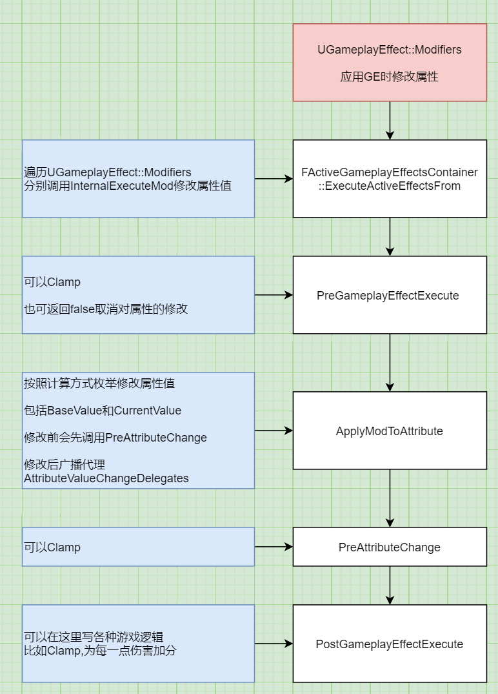

# GAS_04_GE_02_修改属性
## 目录
- [GAS_04_GE_02_修改属性](#gas_04_ge_02_修改属性)
    - [目录](#目录)
    - [简介](#简介)
    - [`InternalExecuteMod`,根据`UGameplayEffect::Modifiers`修改属性](#internalexecutemod根据ugameplayeffectmodifiers修改属性)
        - [`ApplyModToAttribute`按照计算方式枚举修改属性值](#applymodtoattribute按照计算方式枚举修改属性值)
            - [`SetAttributeBaseValue`修改属性的BaseValue,可能也修改CurrentValue](#setattributebasevalue修改属性的basevalue可能也修改currentvalue)
                - [`InternalUpdateNumericalAttribute`广播属性改变代理,设置CurrentValue](#internalupdatenumericalattribute广播属性改变代理设置currentvalue)
                    - [`SetNumericValueChecked`修改属性的CurrentValue](#setnumericvaluechecked修改属性的currentvalue)
    - [`UGameplayEffectExecutionCalculation::Execute`根据`UGameplayEffect::Executions`修改属性](#ugameplayeffectexecutioncalculationexecute根据ugameplayeffectexecutions修改属性)

## 简介
`InternalExecuteMod`,根据`UGameplayEffect::Modifiers`修改属性  

一些生命周期:  

+ `PreGameplayEffectExecute`: Clamp操作,也可返回false取消对属性的修改  
+ `PreAttributeBaseChange`: 没什么用  
+ `PreAttributeChange`: Clamp操作  
+ `PostGameplayEffectExecute`: 可以在这里写各种游戏逻辑,比如Clamp,为每一点伤害加分  



## `InternalExecuteMod`,根据`UGameplayEffect::Modifiers`修改属性
```
bool FActiveGameplayEffectsContainer::InternalExecuteMod(FGameplayEffectSpec& Spec, FGameplayModifierEvaluatedData& ModEvalData)
{
    // 返回是否执行
    bool bExecuted = false;

    FGameplayEffectModCallbackData ExecuteData(Spec, ModEvalData, *Owner);

    // 调用UAttributeSet::PreGameplayEffectExecute()
    // 这里应该做Clamp操作
    // 也可以通过返回false取消修改属性,则UAttributeSet::PostGameplayEffectExecute不会调用
    if (AttributeSet->PreGameplayEffectExecute(ExecuteData))
    {
        // 按照计算方式枚举修改属性值
        ApplyModToAttribute(ModEvalData.Attribute, ModEvalData.ModifierOp, ModEvalData.Magnitude, &ExecuteData);

        // 可以在这里写各种游戏逻辑,比如Clamp,为每一点伤害加分
        AttributeSet->PostGameplayEffectExecute(ExecuteData);
    }

    return bExecuted;
}
```

### `ApplyModToAttribute`按照计算方式枚举修改属性值
```
void FActiveGameplayEffectsContainer::ApplyModToAttribute(
    const FGameplayAttribute &Attribute, 
    TEnumAsByte<EGameplayModOp::Type> ModifierOp, 
    float ModifierMagnitude, 
    const FGameplayEffectModCallbackData* ModData)
{
    float CurrentBase = GetAttributeBaseValue(Attribute);
    
    // 对当前的BaseValue按照计算方式枚举,进行加减乘除
    float NewBase = FAggregator::StaticExecModOnBaseValue(CurrentBase, ModifierOp, ModifierMagnitude);

    SetAttributeBaseValue(Attribute, NewBase);
}
```

#### `SetAttributeBaseValue`修改属性的BaseValue,可能也修改CurrentValue
```
void FActiveGameplayEffectsContainer::SetAttributeBaseValue(FGameplayAttribute Attribute, float NewBaseValue)
{
    Set->PreAttributeBaseChange(Attribute, NewBaseValue);

    DataPtr->SetBaseValue(NewBaseValue);

    // AttributeAggregatorMap是属性捕捉有关的变量,之前没注意什么时候会删除元素
    FAggregatorRef* RefPtr = AttributeAggregatorMap.Find(Attribute);
    if (RefPtr)
    {
        // 注释中说dirty回调链会实际修改属性值,不理解什么意思
        // 猜测:最后还是会修改CurrentValue,AttributeAggregatorMap的作用是保存捕捉的属性
        //      避免在应用GE时属性值与捕捉时不同
        RefPtr->Get()->SetBaseValue(NewBaseValue);
    }
    else
    {
        // 广播属性改变代理,设置CurrentValue
        InternalUpdateNumericalAttribute(Attribute, NewBaseValue, nullptr);
    }
}
```

##### `InternalUpdateNumericalAttribute`广播属性改变代理,设置CurrentValue
```
void FActiveGameplayEffectsContainer::InternalUpdateNumericalAttribute(
    FGameplayAttribute Attribute, 
    float NewValue, 
    const FGameplayEffectModCallbackData* ModData, 
    bool bFromRecursiveCall)
{
    // 存储旧的CurrentValue
    float OldValue = Owner->GetNumericAttribute(Attribute);

    // 设置新的CurrentValue
    Owner->SetNumericAttribute_Internal(Attribute, NewValue);

    // 如果有监听此属性的更改,就广播
    if (FOnGameplayAttributeValueChange* NewDelegate = AttributeValueChangeDelegates.Find(Attribute))
    {
        FOnAttributeChangeData CallbackData;
        CallbackData.NewValue = NewValue;
        CallbackData.OldValue = OldValue;
        NewDelegate->Broadcast(CallbackData);
    }
}
```

###### `SetNumericValueChecked`修改属性的CurrentValue
```
void FGameplayAttribute::SetNumericValueChecked(float& NewValue, class UAttributeSet* Dest) const
{
    // 调用 UAttributeSet::PreAttributeChange(),可以在这里Clamp
    Dest->PreAttributeChange(*this, NewValue);
    DataPtr->SetCurrentValue(NewValue);
}
```

## `UGameplayEffectExecutionCalculation::Execute`根据`UGameplayEffect::Executions`修改属性