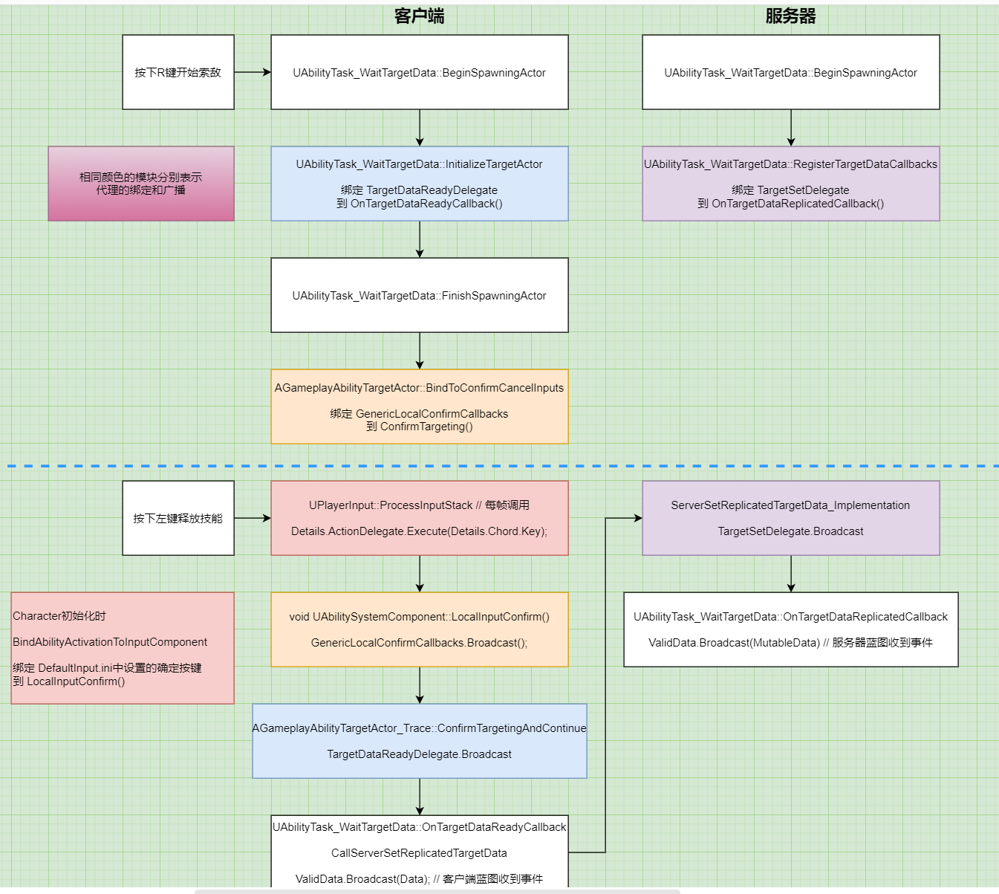

# GAS_05_TargetData
## 目录
- [GAS_05_TargetData](#gas_05_targetdata)
    - [目录](#目录)
    - [先锁定目标再释放技能的整体流程](#先锁定目标再释放技能的整体流程)
    - [监听确认键被按下](#监听确认键被按下)

## 先锁定目标再释放技能的整体流程
  

TargetData流程

进入技能节点`UAbilityTask_WaitTargetData`时,蓝图会自动调用`BeginSpawningActor`和`FinishSpawningActor`来创建`AGameplayAbilityTargetActor_Trace`  
AbilityTargetActor通过`FHitResult PerformTrace()`来获取技能目标(即TargetData)  

在按下确定键时,通过一系列的代理函数,客户端会广播TargetData,即蓝图节点执行ValidData  
同时通过RPC将TargetData传给服务器,然后服务器蓝图节点也执行ValidData  

## 监听确认键被按下
`Character`初始化时,将`DefaultInput.ini`中设置的确定按键绑定到`UAbilitySystemComponent::LocalInputConfirm()`  
游戏运行时,`UPlayerInput::ProcessInputStack`每帧调用,如果按下确定键,就会调用`LocalInputConfirm`  
