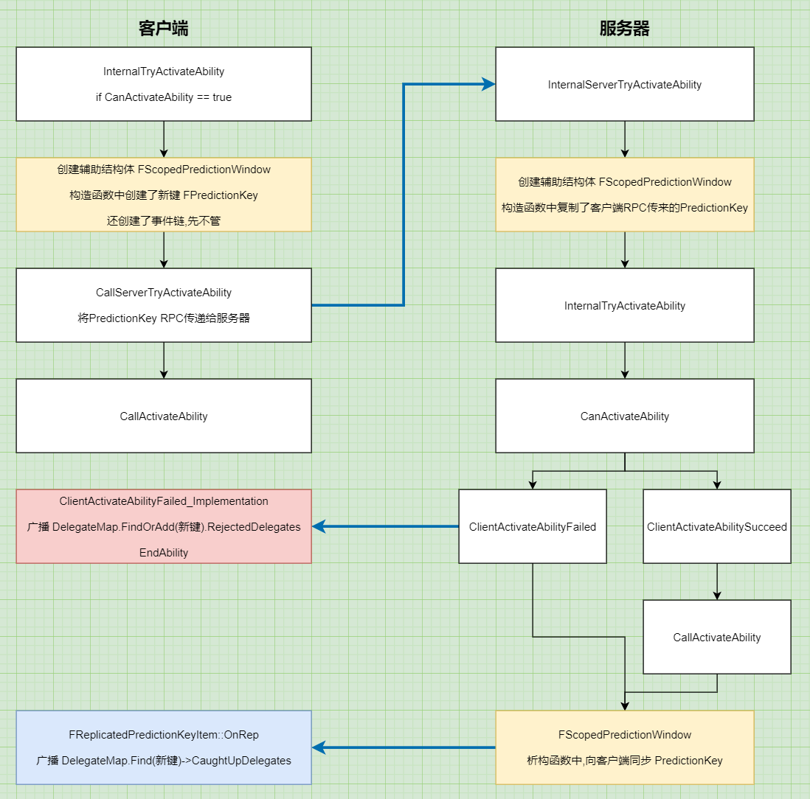

# GAS_06_Prediction
## 目录
- [GAS_06_Prediction](#gas_06_prediction)
	- [目录](#目录)
	- [预测机制简介](#预测机制简介)
	- [创建`FPredictionKey`](#创建fpredictionkey)
	- [服务器给客户端反馈GA是否激活成功](#服务器给客户端反馈ga是否激活成功)
	- [客户端创建预测的GE](#客户端创建预测的ge)
	- [收到服务器返回时,客户端如何处理预测的GE](#收到服务器返回时客户端如何处理预测的ge)
		- [如果激活失败](#如果激活失败)
		- [如果激活成功](#如果激活成功)
	- [预测蒙太奇](#预测蒙太奇)

## 预测机制简介
对于GA中应用的GE,客户端会直接创建一个预测版的GE的实例,而无需服务器先验证成功  
如果服务器验证失败,客户端删除预测版的GE实例  
如果服务器验证成功,客户端使用服务器同步过来的GE,删除预测的GE实例  

通过`FPredictionKey`来实现,里面包含一个整数(可以理解为版本号),GE激活时和这个Key绑定  
如果后面服务器验证失败,就通过这个Key找到对应的GE进行删除  

两个跟PredictionKey绑定的关键的代理:  
1. `RejectedDelegates`服务器验证失败时客户端广播  
2. `CaughtUpDelegates`服务器的PredictionKey同步给客户端时,客户端广播,即无论验证成功/失败都会广播  

  
<center>Prediction</center>

## 创建`FPredictionKey`
1. 客户端执行GA时,会创建辅助结构体`FScopedPredictionWindow`,在它的(客户端版本)构造函数中,为`int16 FPredictionKey::Current`赋了新值  
随后调用`CallServerTryActivateAbility`通过RPC将PredictionKey传给服务器  

2. 服务器收到客户端传来的PredictionKey时,也会创建辅助结构体`FScopedPredictionWindow`,在它的(服务器版本)构造函数中,复制客户端传来的值  

## 服务器给客户端反馈GA是否激活成功
1. 激活失败时,调用`ClientActivateAbilityFailed`,客户端会广播`FPredictionKeyDelegates::FDelegates::RejectedDelegates`,这个代理关联了当前的PredictionKey  

2. 无论激活成功或者失败,在`FScopedPredictionWindow`析构时,都会将当前的PredictionKey同步给客户端,客户端会调用`FReplicatedPredictionKeyItem::OnRep`  
函数中会广播`FPredictionKeyDelegates::FDelegates::CaughtUpDelegates`,这个代理同样关联了当前的PredictionKey  

## 客户端创建预测的GE
创建新的`FActiveGameplayEffect`时会传入PredictionKey,将GE与PredictionKey关联  
然后绑定RejectedDelegates/CaughtUpDelegates,即无论是服务器拒绝,或客户端捕捉到服务器的同步时,都会调用`RemoveActiveGameplayEffect_NoReturn`  

```
FActiveGameplayEffect* FActiveGameplayEffectsContainer::ApplyGameplayEffectSpec(const FGameplayEffectSpec& Spec, FPredictionKey& InPredictionKey, bool& bFoundExistingStackableGE)
{
    AppliedActiveGE = new(GameplayEffects_Internal) FActiveGameplayEffect(NewHandle, Spec, GetWorldTime(), GetServerWorldTime(), InPredictionKey);

    InPredictionKey.NewRejectOrCaughtUpDelegate(FPredictionKeyEvent::CreateUObject(Owner, &UAbilitySystemComponent::RemoveActiveGameplayEffect_NoReturn, AppliedActiveGE->Handle, -1));
}
```

## 收到服务器返回时,客户端如何处理预测的GE
### 如果激活失败
客户端广播RejectedDelegates,删除预测的GE  

### 如果激活成功
1. 先同步GE  
GAS中激活的GE存储在 `FActiveGameplayEffectsContainer UAbilitySystemComponent::ActiveGameplayEffects;`,会从服务器同步给客户端  
`FActiveGameplayEffectsContainer`里面保存激活的GE数组 `TArray<FActiveGameplayEffect>`  
当服务器验证成功时,GE同步到客户端,客户端会调用 `FActiveGameplayEffect::PostReplicatedAdd`  
此时客户端会为同步过来的GE再次执行功能,而客户端自己本身有一个预测的GE,短时间内会有2个相同的GE  

```
void FActiveGameplayEffect::PostReplicatedAdd(const struct FActiveGameplayEffectsContainer &InArray)
{
   	// 添加GE(修改Attribute,tag等)
    const_cast<FActiveGameplayEffectsContainer&>(InArray).InternalOnActiveGameplayEffectAdded(*this);
}
```

2. 再同步PredictionKey  
客户端广播CaughtUpDelegates,删除预测的GE  

## 预测蒙太奇
客户端播放蒙太奇时,将蒙太奇与PredictionKey绑定,服务器激活失败时,客户端广播RejectedDelegates取消播放  

```
float UAbilitySystemComponent::PlayMontage(UGameplayAbility* InAnimatingAbility, FGameplayAbilityActivationInfo ActivationInfo, UAnimMontage* NewAnimMontage, float InPlayRate, FName StartSectionName, float StartTimeSeconds)
{
	PredictionKey.NewRejectedDelegate().BindUObject(this, &UAbilitySystemComponent::OnPredictiveMontageRejected, NewAnimMontage);
}

void UAbilitySystemComponent::OnPredictiveMontageRejected(UAnimMontage* PredictiveMontage)
{
	AnimInstance->Montage_Stop(MONTAGE_PREDICTION_REJECT_FADETIME, PredictiveMontage);
}
```