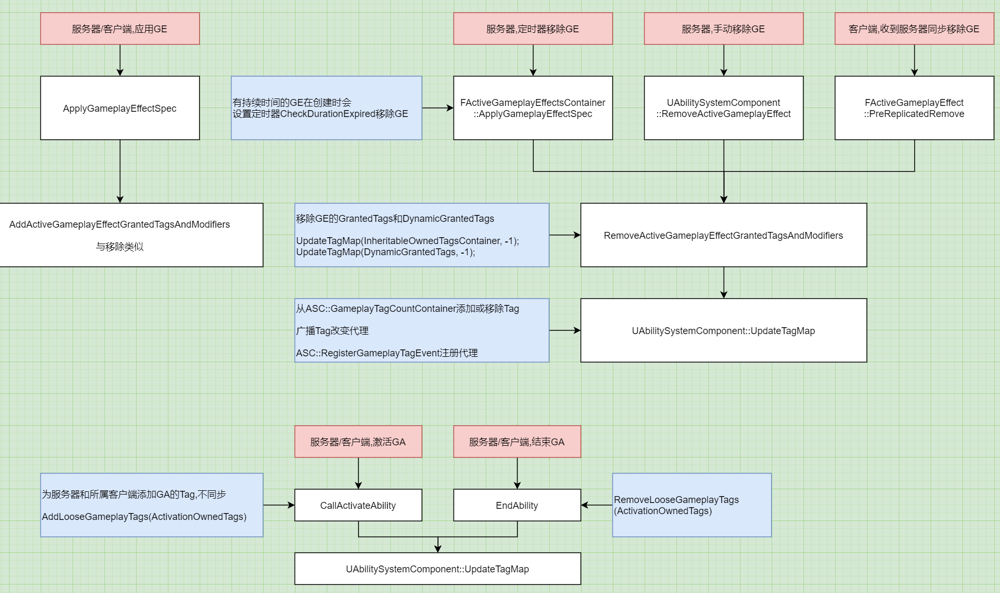

# GAS_07_GameplayTag
## 目录
- [GAS_07_GameplayTag](#gas_07_gameplaytag)
    - [目录](#目录)
    - [所有的Tag储存在`GameplayTagCountContainer`](#所有的tag储存在gameplaytagcountcontainer)
    - [Tag的添加和移除](#tag的添加和移除)

## 所有的Tag储存在`GameplayTagCountContainer`
`FGameplayTagCountContainer UAbilitySystemComponent::GameplayTagCountContainer`

```
FGameplayTagCountContainer
{
    // 记录拥有的Tag,每种Tag只会储存一个
    FGameplayTagContainer ExplicitTags;

    // 记录每种Tag有几个
    TMap<FGameplayTag, int32> ExplicitTagCountMap;
}
```

## Tag的添加和移除
1. 持续性GE添加的Tag  

添加Tag时,服务器和客户端都通过GE向`GameplayTagCountContainer`添加`FGameplayTagContainer UGameplayEffect::InheritableOwnedTagsContainer::CombinedTags`(即GrantedTags)  

移除Tag时,服务器通过移除GE移除Tag,客户端通过服务器同步过来的移除GE的流程内删除Tag  

2. GA添加的Tag  

服务器和客户端都通过AddLooseGameplayTags和RemoveLooseGameplayTags,分别在激活GA和结束GA时,添加或移除Tag  
只在服务器和所属客户端改变Tag,不同步  

  
<center>Tag的添加和移除</center>
