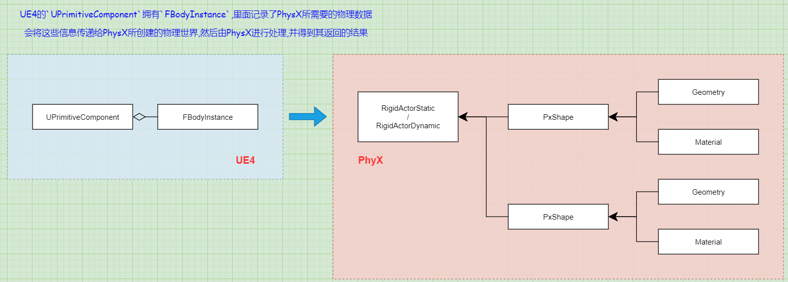

# UE4物理模块 01 概述与可视化调试
原文链接: https://zhuanlan.zhihu.com/p/60253281  
原文中有些到其他文章的链接,也值得看  

UE4采用NVIDIA的PhysX做为其默认的物理引擎,用于计算3D世界的碰撞查询与物理模拟  

## 什么是游戏中的物理系统
游戏物理主要解决两个逻辑  
+ 碰撞查询  
比如前面有一堵墙,还可以走多远就会被撞倒  

+ 物理模拟  
比如游戏死亡后身体如何倒下,飞驰的载具撞倒石头如何表现  

## UE4如何建立物理系统
UE4的`UPrimitiveComponent`拥有`FBodyInstance`,里面记录了PhysX所需要的物理数据  
会将这些信息传递给PhysX所创建的物理世界,然后由PhysX进行处理,并得到其返回的结果  

UE4交给PhysX创建物理  

## 如何Debug物理系统
控制台命令 `ShowCollision`  
PhyX,对于UE4来说就是一个提供输入然后获取输出的黑盒,可以通过NVIDIA提供的PhysX Visual Debugger(PVD)  
来进行可视化调试  
在编辑器里运行游戏,控制台命令pvd connect,在PVD软件窗口就会显示物理世界  

会看到一个巨大的黄球,在右侧setting里面把sleeping objects关掉,就是和游戏内场景差不多的物理世界  

每一个物理对象在PhyX里面都对应一个PxRigid,如果这个对象是静态的,则是RxRigidStatic,绘制成红色  
动态对象是PxRigidDynamic,绘制成黄色  

