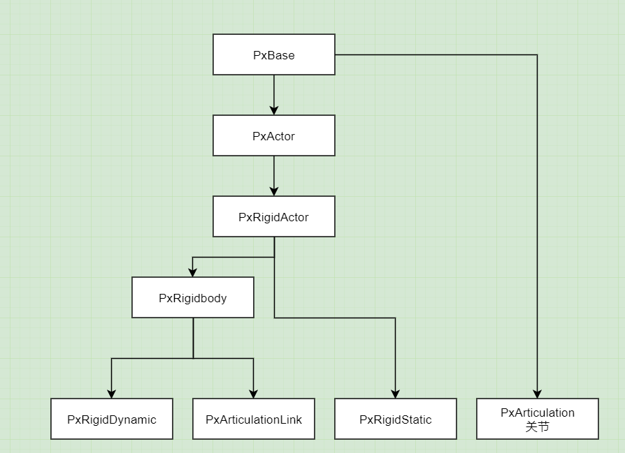

# UE4物理模块 04 PhysX多线程框架 01
## 基本组件
### `PxFoundation`
启动PhysX引擎的基础类,通过`PxCreateFoundation`创建  
```
// 官方示例
gFoundation = PxCreateFoundation(PX_FOUNDATION_VERSION, gAllocator, gErrorCallback);
```
PxFoundation建立后,可以用来连接PVD(PhysX debug工具),创建PxPhysics类  

### `PxPhysics`
用于创建PhysX各种使用组件,如场景,shape,rigidbody,布料,粒子系统等  
```
// 官方示例
PxCreatePhysics(PX_PHYSICS_VERSION, *gFoundation, PxTolerancesScale(), true, gPvd);
```

### `PxPvd`
PhysX的debug软件,UE4可以通过pvd connect命令连接,里面可以看到物理碰撞盒的真实运作情况,及性能消耗等数据  

### `PxScene`
物理场景,是碰撞盒组件的模拟环境,根据`PxSceneDesc`属性创建  
一个大型系统可以有多个场景,不同场景的组件互不影响  
```
// 官方示例
gScene = gPhysics->createScene(sceneDesc);
```

`PxSceneDesc`有如下属性:  
1. gravity 重力大小和方向  
2. PxSimulationEventCallback 模拟事件回调  
3. PxContactModifyCallback 碰撞解算修改回调  
4. PxCDDContactModifyCallback CCD(连续碰撞检测)的碰撞解算修改回调  
5. FilterShader 全局的碰撞分类处理函数  
6. CpuDispatcher Cpu线程分配器  

### `PxCooking`
碰撞盒需要有形状,物理引擎里碰撞盒有胶囊体,长方体,球体  
凸包体,复杂的静态地表碰撞盒,三角面构成的碰撞盒  
对于比较复杂的碰撞盒,PhysX支持使用PxCooking类接受面片数据,然后创建出可以使用的碰撞mesh  

PhysX碰撞盒的层级:  
碰撞mesh -> Shape(碰撞盒的基础单位) -> Rigidbody(  
实体,有多个碰撞盒组成,是场景内独立存在的,可以移动的基本单位)  



Actor作为Scene的基础实体,分为静态的和动态的,静态的有自带的预处理功能,性能高  
Articulation是专门给类似布娃娃这样的系统设计的  
Rididbody创建完成后,让Scene AddActor之后生效  

### `PxRigidDynamic`
基本接口:  
+ CreateShape,AttachShape,DeatchShape  
+ AddForce,AddTorque,SetLinearVelocity,SetAngularVelocity  

主要属性:  
LinearVelocity,AngularVelocity,Damping(阻力,分线性和旋转),Mass(质量)  
CMassLocalPose(重心),MassSpaceInertiaTensor(惯性系数)  
SleepThreshold,休眠阈值,PhysX里的Rigidbody是会休眠的,如果休眠则不参与碰撞运算  

kinematic(英文翻译运动学的),是rigidbody的特殊状态,即运动学状态(默认是动力学状态)  
kinemati型的rigidbody质量相当于无穷大,基本不受力的影响,也基本不参与碰撞解算流程,它的运动是直接设定位置的  
非kinematic型rigidbody运动是通过速度,或者力进行计算的,而且碰到东西穿插会进行复杂的碰撞解算  

kinematic由于不受力和碰撞的影响,所以比较适合随着动画运动的碰撞盒,或者由服务器同步运动的碰撞盒,中间不需要额外的计算干扰,比较省性能,也不会出现抖动  

```
// 官方示例
meshActor->setRigidDynamicFlag(PxRigidDynamicFlag::eKINEMATIC, true);
```

还可以把rigidbody设置成trigger,不碰撞,只参与触发  

### `PxShape`
主要属性:  
+ SimulationFilterData: 划分碰撞模拟类别,设定好SimulationFilterData,在场景的filterShader进行区分,可以控制那些碰撞shape之间是可以相互进行碰撞计算的  

+ userData: void类型的指针,可以存任何想要的数据  

+ localPose: 相对于rididbody的位置  

+ name: 名字  

+ flag: 在PxShapeFlag中,有是否在debug视图可见,是否参与simulate,是否参与query  
query是查询,如raycast,sweep;simulate是模拟,碰撞检测,碰撞回调,分离结算等  

+ material: 材质  

### `PxMaterial`
主要属性:  
DynamicFriction动摩擦,StaticFriction,restitution(英文释义归还,赔偿)弹性系数  
FrictionCombineMode摩擦力的计算方式,比如两个物体碰撞了,摩擦力双方不同,可以选择取最大的,最小的,或平均  
RestitutionCombineMode弹力计算模式,flag,是否参与摩擦力计算,是否避免摩擦力过大的情况  

不同版本的PhysX代码差异很大,根据使用的版本看代码  

## PhysX运行流程
根据PhysX官方示例Snippets(里面有很多简单的demo),在启动时创建PxFoundation,场景,根渲染模块一起创建  
然后渲染每帧tick,PhysX把时间记下,定时调用stepPhysics,更新物理tick  

物理tick更新接口:  
1. `gScene->simulate(timestep)` // 物理模拟计算  
2. `gscene->fetchResults(true)` // 把引擎模拟结果和程序员调用的api相结合,得到一帧最终的数据  

物理tick顺序是固定的,先simulate,再fetchResults,中间采取双缓冲策略,其他物理实体操作只能和这两个接口串行,不能并行操作,如果是多线程的话,必须加锁PxSceneWriteLock  

在Unity中,PhysX的调用位置在FixedUpdate上,物理tick和渲染tick不同,物理tick是定时的,渲染tick由于帧率不稳定的影响,每帧的时间是不一样的,所以在进入脚本tick之前,根据之前渲染的时间,算出这次物理tick需要多长时间,运行0-n次,然后进入引擎的其他操作阶段  
先运行脚本里面的FixedUpdate(客户端根据需求操作完碰撞实体),然后运行simulate,fetchResult  
所有物理步骤走完,物理场景里的碰撞盒位置都确定下来,就可以改变相应的模型位置,给渲染线程输入数据,等待渲染结果,一个渲染帧走完  

手机平台,在渲染帧数比较高的情况,物理tick走0-1帧,但是如果帧数比较低,物理在每个渲染帧会运行>1次,帧数越低,运行次数越高,这就是追帧现象,会加剧卡顿  

## PhysX的双缓存机制


simulate负责每个物理帧模拟计算,具体的步骤如粗测broad phase -> 细测 narrow phase -> 碰撞解算 solver stage  
fetchResult是结合simulate的数据buffer和用户更改后得到的数据buffer,得到最终的物理模拟数据  

阶段1,物理引擎本身的模拟并没有运行,程序员可以调用physx的api做各种操作,更改碰撞实体的位置,加力,增加减少实体  
在调用simulate的时候,之前处理后的数据结果被保存到一个buffer里,提交引擎进行模拟计算,这是第一个buffer  

阶段2,simulate接口调用完毕后,已经把数据提交物理线程处理(其他的线程,非主线程)  
这里会有2个buffer同时存在,引擎模拟计算的时候会独立使用它的buffer数据  
这时如果程序员在主线程调用api更改碰撞实体,这个api调用是有效的,但是更改的是主线程存在的数据buffer  
两者互不干扰,程序员在这个阶段调用的api能马上获得结果,和阶段1没有区别,但是相应的api更改对引擎可见,还需要fetchResult后,下一次调用simulate才管用  

在fetchResult时,程序在api调用的改动结果会覆盖引擎模拟的结果,以这样的规定合并buffer  

## PhysX的多线程任务分配方案
启动时会定义好`CpsDispatcher`和`TaskManager`,然后产生几个常驻的物理线程  
当有新的任务产生的时候,会采用引用计数的方式建立不同任务的依赖,根据顺序运行  

比如两个任务A,B,A在B完成后继续B->A  
B要开始时,它的引用(我理解成执行此任务时,还有几个前置任务没有执行)就是0,A就是1  
当B结束,A的引用-1  
引用减到0的任务会被TaskManager丢给CpuDispatcher,由CpuDispatcher决定放到哪个物理线程运行  

举个例子,一帧内大量使用raycast  
可以使用多线程的方式优化系统,simulate和fetchResult要和raycast整个过程保持串行的状态  
可以再建立一个wait的任务,等待所有raycast完成,wait走完了,再开始simulate  

+ 核心类  
### `PxCpuDispatcher`
所有CpuDispatcher的基类,默认DefaultCpuDispatcher  
对PhysX暴露两个接口  
```
virtual void submitTask(PxBaseTask& task) = 0; // 提交task

virtual uint32_t getWorkerCount() const = 0; // 得到当前的线程数
```

### `DefaultCpuDispatcher`
默认的PxCpuDispatcher,需要传入参数定义线程数  
```
// 构造函数创建线程
if (mWorkerThreads)
{
    for(PxU32 i = 0; i < numThreads; ++i)
    {
        PX_PLACEMENT_NEW(mWorkerThreads+i, CpuWorkerThread)();
        mWorkerThreads[i].initialize(this); 
    }
    for(PxU32 i = 0; i < numThreads; ++i)
    {
        mWorkerThreads[i].start(Ps::Thread::getDefaultStackSize()); //start正式开始
    }
}

// 如果线程数为0,就直接运行任务,如果有线程,就扔到线程队列里去
void Ext::DefaultCpuDispatcher::submitTask(PxBaseTask& task)
{
    if(!mNumThreads)
    {
        runTask(task);
        task.release();
        return;
    }

    const Ps::Thread::Id currentThread = Ps::Thread::getId();
    for(PxU32 i = 0; i < mNumThreads; ++i)
    {
        // 当submit执行位置的线程和目标线程一致的时候,放目标线程任务队列里去
        // 如果都不一致,就失败(比如主线程运行submit)
        if(mWorkerThreads[i].tryAcceptJobToLocalQueue(task, currentThread))
            return mWorkReady.set();
    }

    // 前面没有认领的话,就扔到全局的线程队列中,等待其他线程调用
    SharedQueueEntry* entry = mQueueEntryPool.getEntry(&task);
    if (entry)
    {
        mJobList.push(*entry);
        mWorkReady.set();
    }
}

// 这个是在线程的excute中调用的,当物理线程手上的线程队列为空的时候,就会从全局队列拿
// 如果全局队列也是空的,就会调用stealJob,从其他线程的任务队列拿
PxBaseTask* Ext::DefaultCpuDispatcher::fetchNextTask()
{
    PxBaseTask* task = getJob();

    if(!task)
        task = stealJob();

    return task;
}
```
