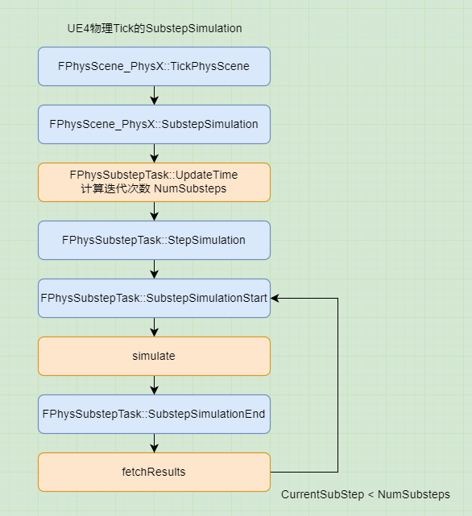

# UE4物理模块 09 PhysX在UE4上的Tick 02
## UE4的DeltaTime分为两部分
+ 标准 simulate  
+ SubstepSimulate  

+ `FPhysScene_PhysX::TickPhysScene` 计算物理帧时间  
```
// 将物理引擎场景的tick暴露在引擎外
void FPhysScene_PhysX::TickPhysScene(FGraphEventRef& InOutCompletionEvent)
{
    // float FPhysScene_PhysX::DeltaSeconds // UWorld的dt,即渲染帧时间
    // float FPhysScene_PhysX::MaxPhysicsDeltaTime // WorldSettings的dt

    // 向下钳制,当模拟物理的速度比实时慢时发生
    // 可以极大的提升帧率(实际上,它与降低所有的速度和增大所有的时间步长是一样的)
    // 但是同时,它会扰乱网络(客户端和服务器会偏离更多)

    float UseDelta = FMath::Min(DeltaSeconds, MaxPhysicsDeltaTime);

    // 根据物理场景的设置为帧时间加权
    AveragedFrameTime *= FrameTimeSmoothingFactor;
    AveragedFrameTime += (1.0f - FrameTimeSmoothingFactor)*UseDelta;
}
```

这么做的结果是,假如MaxPhysicsDeltaTime设置了30帧  
每次渲染tick被保证有且只有一次物理tick  
如果渲染帧高于30帧,将渲染帧作为物理的dt,不同端模拟出的物理效果相同  
如果渲染帧低于30帧,将MaxPhysicsDeltaTime作为物理dt,碰撞盒速度会明显变慢  

我的理解是:  
每次渲染tick被保证有且只有一次物理tick,这个是引擎机制,类似调用一次渲染tick时,会调用一次物理Tick  
限制物理的是MaxPhysicsDeltaTime,就是说一个物理帧的时间最长就是这么多  
当渲染帧很高时,物理帧采用渲染时间,满足需求  
当渲染帧很低时,物理帧采用物理时间,这样,较长的渲染时间a只能对应较短的物理时间b,所以会卡顿  

为了将没有物理计算的时间a-b利用起来,UE4采用substep模式,这个算法是physx自带的  
可以在渲染帧数较低时,通过substep多次tick物理世界,从而达到追帧的目的  

## SubstepSimulation


```
// 将物理引擎场景的tick暴露在引擎外
void FPhysScene_PhysX::TickPhysScene(FGraphEventRef& InOutCompletionEvent)
{
    if(IsSubstepping())
    {
        // 要开始step了所以交换缓存
        // FPhysSubstepTask * FPhysScene_PhysX::PhysSubStepper;
        PhysSubStepper->SwapBuffers();  
    }

    if(IsSubstepping())
    {
        // substep的入口
        bTaskOutstanding = SubstepSimulation(InOutCompletionEvent);
    }
}
```

+ FPhysScene_PhysX::SubstepSimulation  
```
bool FPhysScene_PhysX::SubstepSimulation(FGraphEventRef &InOutCompletionEvent)
{
    float UseDelta = DeltaSeconds;
    // 计算substep迭代次数
    float SubTime = PhysSubStepper->UpdateTime(UseDelta);

    // 我们有有效的场景和subtime来将任务入队
    PhysXCompletionTask* Task = new PhysXCompletionTask(InOutCompletionEvent, PScene->getTaskManager(), &SimScratchBuffer);

    // 先决条件是NULL,直接执行StepSimulation
    FSimpleDelegateGraphTask::CreateAndDispatchWhenReady(
			FSimpleDelegateGraphTask::FDelegate::CreateRaw(
                PhysSubStepper,  // UserClass* InUserObject
                &FPhysSubstepTask::StepSimulation, // TMemFunPtrType<> InFunc 
                Task), // VarTypes... Vars
			GET_STATID(STAT_FSimpleDelegateGraphTask_SubstepSimulationImp), 
            NULL, 
            NamedThread
		);
}
```

### FPhysSubstepTask::UpdateTime 计算迭代次数  
```
// UseDelta: 渲染帧时间
float FPhysSubstepTask::UpdateTime(float UseDelta)
{
	float FrameRate = 1.f;
	uint32 MaxSubSteps = 1;

	UPhysicsSettings * PhysSetting = UPhysicsSettings::Get();
	FrameRate = PhysSetting->MaxSubstepDeltaTime; // 物理设置中,物理帧最大时间
	MaxSubSteps = PhysSetting->MaxSubsteps; // 物理设置中,最多有多少物理帧
	
	float FrameRateInv = 1.f / FrameRate;

	DeltaSeconds = FMath::Min(UseDelta, MaxSubSteps * FrameRate);
    // 计算物理帧的迭代次数NumSubsteps
	NumSubsteps = FMath::CeilToInt(DeltaSeconds * FrameRateInv);
	NumSubsteps = FMath::Max(NumSubsteps > MaxSubSteps ? MaxSubSteps : NumSubsteps, (uint32) 1);
	SubTime = DeltaSeconds / NumSubsteps;

	return SubTime;
}
```
计算逻辑: 假设物理设定为30帧,最大迭代3次,则MaxSubstepDeltaTime=1/30,MaxSubsteps=3  
如果渲染帧率>30,则NumSubsteps=1,物理tick时间和渲染帧时间相同  
如果10<渲染帧率<30,则NumSubsteps=30/渲染帧数,向上取整  
如果渲染帧率<10,则NumSubsteps=3  

+ CreateRaw  

静态模板函数,创建一个原生C++指针成员函数代理  

+ CreateAndDispatchWhenReady  

创建一个任务,并且当先决条件完成时分配它  
```
static FGraphEventRef CreateAndDispatchWhenReady(
    const FDelegate& InTaskDeletegate, 
    const TStatId InStatId, 
    const FGraphEventArray* InPrerequisites = NULL, 
    ENamedThreads::Type InDesiredThread = ENamedThreads::AnyThread)
```

+ FPhysSubstepTask::StepSimulation  
```
void FPhysSubstepTask::StepSimulation(PhysXCompletionTask * Task)
{
	FullSimulationTask = Task;
	Alpha = 0.f; // substep总计时间占渲染帧时间的比例
	StepScale = SubTime / DeltaSeconds; // 一次substep的时间占渲染帧时间比例
	TotalSubTime = 0.f; // substep总计时长
	CurrentSubStep = 0; // substep计数

	SubstepSimulationStart();
}
```

### FPhysSubstepTask::SubstepSimulationStart  

主要运行simulate,在simulate里,会传入SubstepTask,在simulate结束后,才会回调SubstepTask  
然后回调CompletionEvent,即SubstepSimulationEnd的先决条件  
这样保证先simulate,然后运行SubstepSimulationEnd里面的fetchResult,完成一次完整的物理tick  

在进入SubstepSimulationEnd后,运行fetchResult,如果substep计数没达到指定值时  
就重新进入SubstepSimulationStart,否则退出,如此循环tick  

```
void FPhysSubstepTask::SubstepSimulationStart()
{
    // SubstepSimulationEnd的先决条件
    CompletionEvent = FGraphEvent::CreateGraphEvent();

    PhysXCompletionTask* SubstepTask = new PhysXCompletionTask(CompletionEvent,PAScene->getTaskManager());

    // CompletionEvent 完成后调用 SubstepSimulationEnd
    FDelegateGraphTask::CreateAndDispatchWhenReady(
		FDelegateGraphTask::FDelegate::CreateRaw(
            this, &FPhysSubstepTask::SubstepSimulationEnd),
		GET_STATID(STAT_FDelegateGraphTask_ProcessPhysSubstepSimulation), 
        CompletionEvent, 
        ENamedThreads::GameThread, 
        NamedThread);

    ++CurrentSubStep;

    bool bLastSubstep = CurrentSubStep >= NumSubsteps;

    if (!bLastSubstep)
	{
		Alpha += StepScale;
		TotalSubTime += SubTime;
	}

    // 实际物理帧的时间,如果不是最后一帧,就是上面计算的SubTime
    // 如果是最后一帧,为了满足总的物理帧时间与渲染帧时间相同
    // 最后一个物理帧的实际时间会<=SubTime
    // 就是渲染帧时间减去已经走过的物理帧时间
    float DeltaTime = bLastSubstep ? (DeltaSeconds - TotalSubTime) : SubTime;
    // 实际这一物理帧,渲染帧占比
    float Interpolation = bLastSubstep ? 1.f : Alpha;

    // 遍历PhysTargetBuffers,对里面的RigidBody施加各种作用力
    SubstepInterpolation(Interpolation, DeltaTime);

    PAScene->simulate(
        DeltaTime, 
        SubstepTask, 
        FullSimulationTask->GetScratchBufferData(), 
        FullSimulationTask->GetScratchBufferSize());

    // 我的理解: 执行 SubstepTask,里面关联了 SubstepSimulationEnd 的先决条件
    // CompletionEvent,进而执行 SubstepSimulationEnd
    SubstepTask->removeReference();
}
```

+ simulate  
开始模拟APEX和PhysX场景,开始模拟关联这个Scene的actors和PxScene  
对 simulate() 的调用,应该与对 fetchResults() 的调用保持1:1  
completionTask: 如果非空,此任务的引用计数会在 simulate() 中递增  
然后在scene准备调用 fetchResults 时递减  
所以这个任务不会运行,直到这个应用在调用 simulate 后,也调用 removeReference  
```
virtual void simulate(
    float elapsedTime, 
    bool finalStep = true, 
    PxBaseTask *completionTask = NULL,
    void* scratchMemBlock = 0, 
    uint32_t scratchMemBlockSize = 0) = 0;
```

+ FPhysSubstepTask::SubstepSimulationEnd  
```
void FPhysSubstepTask::SubstepSimulationEnd(ENamedThreads::Type CurrentThread, const FGraphEventRef& MyCompletionGraphEvent)
{
    if (CurrentSubStep < NumSubsteps)
    {
        // 因为这是中间步骤,所以不重新构建场景查询
        PScene->setSceneQueryUpdateMode(PxSceneQueryUpdateMode::eBUILD_DISABLED_COMMIT_DISABLED);

        PAScene->fetchResults(true, &OutErrorCode);

        // 重启查询更新,下一次fetchResults会重建SQ树
        PScene->setSceneQueryUpdateMode(PxSceneQueryUpdateMode::eBUILD_ENABLED_COMMIT_ENABLED);

        SubstepSimulationStart();
    }
    else
    {
        // 最后一步,在游戏线程上调用fetch
        // 猜测这里面会调用 fetchResults
        FullSimulationTask->removeReference();
    }
}
```

在substep过程中,我们不会在这个迭代tick中间进行query操作,如raycast或sweep  
只会在query之前或之后query,在fetchResults过程中,physx会重新构建AABB树  
为了提高性能,UE在中间的fetchResults前禁止构建AABB,只在最后一个fetchResults里做  

+ FPhysSubstepTask::SubstepInterpolation  

// 在物理线程和游戏线程之间双缓存,在每次SubstepSimulation之前SwapBuffers  
PhysTargetMap FPhysSubstepTask::PhysTargetBuffers[2]  

遍历PhysTargetBuffers,对里面的RigidBody施加各种作用力  
如冲力,扭矩,径向力等  
并在渲染帧的最后一个substep,清空buffer  

这样做的原因:  
举个例子,物理帧30,渲染帧10,如果在一个渲染帧受到了冲力,并且开启substep  
物理帧有两种情况: 1.每次substep tick时不断设定冲力,dt=0.1s  
2.只在第一帧设置冲力,dt=0.03  

UE在PhysTargetBuffers中加入了这个操作的参数  

```
void FPhysScene_PhysX::AddForce_AssumesLocked(FBodyInstance* BodyInstance, 
    const FVector& Force, 
    bool bAllowSubstepping, // 程序员自己选择
    bool bAccelChange)
{
    if (bAllowSubstepping && IsSubstepping())
    {
        PhysSubStepper->AddForce_AssumesLocked(BodyInstance, Force, bAccelChange);
    }
    else
    {
        PRigidBody->addForce(U2PVector(Force), 
            bAccelChange ? PxForceMode::eACCELERATION : PxForceMode::eFORCE, 
            true);
    }
}
```

另外对于kinematic,如果渲染帧时间较长,substep中逐帧lerp效果比一帧突变更好  
