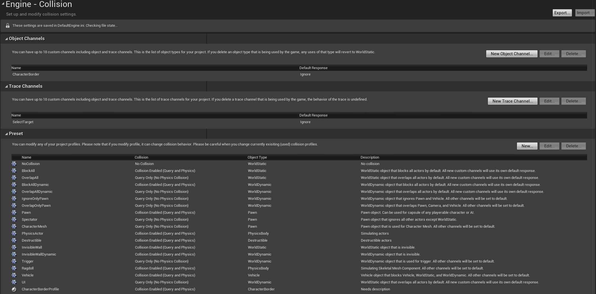

# Collision_02_碰撞通道
## 目录
- [Collision_02_碰撞通道](#collision_02_碰撞通道)
    - [目录](#目录)
    - [区分三种枚举: ECollisionChannel, EObjectTypeQuery, ETraceTypeQuery](#区分三种枚举-ecollisionchannel-eobjecttypequery-etracetypequery)
        - [转换函数](#转换函数)
    - [配置文件](#配置文件)
    - [`UCollisionProfile`用于加载碰撞配置](#ucollisionprofile用于加载碰撞配置)
    - [`UCollisionProfile::LoadProfileConfig`加载碰撞配置](#ucollisionprofileloadprofileconfig加载碰撞配置)
    - [`UCollisionProfile::FillProfileData`更新碰撞预设](#ucollisionprofilefillprofiledata更新碰撞预设)
    - [碰撞通道的响应](#碰撞通道的响应)

## 区分三种枚举: ECollisionChannel, EObjectTypeQuery, ETraceTypeQuery
ECollisionChannel代表碰撞通道,包括Object Channel和Trace Channel  
包括ECC_WorldStatic等内置通道,引擎预留通道,和自定义通道  
自定义通道从ECC_GameTraceChannel1开始,每当在项目设置中添加一个Object Channel或Trace Channel时  
引擎就会自动分配一个没用过的自定义通道,并通过一个布尔值区分是Object Channel还是Trace Channel  

引擎开启时,会加载配置文件,将Object Channel和Trace Channel加以区分(其实他们都是ECollisionChannel)  
并分别加入`TArray<ECollisionChannel> ObjectTypeMapping;`, `TArray<ECollisionChannel> TraceTypeMapping;`  

ETraceTypeQuery其实是一个Trace Channel(本质是ECollisionChannel)在TraceTypeMapping中的索引,强转成枚举类型  
EObjectTypeQuery同理  

### 转换函数
`UEngineTypes`提供了一些静态函数,对`ECollisionChannel`, `ETraceTypeQuery`, `EObjectTypeQuery`进行互相转化  

```
ETraceTypeQuery UEngineTypes::ConvertToTraceType(ECollisionChannel CollisionChannel)
```

## 配置文件
  

每当在编辑器中新建一个自定义的碰撞通道Object Channels或Trace Channels  
都会在配置文件DefaultEngine.ini中,向配置变量DefaultChannelResponses加入一个结构体  
这个结构体会自动分配一个ECollisionChannel枚举,从ECC_GameTraceChannel1开始  
通过bTraceType来区分是Object Channel还是Trace Channel  

新建一个碰撞预设(Preset)时,会在ini中,向配置变量Profiles加入一个结构体  

## `UCollisionProfile`用于加载碰撞配置

CollisionProfile是一个单例,用于在引擎预初始化时,从`DefaultEngine.ini`中加载碰撞配置  
2个主要的config变量:  
1. DefaultChannelResponses  
   自定义的碰撞通道,包括Trace Channel和Object Channel,用变量bTraceType进行区分  

2. Profiles  
   碰撞预设,包括引擎内置的和自定义的  

## `UCollisionProfile::LoadProfileConfig`加载碰撞配置
函数主要从ini中读取碰撞配置,然后填充下列数据  

```
// 储存所有ECollisionChannel的显示名
TArray<FName> ChannelDisplayNames;

// 储存ECollisionChannel中,作为TraceType的通道
TArray<ECollisionChannel> TraceTypeMapping;

// 储存ECollisionChannel中,作为ObjectType的通道
TArray<ECollisionChannel> ObjectTypeMapping;
```

1. 遍历ECollisionChannel  
   将每一个枚举名(枚举转字符串,通过反射实现)加入ChannelDisplayNames  
   将引擎内置的ECC_Visibility, ECC_Camera加入TraceTypeMapping  
   将引擎内置的ECC_WorldStatic, ... ECC_Destructible加入ObjectTypeMapping  

2. 遍历ini中自定义的碰撞通道DefaultChannelResponses  
   将ChannelDisplayNames更新为自定义的通道名字  
   根据bTraceType,加入TraceTypeMapping或ObjectTypeMapping  

3. 调用FillProfileData(),更新碰撞预设  

## `UCollisionProfile::FillProfileData`更新碰撞预设
读取ini,Profiles数组对应碰撞预设,包括引擎内置的和自定义的  

函数遍历所有预设,设置下面变量:  
预设的碰撞通道: ECollisionChannel ObjectType  
预设对所有通道的响应: FCollisionResponseContainer ResponseToChannels  

## 碰撞通道的响应
```
// 储存了对每一个ECollisionChannel的ECollisionResponse
uint8 FCollisionResponseContainer::EnumArray[32];
```
