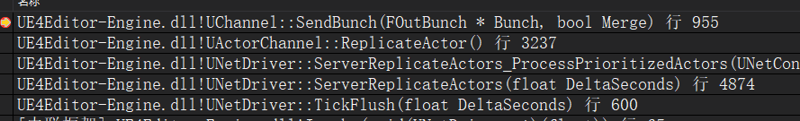
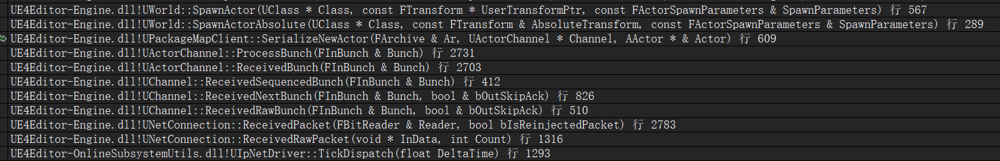

# UE4网络同步 05 Actor同步
NetDriver负责整个网络的驱动,ActorChannel是专门用于Actor同步的通信通道  

## 服务器同步Actor到客户端
`UNetDriver::TickFlush`,每帧执行`ServerReplicateActors`来同步Actor的相关内容  
这里需要:  
1. 获取所有连接到服务器的ClientConnection,先获取引擎每帧可以同步的最大Connection数量,超过的忽略  
然后对每个Connection进行下面所有的操作  

2. 找到要同步的Actor,只有被放到`TSharedPtr<FNetworkObjectList> UNetDriver::NetworkObjects`里面的Actor才会被考虑  
Actor在Spawn时就会添加到这个列表里面  

3. 找到客户端玩家控制的角色ViewTarget(即Character,与摄像机绑定在一起),这个角色的位置决定其他Actor是否同步  

4. 验证Actor,对于要销毁的,以及Role==ROLE_None的Actor不会同步  

5. 是否到达Actor同步时间,Actor的同步是有一定频率的`NetUpdateFrequency`  
如果没有到达这个时间就会放弃本次同步  

6. 将Actor放入临时变量`TArray<FNetworkObjectInfo*> ConsiderList`里面  
遍历时如果Actor::bOnlyRelevantToOwner,对于没被拥有的Connection,如果有Channel,则关闭  

7. 休眠状态的Actor不同步,对于要进入休眠状态的Actor也要特殊处理关闭同步通道  

8. 检查Actor是否有Channel,如果没有,还要看Actor是否已经加在了场景,没有加载就跳过同步  

9. 接8,如果没有Channel,调用Actor->IsNetRelevantFor判断是否网络相关,对于不可见的或太远的Actor返回false,不会同步  

10. Actor同步的数量可能非常大,所以进行优先级排列  

11. 排序后,如果连接没有加载此Actor所在的关卡,则关闭通道(如果存在)  
并继续每秒调用Actor->IsNetRelevantFor确定Actor是否与连接相关,如果不相关时间到达5秒,关闭通道  

如果要同步的Actor没有ActorChannel就创建一个并绑定Actor,执行同步并更新NextUpdateTime  

12. 调用`UActorChannel::ReplicateActor`执行真正的Actor同步,及内部数据的同步  
```
// 将Actor,Actor子对象及其属性序列化
Connection->PackageMap->SerializeNewActor(Bunch, this, Actor);

// 封装到Bunch并发送给客户端
bool WroteSomething = ObjectReplicator.Get().ReplicateProperties(Bunch, RepFlags);
```

服务器同步Actor发送Bunch堆栈


## 客户端接收并序列化同步过来的Actor
首先`UIpNetDriver::TickDispatch`检测服务器的消息,收到消息后  
通过Connection和Channel进行解析,进一步在`UActorChannel::ProcessBunch`解析出完整的数据  
在这个函数里面  
1. 如果`AActor* UActorChannel::Actor`为空,则序列化当前的Bunch  
`Connection->PackageMap->SerializeNewActor(Bunch, this, NewChannelActor);`  
解析出Actor的内容并执行PostInitializeComponents  
```
void UActorChannel::ProcessBunch( FInBunch & Bunch )
{
    if( Actor == NULL )
    {
      	AActor* NewChannelActor = NULL;
		bSpawnedNewActor = Connection->PackageMap->SerializeNewActor(Bunch, this, NewChannelActor);

        SetChannelActor(NewChannelActor, Flags);
    }

    Actor->PostNetInit();
}
```
2. 之后根据Bunch信息找到同步过来的属性值,并对当前Actor的对应属性进行赋值  
3. 最后执行`AActor::PostNetInit`  

客户端接收并序列化同步的Actor堆栈


## 组件(子对象)同步
当一个Actor进行同步时会判断所有的子对象是否标记了Replicate,如果标记了,就对其以及其属性进行同步  
子对象借助ActorChannel创建FObjectReplicator  

客户端接收服务器同步过来的子对象的逻辑:  
ActorChannel杰斯Bunch信息时,对该数据流进行Actor的反序列化  
之后判断Bunch里面是否存在其子对象,如果存在会进一步子对象同步过来的属性值  
如果没有子对象,就读取自身同步过来的属性  

+ 对于静态组件:  
C++构造函数里面创建的默认组件或在蓝图里面添加的组件  
如果一个Actor被标记为同步,静态组件就会随Actor一起发送到客户端  
这个过程与该组件是否标记为Replicate是没有关系的  
如果不想同步组件的属性,就不设置Replicate  

+ 对于动态组件:  
游戏运行时,服务器创建或删除的组件  
需要设置它的Replicate为true,`UActorComponent::SetIsReplicated`  

## 属性同步细节
### 1.属性同步概述
基本思路: 获取当前同步对象的空间大小,然后保存到一个buffer  
然后根据属性的Offset给每个需要同步的属性初始化  
这样就保存了一份简单的copy用于之后的比较,这么做的前提是反射系统  

给一个Actor类的属性标记Replicated,UClass会将所有要同步的属性保存到`TArray<FRepRecord> ClassReps;`  
这样就可以通过这个Actor的UClass获取这个Actor上所有要同步的属性  
当这个Actor实例化一个可以同步的对象,并开始创建对应的同步通道时,就需要准备属性同步了  

+ 属性同步关键的4个类:  
1. 需要一个同步属性列表来记录当前这个类有哪些属性要同步`FRepLayout`  
每个类有一个,从UClass里面初始化  

2. 针对每一个对象保存一个缓存数据,来及时的与发生改变的Actor作比较,从而判断与上一次同步前是否发生变化  
`FRepState`里面有一个`FRepStateStaticBuffer`来保存  

3. 一个属性变化跟踪器,记录所有发生改变同步属性的序号  
`FRepChangedPropertyTracker`,对各个Connection可见,被各个Connection的RepState保存一个共享指针  
新版本被`FRepChangelistState`替代  

4. 针对每个连接的每个对象有一个控制前面这些数据的执行者`FObjectReplicator`  

### 2.重要数据的初始化流程
具体流程见UML图,UE4网络同步  

每个`UActorChannel`在创建的时候,会创建一个`FObjectReplicator`用来处理所有的属性同步相关的操作  
(这里没搞清FObjectReplicator是单例还是每个Channel都有一个实例)  

同时把当前通道的Actor的同步属性记录在FRepLayout::Parents数组里  
Parents记录了每个属性的FProperty,复制条件,在Object里面的偏移等  

同时把这个F`RepLayout`存到`FRepState`里面(这里只看到friend FRepLayout,没看到变量)  
该FRepState指针也会被存到FObjectReplicator里面  
FRepState会申请一个缓存空间,用来存放当前的Object对象,用于客户端比较  
不是完整对象,只包含同步属性,单占用的空间大小是一样的  

FObjectReplicator还会保存一个指向`FReplicationChangelistMgr`的指针  
里面的FRepChangelistState也申请一个缓存空间StaticBuffer用来存放当前的Object,用于服务器比较  
同时还有一个ChangeHistory保存属性变化历史记录  

`FRepChangedPropertyTracker`在创建FRepState时也会被创建,FRepState里面保存指向他的指针  
通过FRepLayout::Parents的数量来初始化它的记录表的大小  
主要记录对应的位置是否是条件复制属性  

```
void UActorChannel::SetChannelActor(AActor* InActor, ESetChannelActorFlags Flags)
{
    // 设置这个channel负责的Actor
    // AActor* UActorChannel::Actor;
    Actor = InActor;

    if (Actor)
    {
        // 查找或创建Replicator
        // TSharedPtr<FObjectReplicator> UActorChannel::ActorReplicator;
        // 在下面map中查找
        // TMap< UObject*, TSharedRef< FObjectReplicator > > UActorChannel::ReplicationMap
        ActorReplicator = FindOrCreateReplicator(Actor);
    }
}
```
