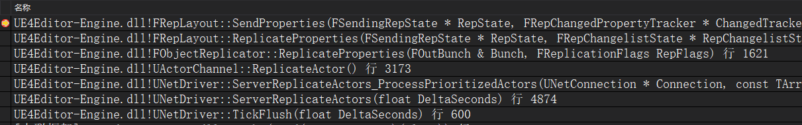
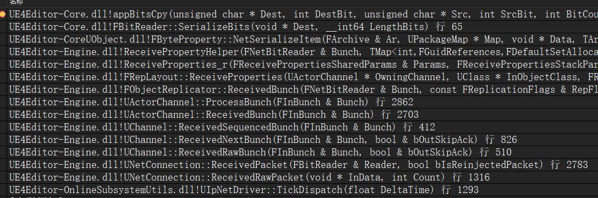

# UE4网络同步 06 Actor属性同步
## 3.发送同步数据流程
服务器发送属性堆栈  


客户端接收属性堆栈  



属性同步是通过FObjectReplicator::ReplicateProperties执行,进一步执行FRepLayout::ReplicateProperties  

在设置通道Actor时,给FObjectReplicator设置了一个Object指针,保存当前的同步对象  
在初始化RepChangelistState时创建了一个StaticBuffer,大小和Object相同  
对buffer取Offset,设置对应的属性值  

比较时,对Object和StaticBuffer,根据Offset分别获取属性值,进行比较  
如果发生改变,就存入ChangelistMgr里面的ChangeHistory  

```
// 同步属性到Bunch中
bool FObjectReplicator::ReplicateProperties( FOutBunch & Bunch, FReplicationFlags RepFlags )
{
    // 获取到当前Object的对象指针
	UObject* Object = GetObject();

    // 属性变化比较,更改ChangelistMgr里面的ChangeHistory
    const ERepLayoutResult UpdateResult = FNetSerializeCB::UpdateChangelistMgr(
        *RepLayout, // 自身的属性参照表
        SendingRepState, // 自身的RepState里面的SendingRepState
        *ChangelistMgr, // 自身的ChangelistMgr
        Object, // 当前Object
        // uint32,用于使FRepChangedPropertyTracker里面标记为unchanged的属性无效
        // 可以避免一帧内多次同步同一个Actor的属性
        Connection->Driver->ReplicationFrame, 
        RepFlags, 
        OwningChannel->bForceCompareProperties); // 强制使这个Actor在一帧内比较所有属性

    // 同步laypout中的属性
    const bool bHasRepLayout = RepLayout->ReplicateProperties(SendingRepState, ChangelistMgr->GetRepChangelistState(), (uint8*)Object, ObjectClass, OwningChannel, Writer, RepFlags);
}

static ERepLayoutResult UpdateChangelistMgr(
    const FRepLayout& RepLayout,
    FSendingRepState* RESTRICT RepState,
    FReplicationChangelistMgr& InChangelistMgr,
    const UObject* InObject,
    const uint32 ReplicationFrame, 
    const FReplicationFlags& RepFlags,
    const bool bForceCompare)
{
    return RepLayout.UpdateChangelistMgr(RepState, InChangelistMgr, InObject, ReplicationFrame, RepFlags, bForceCompare);
}

ERepLayoutResult FRepLayout::UpdateChangelistMgr()
{
    // 先检查 InChangelistMgr.LastReplicationFrame == ReplicationFrame,判断是否已经同步过
    // 如果没有就比较属性
    Result = CompareProperties(RepState, &InChangelistMgr.RepChangelistState, (const uint8*)InObject, TempFlags);

    // 确保一帧不会多次同步同一个对象属性
    InChangelistMgr.LastReplicationFrame = ReplicationFrame;
}

ERepLayoutResult FRepLayout::CompareProperties(
	FSendingRepState* RESTRICT RepState, // FObjectReplicator自身的RepState里面的SendingRepState
	FRepChangelistState* RESTRICT RepChangelistState, // FObjectReplicator自身的ChangelistMgr里面的RepChangelistState
	const FConstRepObjectDataBuffer Data, // 当前Object转为(const uint8*)
    // FConstRepObjectDataBuffer这个类型,适合用于缓存,根据偏移获取数据
	const FReplicationFlags& RepFlags) const
{
    // 获取ChangeHistory中最新的元素
    FRepChangedHistory& NewHistoryItem = RepChangelistState->ChangeHistory[HistoryIndex];

    // 获取改动的Property Command句柄列表
	TArray<uint16>& Changed = NewHistoryItem.Changed;

    // 里面包含了有哪些属性的信息
	FComparePropertiesSharedParams SharedParams{
		Parents, // FRepLayout自身的Parents,顶层属性
		Cmds, // // FRepLayout自身的Cmds,所有属性,包含嵌套属性
		RepState, // FObjectReplicator自身的RepState里面的SendingRepState
		RepChangelistState, // FObjectReplicator自身的ChangelistMgr里面的RepChangelistState
		(RepState ? RepState->RepChangedPropertyTracker.Get() : nullptr), // FRepChangedPropertyTracker
	};

    // 里面包含了当前Object的信息和服务器StaticBuffer信息,即ShadowData
    FComparePropertiesStackParams StackParams{
		Data, // 当前Object
        // FObjectReplicator自身的ChangelistMgr里面的RepChangelistState里面的StaticBuffer,在服务器使用
        // FRepShadowDataBuffer ShadowData;
		RepChangelistState->StaticBuffer.GetData(), 
		Changed, // ChangeHistory中最新的元素,改动的Property Command句柄列表
	};

    CompareParentProperties(SharedParams, StackParams);
}

static void CompareParentProperties(
	const FComparePropertiesSharedParams& SharedParams,
	FComparePropertiesStackParams& StackParams)
{
	for (int32 ParentIndex = 0; ParentIndex < SharedParams.Parents.Num(); ++ParentIndex)
	{
		UE4_RepLayout_Private::CompareParentPropertyHelper(ParentIndex, SharedParams, StackParams);
	}
}

// 比较指定的FRepParentCmd
static bool CompareParentProperty(
	const int32 ParentIndex,
	const FComparePropertiesSharedParams& SharedParams,
	FComparePropertiesStackParams& StackParams)
{
    const FRepParentCmd& Parent = SharedParams.Parents[ParentIndex];

    // uint16 CmdStart, CmdEnd 表示这个顶层属性内嵌套的子属性在FRepLayoutCmd数组中的索引范围
    const FRepLayoutCmd& Cmd = SharedParams.Cmds[Parent.CmdStart];

    // RelativeHandle是数组开始的句柄,后面递增,所以参数-1
    CompareProperties_r(SharedParams, StackParams, Parent.CmdStart, Parent.CmdEnd, Cmd.RelativeHandle - 1);
}

// 如果属性变化,则用当前Object的值,更新服务器StaticBuffer中的值
// 存入ChangelistMgr里面的ChangeHistory
static uint16 CompareProperties_r(
	const FComparePropertiesSharedParams& SharedParams,
	FComparePropertiesStackParams& StackParams,
	const uint16 CmdStart,
	const uint16 CmdEnd,
	uint16 Handle)
{
    for (int32 CmdIndex = CmdStart; CmdIndex < CmdEnd; ++CmdIndex)
	{
        const FRepLayoutCmd& Cmd = SharedParams.Cmds[CmdIndex];

        // 运算符重载 operator+, return InBuffer + Cmd.Offset;
        // 获取当前Object的属性
        const FConstRepObjectDataBuffer Data = StackParams.Data + Cmd;
        // 获取服务器StaticBuffer中的属性
        FRepShadowDataBuffer ShadowData = StackParams.ShadowData + Cmd;

        // 判断是否是动态数组
		if (Cmd.Type == ERepLayoutCmdType::DynamicArray)
		{
            FComparePropertiesStackParams NewStackParams{
				Data,
				ShadowData,
				StackParams.Changed,
				StackParams.Result
			};

            // 遍历调用CompareProperties_r
			CompareProperties_Array_r(SharedParams, NewStackParams, CmdIndex, Handle);
		}
        // 检测属性值是否发生变化
        // 里面是一个大的switch,根据Cmd.Type,将两个指针ShadowData.Data和Data.Data进行类型转换,比较所指向的值
		else if (!PropertiesAreIdentical(Cmd, ShadowData.Data, Data.Data, SharedParams.NetSerializeLayouts))
		{
            // 如果属性变化,则用当前Object的值,更新服务器StaticBuffer中的值
			StoreProperty(Cmd, ShadowData.Data, Data.Data);

            // 存到ChangeHistory中
            // FObjectReplicator自身的ChangelistMgr里面的RepChangelistState
            // ChangeHistory中最新的元素,改动的Property Command句柄列表
			StackParams.Changed.Add(Handle);
		}
	}
}
```

+ 在改动的属性已经存入ChangelistMgr里面的ChangeHistory后,同步属性  
```
bool FRepLayout::ReplicateProperties(
	FSendingRepState* RESTRICT RepState,
	FRepChangelistState* RESTRICT RepChangelistState,
	const FConstRepObjectDataBuffer Data,
	UClass* ObjectClass,
	UActorChannel* OwningChannel,
	FNetBitWriter& Writer,
	const FReplicationFlags& RepFlags) const
{
    FRepChangedPropertyTracker*	ChangeTracker = RepState->RepChangedPropertyTracker.Get();

    // 将FRepChangelistState的ChangeHistory,存储到FSendingRepState的ChangeHistory里
    
    // Changed是RepState->ChangeHistory中的最后一个
    const int32 PossibleNewHistoryIndex = RepState->HistoryEnd % FSendingRepState::MAX_CHANGE_HISTORY;

    FRepChangedHistory& PossibleNewHistoryItem = RepState->ChangeHistory[PossibleNewHistoryIndex];

    TArray<uint16>& Changed = PossibleNewHistoryItem.Changed;

    // 遍历自从上次检查以来,所有的修改列表,把它们全部放到Changed中
    for (int32 i = RepState->LastChangelistIndex; i < RepChangelistState->HistoryEnd; ++i)
	{
		const int32 HistoryIndex = i % FRepChangelistState::MAX_CHANGE_HISTORY;

		FRepChangedHistory& HistoryItem = RepChangelistState->ChangeHistory[HistoryIndex];

		TArray<uint16> Temp = MoveTemp(Changed);
		MergeChangeList(Data, HistoryItem.Changed, Temp, Changed);
	}

    // 这里过滤掉了Condition不满足的属性,详见<网络同步 10 条件复制>
    // 将最终的changelist过滤为激活的和未激活的
    TArray<uint16> UnfilteredChanged = MoveTemp(Changed);
	TArray<uint16> NewlyInactiveChangelist;
	FilterChangeList(UnfilteredChanged, RepState->InactiveParents, NewlyInactiveChangelist, Changed);

    SendProperties(RepState, ChangeTracker, Data, ObjectClass, Writer, Changed, RepChangelistState->SharedSerialization);
}

void FRepLayout::SendProperties(
	FSendingRepState* RESTRICT RepState,
	FRepChangedPropertyTracker* ChangedTracker,
	const FConstRepObjectDataBuffer Data,
	UClass* ObjectClass,
	FNetBitWriter& Writer,
	TArray<uint16>& Changed, // 这个是FSendingRepState.ChangeHistory[最后一个]
    // 而它是从ChangelistMgr里面的ChangeHistory中复制的
	const FRepSerializationSharedInfo& SharedInfo) const
{
    // FRepHandleIterator 遍历一个changelist,获取每个handle,以及它对应的rep layout index, array index
    FChangelistIterator ChangelistIterator(Changed, 0);
	FRepHandleIterator HandleIterator(Owner, ChangelistIterator, Cmds, BaseHandleToCmdIndex, 0, 1, 0, Cmds.Num() - 1);
    
    // 通过handle迭代器遍历,NetSerializeItem序列化属性,随Actor数据一同发送给客户端
    SendProperties_r(RepState, Writer, bDoChecksum, HandleIterator, Data, 0, &SharedInfo);
}
```
