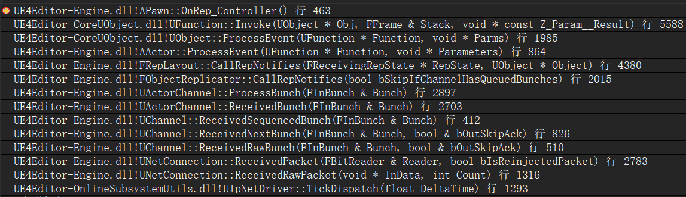

# UE4网络同步 07 Actor属性回调
## 4.属性变化历史记录
ChangeHistory在FRepState和RepChangelistState里面都存在  
每次同步前先更新RepChangelistState里面的ChangeHistory  
随后在发送前,将本次发生变化的数据复制到FRepState的ChangeHistory中  

FRepState的ChangeHistory只保存这一次同步发生变化的属性序号  
RepChangelistState的ChangeHistory保存所有的变化的记录  
是一个64个元素的环形数组,不断向最后加入  
当溢满时,将最前面的并入最前面的后面的一个,并添加到最前面  

## 5.属性回调函数执行
客户端属性回调堆栈  


FObjectReplicator,FRepLayout,UChannel在服务器,客户端都存在,客户端也执行SetChannelActor  

在UActorChannel::ProcessBunch里,如果actor为空,则通过Connection->PackageMap->SerializeNewActor  
序列化(在客户端spawn)一个actor,并为其指定GUID  

RepState->StaticBuffer,在服务器上储存上次同步后的值,与当前Object比较,如果发生变化则同步属性到客户端  
在客户端储存同步前的值,与当前Object比较,如果发生变化则,在RepState->RepNotifies里面添加一个函数回调通知  

在FRepLayout::CallRepNotifies里面处理所有回调  

```
void UActorChannel::ProcessBunch( FInBunch & Bunch )
{
    // 如果是第一次连接,初始化客户端
    bool bSpawnedNewActor = false;
    if( Actor == NULL )
    {
        AActor* NewChannelActor = NULL;
        // 序列化一个新actor
        // 如果spawn了一个新的actor,返回true,如果根据netguid发现了一个存在的actor,返回false
        // 对于静态actor,只会单次调用SerializeObject,因为它可以被路径名引用
        // 对于动态actor,首先序列化actor的引用,但不会在客户端上解析,因为客户端还没有spawn这个actor
        // 然后将actor的原型,位置,旋转,速度序列化
        // 读取这些信息之后,客户端spawn这个actor,并且为其指定NetGUID
        bSpawnedNewActor = Connection->PackageMap->SerializeNewActor(Bunch, this, NewChannelActor);

        SetChannelActor(NewChannelActor, Flags);

        NotifyActorChannelOpen(Actor, Bunch);
    }

    while ( !Bunch.AtEnd() && Connection != NULL && Connection->State != USOCK_Closed )
    {
        TSharedRef< FObjectReplicator > & Replicator = FindOrCreateReplicator( RepObj );

        // 可能这里设置了RepState里面的RepNotifies
        Replicator->ReceivedBunch( Reader, RepFlags, bHasRepLayout, bHasUnmapped )
    }

    // TMap< UObject*, TSharedRef< FObjectReplicator > > UActorChannel::ReplicationMap;
    for (auto RepComp = ReplicationMap.CreateIterator(); RepComp; ++RepComp)
	{
		TSharedRef<FObjectReplicator>& ObjectReplicator = RepComp.Value();

        // 里面调用FObjectReplicator::CallRepNotifies
		ObjectReplicator->PostReceivedBunch();
	}

    if (Actor && bSpawnedNewActor)
	{
        // 里面会调用Beginplay
		Actor->PostNetInit();
	}
}

void FObjectReplicator::CallRepNotifies(bool bSkipIfChannelHasQueuedBunches)
{
    UObject* Object = GetObject();

    FReceivingRepState* ReceivingRepState = RepState->GetReceivingRepState();
	RepLayout->CallRepNotifies(ReceivingRepState, Object);
}

void FRepLayout::CallRepNotifies(FReceivingRepState* RepState, UObject* Object) const
{
    // 获取缓存数据
   	FRepShadowDataBuffer ShadowData(RepState->StaticBuffer.GetData());
    // 获取当前Object数据
	FRepObjectDataBuffer ObjectData(Object);

    // 遍历RepState->RepNotifies回调函数缓存
    for (FProperty* RepProperty : RepState->RepNotifies)
    {
        // 根据函数名,查找回调函数
        UFunction* RepNotifyFunc = Object->FindFunction(RepProperty->RepNotifyFunc);

        // 获取同步属性的偏移
        // 重载运算符 operator+, return InBuffer + Cmd.ShadowOffset;
        const FRepParentCmd& Parent = Parents[RepProperty->RepIndex];
		const int32 NumParms = RepNotifyFunc->NumParms;

        switch (NumParms)
        {
            case 0:
            {
                // 调用回调函数
                Object->ProcessEvent(RepNotifyFunc, nullptr);

                // 更新缓存中的属性值
                RepProperty->CopyCompleteValue(ShadowData + Parent, ObjectData + Parent);
            }
            case 1:
            {
                FRepShadowDataBuffer PropertyData = ShadowData + Parent;

                // 回调函数有一个参数时,将旧的参数值作为函数参数传入
                Object->ProcessEvent(RepNotifyFunc, PropertyData);

                RepProperty->CopyCompleteValue(ShadowData + Parent, ObjectData + Parent);
            }
            case 2:
            {
                // 回调函数的参数中额外加入元信息
            }
        }
    }

    // 清空RepState->RepNotifies回调函数缓存
    RepState->RepNotifies.Empty();
}
```

```
// 序列化一个新actor
// 如果spawn了一个新的actor,返回true,如果根据netguid发现了一个存在的actor,返回false
// 对于静态actor,只会单次调用SerializeObject,因为它可以被路径名引用
// 对于动态actor,首先序列化actor的引用,但不会在客户端上解析,因为客户端还没有spawn这个actor
// 然后将actor的原型,位置,旋转,速度序列化
// 读取这些信息之后,客户端spawn这个actor,并且为其指定NetGUID
bool UPackageMapClient::SerializeNewActor(FArchive& Ar, class UActorChannel *Channel, class AActor*& Actor)
{
	FNetworkGUID NetGUID;
	UObject *NewObj = Actor;
	SerializeObject(Ar, AActor::StaticClass(), NewObj, &NetGUID);

    Channel->ActorNetGUID = NetGUID;

    Actor = Cast<AActor>(NewObj);

    bool bActorWasSpawned = false;

    if ( NetGUID.IsDynamic() )
	{
		FVector Location; // 后面会根据FArchive序列化

        // IsSaving()表示序列化,即发送流程
        // IsLoading()表示反序列化,即接收流程
        if ( Ar.IsLoading() )
        {
            if ( Actor == NULL )
            {
                if ( Archetype )
                {
                    UWorld* World = Connection->Driver->GetWorld();

                    Actor = World->SpawnActorAbsolute(Archetype->GetClass(), FTransform(Rotation, SpawnLocation), SpawnInfo);
                    {
                        if (Actor)
                        {
                            GuidCache->RegisterNetGUID_Client(NetGUID, Actor);
                            bActorWasSpawned = true;
                        }
                    }
                }
            }
        }
    }
    return bActorWasSpawned;
}

// 这是PackageMap类的主要部分,它序列化了对对象的引用
bool UPackageMapClient::SerializeObject( FArchive& Ar, UClass* Class, UObject*& Object, FNetworkGUID *OutNetGUID)
{
    // IsSaving()表示序列化,即发送流程
    // IsLoading()表示反序列化,即接收流程
    if (Ar.IsSaving()) // 对于PC,在ClientSetHUD时,Object有值,这里为true
    {
        FNetworkGUID NetGUID = GuidCache->GetOrAssignNetGUID( Object );

        if (OutNetGUID)
		{
			*OutNetGUID = NetGUID;
		}

        // 向FArchive中写入object的GUID
        InternalWriteObject( Ar, NetGUID, Object, TEXT( "" ), NULL );
    }
    // IsSaving()表示序列化,即发送流程
    // IsLoading()表示反序列化,即接收流程
    else if (Ar.IsLoading())
    {
        FNetworkGUID NetGUID;

        {
            // 从流中读取GUID并解析object
            NetGUID = InternalLoadObject(Ar, Object, 0);

            if (OutNetGUID)
			{
				*OutNetGUID = NetGUID;
			}
        }
    }
}
```