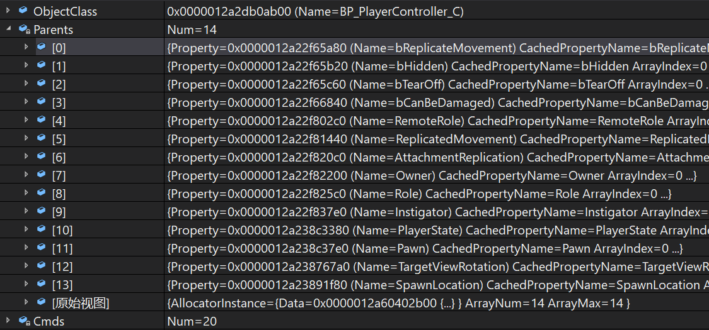

# UE4网络同步 08 动态数组,结构体,UObject
## 动态数组与结构体
### 结构体
UStruct类型的结构体与C++的Struct不一样,在反射系统中对应的是`UScriptStruct`  
它本身可以被标记Replicated并且结构体内的数据默认都会被同步,而且如果里面还有子结构体的话,也会递归的进行同步  
如果不想同步的话,需要在对应的属性标记NotReplicated,这个标记只对UStruct有效,对UClass无效  
结构体内的属性不能被标记为Replicated,UStruct不能以成员指针的形式在类中声明  

### 数组
数组分为静态数组和动态数组  

+ 静态数组  

每个元素都相当于一个单独的属性存放在`TArray<FRepRecord> UClass::ClassReps;`  
同步时会逐个添加到`FRepLayout::Parents`里面  
```
struct FRepRecord
{
	FProperty* Property;
	int32 Index;
};
```

+ 动态数组TArray  

在网络中可以正常同步,在初始化`FRepLayout::Cmds`时,会判断当前的属性是否是动态数组UArrayProperty  
并会给其cmd.type标记REPCMD_DynamicArray,后面在同步的时候,会通过这个标记对其做特殊处理  
如服务器上数组长度发生变化,客户端在接收同步过来的数组时,会执行`FRepLayout::SerializeProperties_DynamicArray_r`来处理动态数组  
这个函数会更新当前对象同步数组的大小  

### 初始化同步属性
这段逻辑在`FRepLayout::InitFromClass`里面处理  

RepLayout首先会读取Class里面所有的同步属性并逐一放到`FRepLayout::Parents`里面  
这个Parents里面存放的就是当前类的继承树里面所有的同步属性  
`FRepParentCmd`,[CmdStart, CmdEnd)是子属性在Cmds数组中的索引  
`FRepLayoutCmd`,ParentIndex是顶层属性在Parents数组中的索引  

随后对Parents里面的属性进一步解析`FRepLayout::InitFromProperty_r`  
如果发现当前的同步属性是数组或结构体,就对其递归展开  
将数组里面的每个元素/UStruct里面的每个属性逐个放到`FRepLayout::Cmds`里面  

这个过程中如果遇到了标记NotReplicate的UStruct内部属性,就跳过  
所以Cmds里面存放的是对数组或结构体展开的详细属性  

> 举例  

在FRepLayout::SendProperties断点查看  
PlayerController Parents  


PlayerController Cmds  


对于APlayerController,Parents和Cmds之间的区别只有FRepAttachment AActor::AttachmentReplication  
在Parents中包含AttachmentReplication  
在Cmds中不包含AttachmentReplication本身,包含FRepAttachment结构里面的每一个属性  

```
UPROPERTY(Transient, ReplicatedUsing=OnRep_AttachmentReplication)
	struct FRepAttachment AttachmentReplication;

USTRUCT()
struct FRepAttachment
{
	class AActor* AttachParent;

	FVector_NetQuantize100 LocationOffset;

	FVector_NetQuantize100 RelativeScale3D;

	FRotator RotationOffset;

	FName AttachSocket;

	class USceneComponent* AttachComponent;
}
```

### 初始化同步属性代码  
```
void FRepLayout::InitFromClass(
	UClass* InObjectClass,
	const UNetConnection* ServerConnection,
	const ECreateRepLayoutFlags CreateFlags)
{
	// 设置一个类的同步属性数组 TArray<FRepRecord> UClass::ClassReps;
	InObjectClass->SetUpRuntimeReplicationData();

	for (int32 i = 0; i < InObjectClass->ClassReps.Num(); i++)
	{
		FProperty * Property = InObjectClass->ClassReps[i].Property;
		// 如果是静态数组,每个元素都会创造一个cmd,ArrayIdx代表这个cmd在数组中的索引,
		// 对于非静态数组,永远是0
		const int32 ArrayIdx = InObjectClass->ClassReps[i].Index;

		// 将UClass::ClassReps中的属性加入Parents数组中,并返回在Parents数组中的索引
		const int32 ParentHandle = AddParentProperty(Parents, Property, ArrayIdx);

		// 静态数组cmd相对于第一个元素的偏移
		const int32 ParentOffset = Property->ElementSize * ArrayIdx;

		FInitFromPropertySharedParams SharedParams
		{
			/*Cmds=*/Cmds,
			/*ServerConnection=*/ServerConnection,
			/*ParentIndex=*/ParentHandle, // Parents数组中的索引
			/*Parent=*/Parents[ParentHandle], // Parents数组中的元素
		};

		FInitFromPropertyStackParams StackParams
		{
			/*Property=*/Property,
			/*Offset=*/ParentOffset, // 静态数组cmd相对于第一个元素的偏移
			/*RelativeHandle=*/RelativeHandle,
			/*ParentChecksum=*/0,
			/*StaticArrayIndex=*/ArrayIdx // cmd在静态数组中的索引
		};

		// 顶层属性的子属性在Cmds数组中的开始索引
		Parents[ParentHandle].CmdStart = Cmds.Num();
		// 添加Cmds数组
		RelativeHandle = InitFromProperty_r<ERepBuildType::Class>(SharedParams, StackParams);
		Parents[ParentHandle].CmdEnd = Cmds.Num();
	}
}
```

+ 设置一个类的同步属性数组 `TArray<FRepRecord> UClass::ClassReps`  
```
void UClass::SetUpRuntimeReplicationData()
{
	// FProperty* PropertyLink; 从最子类到基类的属性链
	if (!HasAnyClassFlags(CLASS_ReplicationDataIsSetUp) && PropertyLink != NULL)
	{
		// 清空网络相关字段(函数)列表 TArray<UField*> UClass::NetFields;
		NetFields.Empty();

		// 先设置基类的同步属性数组
		if (UClass* SuperClass = GetSuperClass())
		{
			SuperClass->SetUpRuntimeReplicationData();
			ClassReps = SuperClass->ClassReps;
			// 这个类的ClassReps第一个索引,小于此索引的都是基类属性
			FirstOwnedClassRep = ClassReps.Num();
		}
		else
		{
			ClassReps.Empty();
			FirstOwnedClassRep = 0;
		}

		// 遍历属性,将CPF_Net标记的属性存入临时数组中
		TArray<FProperty*> NetProperties;
		for (TFieldIterator<FField> It(this, EFieldIteratorFlags::ExcludeSuper); It; ++It)
		{
			if (FProperty* Prop = CastField<FProperty>(*It))
			{
				if ((Prop->PropertyFlags & CPF_Net) && Prop->GetOwner<UObject>() == this)
				{
					NetProperties.Add(Prop);
				}
			}
		}

		// 遍历属性,将FUNC_Net标记的函数存入NetFields
		for(TFieldIterator<UField> It(this,EFieldIteratorFlags::ExcludeSuper); It; ++It)
		{
			if (UFunction * Func = Cast<UFunction>(*It))
			{
				if ((Func->FunctionFlags&FUNC_Net) && !Func->GetSuperFunction())
				{
					NetFields.Add(Func);
				}
			}
		}

		// 分配基类+这个类的空间
		ClassReps.Reserve(ClassReps.Num() + NetProperties.Num());
		for (int32 i = 0; i < NetProperties.Num(); i++)
		{
			// 设置属性在ClassReps数组中的索引
			NetProperties[i]->RepIndex = ClassReps.Num();
			// 对于静态数组,为每个元素都添加一条FRepRecord
			for (int32 j = 0; j < NetProperties[i]->ArrayDim; j++)
			{
				// 在数组末尾添加元素
				new(ClassReps)FRepRecord(NetProperties[i], j);
			}
		}

		// 避免重复设置这个类的ClassRep
		ClassFlags |= CLASS_ReplicationDataIsSetUp;
	}
}
```

+ 将一个Parent属性添加到Cmds数组中
```
template<ERepBuildType BuildType>
static int32 InitFromProperty_r(
	FInitFromPropertySharedParams& SharedParams, // Cmds为RepLayout自身的Cmds
	FInitFromPropertyStackParams StackParams) // Property为当前参数
{
	// 如果是动态数组
	if (FArrayProperty* ArrayProp = CastField<FArrayProperty>(StackParams.Property))
	{
		const int32 CmdStart = SharedParams.Cmds.Num();
		const uint32 ArrayChecksum = AddArrayCmd(SharedParams, StackParams);
		// 这里应该是将数组中的每个属性都加入Cmds中
		FInitFromPropertyStackParams NewStackParams{
			/*Property=*/ArrayProp->Inner,
		};
		InitFromProperty_r<BuildType>(SharedParams, NewStackParams);
		// 添加一个Cmd,仅设置Type为ERepLayoutCmdType::Return,没有对应的属性
		AddReturnCmd(SharedParams.Cmds);
		// 设置跳出数组子属性的索引
		SharedParams.Cmds[CmdStart].EndCmd = SharedParams.Cmds.Num();
	}
	// 如果是结构体
	else if (FStructProperty* StructProp = CastField<FStructProperty>(StackParams.Property))
	{
		const int32 NetSerializeStructOffset = InitFromStructProperty<BuildType>(NewSharedParams, NewStackParams, StructProp, Struct);
	}
	// 如果是普通属性
	else
	{
		// 向Cmds数组添加一个cmd,并设置cmd.Type(遍历了各种类型的if-else)
		AddPropertyCmd(SharedParams, StackParams);
	}
}

// 添加一个动态数组中的cmd
static FORCEINLINE uint32 AddArrayCmd(
	FInitFromPropertySharedParams& SharedParams,
	const FInitFromPropertyStackParams StackParams)
{
	// 在Cmds数组末尾分配一个元素的内存,设置为0,返回引用
	FRepLayoutCmd& Cmd = SharedParams.Cmds.AddZeroed_GetRef();

	Cmd.Type = ERepLayoutCmdType::DynamicArray;
	Cmd.Property = StackParams.Property;

	Cmd.ParentIndex = SharedParams.ParentIndex;
}

// 添加一个结构体中的cmd
template<ERepBuildType BuildType>
static int32 InitFromStructProperty(
	FInitFromPropertySharedParams& SharedParams,
	FInitFromPropertyStackParams StackParams,
	const FStructProperty* const StructProp,
	const UScriptStruct* const Struct)
{
	TArray<FProperty*> NetProperties;

	// 遍历结构体中的属性
	for (TFieldIterator<FProperty> It(Struct); It; ++It)
	{
		// 这里可能是标记NotReplicated
		if ((It->PropertyFlags & CPF_RepSkip))
		{
			continue;
		}

		NetProperties.Add(*It);
	}

	for (int32 i = 0; i < NetProperties.Num(); i++)
	{
		for (int32 j = 0; j < NetProperties[i]->ArrayDim; j++)
		{
			FInitFromPropertyStackParams NewStackParams{
				/*Property=*/NetProperties[i],
				/*StaticArrayIndex=*/j,
			};

			// 递归添加子属性
			StackParams.RelativeHandle = InitFromProperty_r<BuildType>(SharedParams, NewStackParams);
		}
	}
}
```