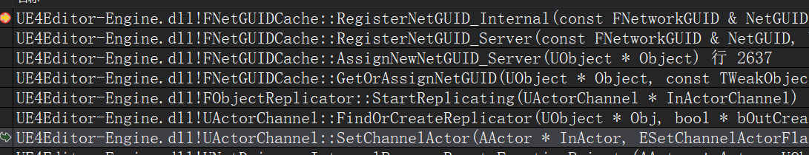

# UE4网络同步 09 UObject指针
服务器在同步一个UObject的时候,会为其分配`FNetworkGUID`,并通过网络进行发送  
客户端识别这个id找到对应的UObject  
```
class FNetworkGUID
{
	uint32 Value;
}
```

## 服务器分配GUID
服务器在同步UObject时,需要对这个对象进行序列化`UPackageMapClient::SerializeObject`  
在序列化对象前,先检查GUID缓存表`TSharedPtr< FNetGUIDCache >	 UPackageMapClient::GuidCache;`  
如果表里有,证明已经分配过,否则需要分配一个GUID,并写入数据流  
一般,GUID分配不是在发送数据时才进行,而是在创建FObjectReplicator时  



+ 初始化时分配GUID  
```
// 使用 FNetGUIDCache* UNetDriver::GuidCache,来查找/创建GUID
void FObjectReplicator::StartReplicating(class UActorChannel * InActorChannel)
{
    UObject* const Object = GetObject();

    UNetDriver* const ConnectionNetDriver = Connection->GetDriver();

    ObjectNetGUID = ConnectionNetDriver->GuidCache->GetOrAssignNetGUID( Object );
}

// 先从 TMap< FNetworkGUID, FNetGuidCacheObject > FNetGUIDCache::ObjectLookup; 查找,找不到再创建
FNetworkGUID FNetGUIDCache::GetOrAssignNetGUID(UObject* Object, const TWeakObjectPtr<UObject>* WeakObjectPtr)
{
    FNetworkGUID NetGUID = NetGUIDLookup.FindRef(WeakObject);

    if (NetGUID.IsValid())
    {
        return NetGUID;
    }

    // 先分配一个新的guid,然后注册object
    return AssignNewNetGUID_Server(Object);
}

void FNetGUIDCache::RegisterNetGUID_Server( const FNetworkGUID& NetGUID, UObject* Object )
{
    FNetGuidCacheObject CacheObject;

    CacheObject.Object				= MakeWeakObjectPtr(const_cast<UObject*>(Object));
    // 这些字段在GUID是静态时会设置
	CacheObject.OuterGUID			= GetOrAssignNetGUID( Object->GetOuter() );
	CacheObject.PathName			= Object->GetFName();

    RegisterNetGUID_Internal( NetGUID, CacheObject );
}

// 设置GUID和Object的双向map
void FNetGUIDCache::RegisterNetGUID_Internal( const FNetworkGUID& NetGUID, const FNetGuidCacheObject& CacheObject )
{
    // TMap< FNetworkGUID, FNetGuidCacheObject >		FNetGUIDCache::ObjectLookup;
    ObjectLookup.Add( NetGUID, CacheObject );
    // TMap< TWeakObjectPtr< UObject >, FNetworkGUID >	FNetGUIDCache::NetGUIDLookup;
    NetGUIDLookup.Add( CacheObject.Object, NetGUID );
}
``` 

## 服务器同步对象前检测或分配GUID
```
void FRepLayout::SendProperties_r()
{
    // 这个属性改变了,所以发送它
    Cmd.Property->NetSerializeItem(Writer, Writer.PackageMap, const_cast<uint8*>(Data.Data));
}

// PackageMap的主要部分,序列化一个对象的引用
bool UPackageMapClient::SerializeObject( FArchive& Ar, UClass* Class, UObject*& Object, FNetworkGUID *OutNetGUID)
{
    // IsSaving()表示序列化,即发送流程
    // IsLoading()表示反序列化,即接收流程
    if (Ar.IsSaving())
    {
        // TSharedPtr< FNetGUIDCache > UPackageMapClient::GuidCache;
        FNetworkGUID NetGUID = GuidCache->GetOrAssignNetGUID( Object );
        
        if (OutNetGUID)
		{
			*OutNetGUID = NetGUID;
		}
    }
}
```

## 客户端反序列化,获取并注册GUID
### 情况1,客户端接收到服务器同步过来一个新的Actor
需要Spawn,然后注册GUID  
```
void UActorChannel::ProcessBunch( FInBunch & Bunch )
{
    if( Actor == NULL )
    {
        AActor* NewChannelActor = NULL;
        bSpawnedNewActor = Connection->PackageMap->SerializeNewActor(Bunch, this, NewChannelActor);
    }
}

// 序列化新Actor的标准流程
// 对于静态对象,只需要调用SerializeObject,因为他们可以被路径引用
// 对于动态对象,首先会序列化actor的引用,但是不会在客户端解析,因为还未spawn出来
// 接下来序列化actor archetype,位置,旋转,速度
// 读取这些信息后,客户端在NetDriver's World生成这个actor,并且为其分配GUID,在函数顶部
// 如果spawn返回true,如果根据guid找到,返回false
bool UPackageMapClient::SerializeNewActor(FArchive& Ar, class UActorChannel *Channel, class AActor*& Actor)
{
    FNetworkGUID NetGUID;
	UObject *NewObj = Actor;
    // 从流中获取guid,并尝试从FNetGUIDCache::ObjectLookup中找到object
	SerializeObject(Ar, AActor::StaticClass(), NewObj, &NetGUID);

    Actor = Cast<AActor>(NewObj);

    bool bActorWasSpawned = false;

    if ( NetGUID.IsDynamic() )
    {
        // --------------------- spawn参数 start ------------------------
        UObject* Archetype = nullptr;
        UObject* ActorLevel = nullptr;
        FVector Location; // 用于接收序列化后的生成位置
        FVector Scale;
        FVector Velocity;
        FRotator Rotation;

        // 这里不明白Archetype会怎样,可能参数UObject::StaticClass()有含义
        FNetworkGUID ArchetypeNetGUID;
        SerializeObject(Ar, UObject::StaticClass(), Archetype, &ArchetypeNetGUID);

        bool bSerializeLocation = false; // 用于记录是否从流中读取到Location
        bool bSerializeRotation = false;
        bool bSerializeScale = false;
        bool bSerializeVelocity = false;

        {
            // 声明lambda表达式,用于反序列化Location
            auto ConditionallySerializeQuantizedVector = [this, &Ar, &SerSuccess](
                FVector& InOutValue,
                const FVector& DefaultValue,
                bool bShouldQuantize,
                bool& bWasSerialized)
            {
                // 从流中读取Location
            }

            ConditionallySerializeQuantizedVector(Location, FVector::ZeroVector, GbQuantizeActorLocationOnSpawn, bSerializeLocation);

            // 从流中读取Rotation

            // 从流中读取Scale
            ConditionallySerializeQuantizedVector(Scale, FVector::OneVector, GbQuantizeActorScaleOnSpawn, bSerializeScale);
            // 从流中读取Velocity
            ConditionallySerializeQuantizedVector(Velocity, FVector::ZeroVector, GbQuantizeActorVelocityOnSpawn, bSerializeVelocity);
            }
        // --------------------- 解析spawn参数 end ------------------------

        if ( Ar.IsLoading() )
        {
            if ( Actor == NULL )
            {
                // spawn actor,参数在上面从流中获取
                if ( Archetype )
                {
                    // 对于streaming levels,可能owning level不可见,但依旧加载
                    // 这种情况下,level会被找到,但是owning world是无效的
                    // 如果这种情况发生,等到下一次level streamed in,再spawn actor
                    // 那时,服务器应该重发动态actors
                    ULevel* SpawnLevel = Cast<ULevel>(ActorLevel);
					if (SpawnLevel == nullptr || SpawnLevel->GetWorld() != nullptr)
                    {
                        FActorSpawnParameters SpawnInfo;
						SpawnInfo.Template = Cast<AActor>(Archetype);
						SpawnInfo.OverrideLevel = SpawnLevel;

                        UWorld* World = Connection->Driver->GetWorld();
						FVector SpawnLocation = FRepMovement::RebaseOntoLocalOrigin(Location, World->OriginLocation);
						Actor = World->SpawnActorAbsolute(Archetype->GetClass(), FTransform(Rotation, SpawnLocation), SpawnInfo);

                        if (Actor)
						{
							// 服务器序列化了速度
							if (bSerializeVelocity)
							{
								Actor->PostNetReceiveVelocity(Velocity);
							}

							if (bSerializeScale)
							{
								Actor->SetActorScale3D(Scale);
							}

                            // 注册GUID,这个guid是从服务器同步过来的流中解析出来的
                            // 所以服务器和客户端,对于同一个actor就有相同的guid
							GuidCache->RegisterNetGUID_Client(NetGUID, Actor);
							bActorWasSpawned = true;
						}
                    }
                }
            }
        }
    }
    return bActorWasSpawned;
}

bool UPackageMapClient::SerializeObject( FArchive& Ar, UClass* Class, UObject*& Object, FNetworkGUID *OutNetGUID)
{
    else if (Ar.IsLoading())
    {
        FNetworkGUID NetGUID;
        // 从流中guid读取,并解析object
        NetGUID = InternalLoadObject(Ar, Object, 0);

        if (OutNetGUID)
        {
            *OutNetGUID = NetGUID;
        }
    }
}

// 从FArchive流中加载一个UObject,如果有路径就读取路径,如果没有加载过,就尝试加载
FNetworkGUID UPackageMapClient::InternalLoadObject( FArchive & Ar, UObject *& Object, 
    const int InternalLoadObjectRecursionCount ) // 递归次数,默认0,加载outer时为1
{
    // 读取guid
    FNetworkGUID NetGUID;
	Ar << NetGUID;

    // 尝试解析guid
    if ( NetGUID.IsValid() && !NetGUID.IsDefault() )
	{
        // 先根据guid查找object
        // TMap< FNetworkGUID, FNetGuidCacheObject > FNetGUIDCache::ObjectLookup
		Object = GetObjectFromNetGUID( NetGUID, GuidCache->IsExportingNetGUIDBunch );
	}

    if ( ExportFlags.bHasPath )
    {
        UObject* ObjOuter = NULL;

		FNetworkGUID OuterGUID = InternalLoadObject( Ar, ObjOuter, InternalLoadObjectRecursionCount + 1 );

		FString PathName;

        // 读取路径名
        Ar << PathName;

        if (NetGUID.IsDefault())
        {
            // 这是服务器的逻辑
        }
        else if ( Object != nullptr )
        {
            // 如果对象存在,直接返回
            return NetGUID;
        }

        // 注册path和outer guid
        GuidCache->RegisterNetGUIDFromPath_Client( NetGUID, PathName, OuterGUID, NetworkChecksum, ExportFlags.bNoLoad, bIgnoreWhenMissing );
    }
    return NetGUID;
}
```

+ 客户端注册GUID  
```
// 将一个guid和object进行关联,此函数仅在有动态guid的客户端,进行调用
// 静态guid应该通过 RegisterNetGUIDFromPath_Client
void FNetGUIDCache::RegisterNetGUID_Client( const FNetworkGUID& NetGUID, const UObject* Object )
{
    FNetGuidCacheObject CacheObject;

	CacheObject.Object = MakeWeakObjectPtr(const_cast<UObject*>(Object));

	RegisterNetGUID_Internal( NetGUID, CacheObject );
}

// 注册guid,这个上面服务器也进行过
void FNetGUIDCache::RegisterNetGUID_Internal( const FNetworkGUID& NetGUID, const FNetGuidCacheObject& CacheObject )
{
    ObjectLookup.Add( NetGUID, CacheObject );
    NetGUIDLookup.Add( CacheObject.Object, NetGUID );
}
```

### 情况2,客户端接收到含有guid的消息立刻解析
解析成功后通过`RegisterNetGUIDFromPath_Client`进行guid的注册  
```
void UChannel::ReceivedRawBunch( FInBunch & Bunch, bool & bOutSkipAck )
{
    // 立即使用这个bunch的guid部分,不管他是否仅是一部分或reliable
    if ( Bunch.bHasPackageMapExports && !Connection->IsInternalAck() )
    {
        Cast<UPackageMapClient>( Connection->PackageMap )->ReceiveNetGUIDBunch( Bunch );
    }
}

void UPackageMapClient::ReceiveNetGUIDBunch( FInBunch &InBunch )
{
    UObject* Obj = NULL;
    const FNetworkGUID LoadedGUID = InternalLoadObject( InBunch, Obj, 0 );
}

FNetworkGUID UPackageMapClient::InternalLoadObject( FArchive & Ar, UObject *& Object, const int InternalLoadObjectRecursionCount )
{
    FNetworkGUID NetGUID;
	Ar << NetGUID;

    UObject* ObjOuter = NULL;
    FNetworkGUID OuterGUID = InternalLoadObject( Ar, ObjOuter, InternalLoadObjectRecursionCount + 1 );

    FString PathName;
    Ar << PathName;

    Object = StaticFindObject(UObject::StaticClass(), ObjOuter, *PathName, false);

    GuidCache->RegisterNetGUIDFromPath_Client( NetGUID, PathName, OuterGUID, NetworkChecksum, ExportFlags.bNoLoad, bIgnoreWhenMissing );
}

void FNetGUIDCache::RegisterNetGUIDFromPath_Client( const FNetworkGUID& NetGUID, const FString& PathName, const FNetworkGUID& OuterGUID, const uint32 NetworkChecksum, const bool bNoLoad, const bool bIgnoreWhenMissing )
{
    RegisterNetGUID_Internal( NetGUID, CacheObject );
}
```

## 从数据包加载出来的对象,分配guid
上面讨论的是标记Replicated的Actor,但并不是只有这样的对象才能分配guid  
对于直接从数据包加载出来的对象,如地图里面的山,可以直接认为服务器与客户端上是同一对象  

4中情况下UObject对象的引用可以同步  
1. 标记Replicated  
2. 从数据包直接加载  
3. C++构造函数中添加  
4. UActorComponent::SetNetAddressable()标记,这个只针对组件,BP里面创建的组件默认执行此操作  

+ 检测UObject是否支持网络复制  
```
bool FNetGUIDCache::SupportsObject( const UObject* Object, const TWeakObjectPtr<UObject>* WeakObjectPtr ) const
{
	// nullptr总是支持的
	if ( !Object )
	{
		return true;
	}

	const TWeakObjectPtr<UObject>& WeakObject = WeakObjectPtr ? *WeakObjectPtr : MakeWeakObjectPtr<UObject>(const_cast<UObject*>(Object));

    // 如果guid已经存在,那么他就支持网络复制,这在dynamic subobjects发生
	FNetworkGUID NetGUID = NetGUIDLookup.FindRef( WeakObject );

	if ( NetGUID.IsValid() )
	{
		return true;
	}

    // 如果对象完全可以网络寻址,那么支持网络同步
    // 这里判断是否是从数据包加载或默认构造的
    // 里面递归判断自己和Outer是否可以在网络上通过路径引用
    // 主要通过EObjectFlags来判断
	if ( Object->IsFullNameStableForNetworking() )
	{
		return true;
	}

	return false;
}
```