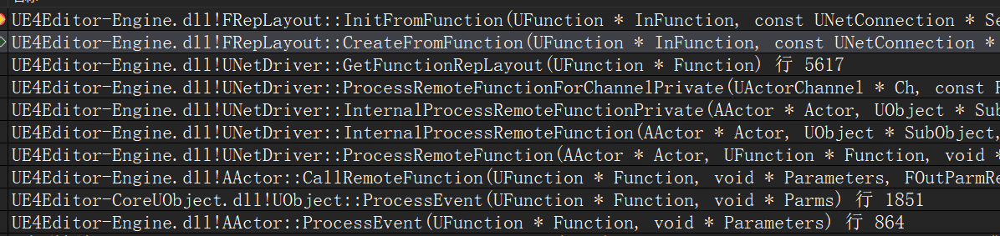
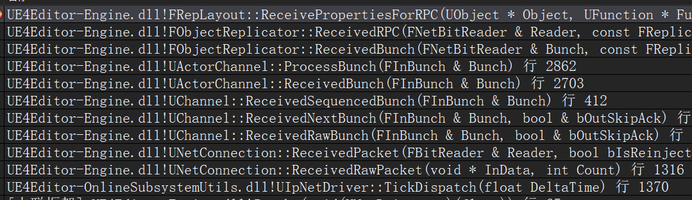

# UE4网络同步 11 RPC
RepLayput对照表不止同步的属性有,函数也有,RPC执行也是通过同步属性的框架  

## UHT生成的RPC代码
```
// .h
UFUNCTION(Client, Reliable)
    void ClientFunc();

// .cpp
void ATest_Replication::ClientFunc_Implementation()
{
	// 自定义实现
}

// .generated.h
virtual void ClientFunc_Implementation();

static void execClientFunc( UObject* Context, FFrame& Stack, void* const Z_Param__Result);

// .gen.cpp
void ATest_Replication::ClientFunc()
{
    ProcessEvent(FindFunctionChecked(FName(TEXT("ClientFunc"))),NULL);
}

static const FNameNativePtrPair Funcs[] = 
{
	{ "ClientFunc", &ATest_Replication::execClientFunc },
};

void ATest_Replication::execClientFunc( UObject* Context, FFrame& Stack, void* const Z_Param__Result);
{
    {
        ((ThisClass*)(Context))->ClientFunc_Implementation();
    }
}
```

1. 直接调用ClientFunc  
2. 通过函数名"ClientFunc",找到execClientFunc  
3. execClientFunc调用ClientFunc_Implementation  

## RPC的发送
RPC调用堆栈


+ `UObject::FindFunctionChecked`  
通过反射系统,根据函数名在 `TMap<FName, UFunction*> UClass::FuncMap` 中查找函数  
先查找自己的UClass,没有找到就查找递归查找基类,还没找到就查找所有实现的接口  

+ `AActor::ProcessEvent`  
通过 ProcessEvent 来调用 UFunction  
通过识别UFunction里面的标记,可以知道这个函数是不是RPC,是否需要发送给其他端  

```
void UObject::ProcessEvent( UFunction* Function, void* Parms )
{
    if ((Function->FunctionFlags & FUNC_Native) != 0)
    {
        // 判断是否是RPC函数
        int32 FunctionCallspace = GetFunctionCallspace(Function, NULL);
		if (FunctionCallspace & FunctionCallspace::Remote)
		{
			CallRemoteFunction(Function, Parms, NULL, NULL);
		}
    }
}

int32 AActor::GetFunctionCallspace( UFunction* Function, FFrame* Stack )
{
    // 根据flag来判断函数是否是RPC
    if (Function->FunctionFlags & FUNC_NetRequest)
    {
        return FunctionCallspace::Remote;
    }
}
```

### 初始化RPC  
正常来说,函数本身是一个执行过程,函数名是一个起始的执行地址,本身没有内存空间,无法存储属性  
不过,在UE4的反射系统里面,函数被额外的定义为UFunction,从而保存自己的相关数据信息  
RPC函数的参数就保存在`UFunction`的基类`UStruct`的属性链表`PropertyLink`里面  
通过`TFieldIterator<FProperty>`将参数存储到 FRepLayout 中  
UNetDriver会从`UNetDriver::RepLayoutMap`中查找/创建UFunction的FRepLayout  
随后立刻调用`FRepLayout::SendPropertiesForRPC`将RPC的参数序列化封装与RPC函数一同发送  

```
bool AActor::CallRemoteFunction( UFunction* Function, void* Parameters, FOutParmRec* OutParms, FFrame* Stack )
{
    FWorldContext* const Context = GEngine->GetWorldContextFromWorld(GetWorld());
    if (Context != nullptr)
	{
		for (FNamedNetDriver& Driver : Context->ActiveNetDrivers)
		{
			if (Driver.NetDriver != nullptr && Driver.NetDriver->ShouldReplicateFunction(this, Function))
			{
                // 转发给 UNetDriver::ProcessRemoteFunction
				Driver.NetDriver->ProcessRemoteFunction(this, Function, Parameters, OutParms, Stack, nullptr);
			}
		}
	}
}

void UNetDriver::ProcessRemoteFunction(...)
{
    {
        const bool bIsServer = IsServer();
		const bool bIsServerMulticast = bIsServer && (Function->FunctionFlags & FUNC_NetMulticast);
        if (bIsServerMulticast)
        {
            // 仅向相关的客户端发送RPC
            return;
        }

        Connection = Actor->GetNetConnection();
		if (Connection)
		{
            // 转发
			InternalProcessRemoteFunction(Actor, SubObject, Connection, Function, Parameters, OutParms, Stack, bIsServer);
		}
    }
}

void UNetDriver::InternalProcessRemoteFunctionPrivate(...)
{
    // 如果饱和并且函数不重要,就跳过他
    if (!(Function->FunctionFlags & FUNC_NetReliable) 
        && (!(Function->FunctionFlags & FUNC_NetMulticast)) 
        && !Connection->IsNetReady(0))
    {
        return;
    }

    // 转发
    ProcessRemoteFunctionForChannelPrivate(...);
}

void UNetDriver::ProcessRemoteFunctionForChannelPrivate()
{
    // 使用 FRepLayout 来发送RPC函数参数
    TSharedPtr<FRepLayout> RepLayout = GetFunctionRepLayout(Function);
    // 将RPC的参数序列化封装与RPC函数一同发送
    RepLayout->SendPropertiesForRPC(Function, Ch, TempWriter, Parms);
}
```

### 函数的 `FRepLayout`  
创建函数的 FRepLayout,并加入`UNetDriver::RepLayoutMap`  
遍历函数参数,加入Parents数组和Cmds数组  

```
// 先从UNetDriver::RepLayoutMap中查找,如果没找到就创建并添加到map中
// TMap< TWeakObjectPtr< UObject >, TSharedPtr< FRepLayout > > UNetDriver::RepLayoutMap;

TSharedPtr<FRepLayout> UNetDriver::GetFunctionRepLayout(UFunction * Function)
{
	TSharedPtr<FRepLayout>* RepLayoutPtr = RepLayoutMap.Find(Function);

	if (!RepLayoutPtr) 
	{
        // 转发 FRepLayout::CreateFromFunction
		RepLayoutPtr = &RepLayoutMap.Add(Function, FRepLayout::CreateFromFunction(Function, ServerConnection, Flags));
	}

	return *RepLayoutPtr;
}

TSharedPtr<FRepLayout> FRepLayout::CreateFromFunction(UFunction* InFunction, const UNetConnection* ServerConnection, const ECreateRepLayoutFlags CreateFlags)
{
	TSharedPtr<FRepLayout> RepLayout = MakeShareable<FRepLayout>(new FRepLayout());
	RepLayout->InitFromFunction(InFunction, ServerConnection, CreateFlags);
	return RepLayout;
}

void FRepLayout::InitFromFunction(
	UFunction* InFunction,
	const UNetConnection* ServerConnection,
	const ECreateRepLayoutFlags CreateFlags)
{
    for (TFieldIterator<FProperty> It(InFunction); It && (It->PropertyFlags & (CPF_Parm | CPF_ReturnParm)) == CPF_Parm; ++It)
    {
        // 写法类似InitFromClass
        // 遍历函数的参数,添加入Parents数组和Cmds数组
    }

    Owner = InFunction;
}
```

## RPC的接收
RPC接收  
  

  

当接收到上面的RPC发来的数据后,执行`ReceivePropertiesForRPC`来接收参数  
做一些判断来确定是否符合执行条件,如果符合就通过`ProcessEvent`调用RPC函数  
`FRepLayout`里面的Parents负责记录当前function的属性信息及属性位置  
服务器与客户端保存相同的FRepLayout,客户端才能在反序列化的时候通过offset解析出服务器传来的RPC函数的参数  

```
bool FObjectReplicator::ReceivedRPC(...)
{
    UObject* Object = GetObject();
	FName FunctionName = FieldCache->Field.GetFName();
	UFunction* Function = Object->FindFunction(FunctionName);

    // 验证函数可调用
    const bool bCanExecute = Connection->Driver->ShouldCallRemoteFunction(Object, Function, RepFlags);

    if (bCanExecute)
    {
        // 使用 FRepLayout 来接收RPC参数
        // 遍历 Parents 调用 FRepLayout::SerializeProperties_r
        TSharedPtr<FRepLayout> FuncRepLayout = Connection->Driver->GetFunctionRepLayout(Function);

        FuncRepLayout->ReceivePropertiesForRPC(Object, Function, OwningChannel, Reader, Parms, UnmappedGuids);

        // 调用RPC,前面有些判断条件,可能会加入队列延迟调用
        Object->ProcessEvent(Function, Parms);
    }
}

void UObject::ProcessEvent( UFunction* Function, void* Parms )
{
    Function->Invoke(this, NewStack, ReturnValueAddress);
}

void UFunction::Invoke(UObject* Obj, FFrame& Stack, RESULT_DECL)
{
    // typedef void (*FNativeFuncPtr)(UObject* Context, FFrame& TheStack, RESULT_DECL);
    // FNativeFuncPtr UFunction::Func;
    // 这里Func是exec函数,exec调用了_Implementation函数

    return (*Func)(Obj, Stack, RESULT_PARAM);
}
```

RPC数据包与属性不同,调用的时候立刻产生bunch并放到SendBuffer  
按照UE4一帧的执行顺序(收包-Tick-发包),RPC数据要比属性同步早放到buffer里面  
