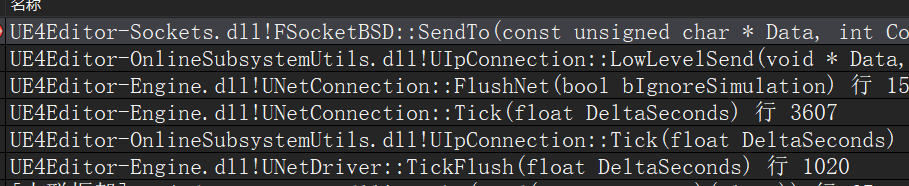
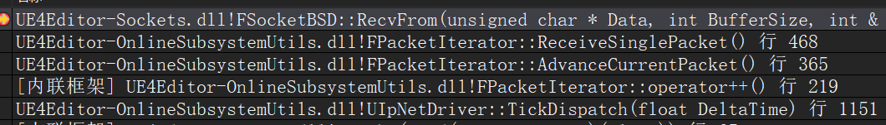
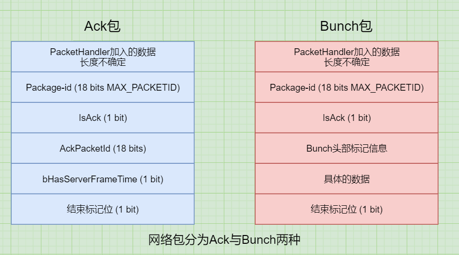
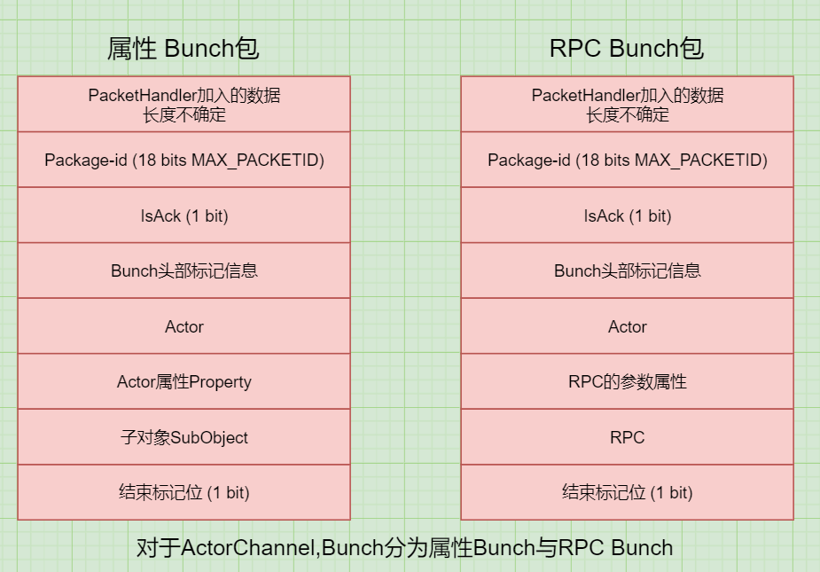
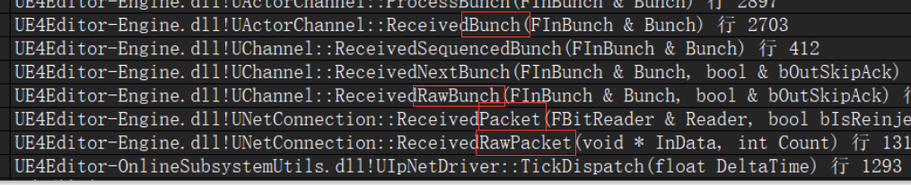
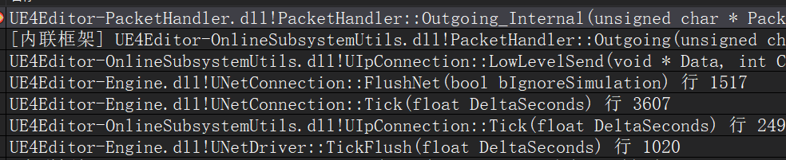

# UE4网络同步 12 可靠数据传输
UE4默认收发包都在主线程处理,收包可以通过`CVarNetIpNetDriverUseReceiveThread`开启线程单独处理  

发包堆栈  
  

收包堆栈  
  

## 数据包格式
UE4的网络包精确到bit,通过`FBitReader`和`FBitWriter`去读写  

网络包  
  

ActorChannel的Bunch包  
  

ActorChannel发送数据的Bunch分为属性Bunch与RPC Bunch  
如果Bunch太大就会被拆分为多个小Bunch,拆分后的Bunch就不是完整的Bunch,称为RawBunch  
这些Bunch被塞到一个Sendbuffer里面,如果这样直接发出去,就是一个Packet  
每一个Sendbuffer发出前还可能会被PacketHandler处理,处理之后就是RawPacket  

收包的解析顺序  
  

由于发包按照最小单位Byte来发送,UE4精确到bit,所以会在Sendbuffer最后面添加1bit的结束标志位  
收包时可以先找到最后一个为1的bit,把后面的0删除,剩下的就是原始的网络包  

## PacketHandler
PacketHandler是用来对原始数据包Packet进行处理的工具,里面可以自由的添加组件来对原始数据包进行多层处理  
引擎内置的组件有握手组件`StatelessConnectHandlerComponent`  
加密组件`FEncryptionComponent`  
可靠数据传输组件`ReliabilityHandlerComponent`  

由于组件不确定,所以网络消息的包头也是不确定的  
比如加密组件可能会对一个Packet进行加密,然后在前面加一个2bit的头部和1bit的结束标志位  
因此各个组件应该按固定的顺序处理Packet,默认一直存在一个StatelessConnectHandlerComponent组件  

由于PacketHandler组件有可能对原有的Packet进行加密从而导致位发生变化,所以PacketHandler组件本身也会对处理后的数据添加一个bit的结束标记位  

PacketHandler   
  

## Bunch的发送时机
每次只要执行`UNetConnection::SendRawBunch`(Tick里面执行),就会设置`UNetConnection::TimeSensitive`为true,就会触发`UNetConnection::FlushNet`  
所以,只要每帧有数据就会发送  
只要里面有SendBuffer或者时间到了就会触发`LowLevelSend`,调用Socket的发送  

```
int32 UNetConnection::SendRawBunch()
{
    TimeSensitive = 1;
}

void UNetConnection::Tick(float DeltaSeconds)
{
    if ( TimeSensitive ...)
	{
		FlushNet();
	}
}

void UNetConnection::FlushNet(bool bIgnoreSimulation)
{
    if (SendBuffer.GetNumBits() 
    || HasDirtyAcks 
    || ( Driver->GetElapsedTime() - LastSendTime > Driver->KeepAliveTime 
    && !IsInternalAck() 
    && State != USOCK_Closed))
    {
        ...
        LowLevelSend(SendBuffer.GetData(), SendBuffer.GetNumBits(), Traits);
    }
}
```

## 可靠数据传输的实现
可靠数据传输的基本原理就是接收方对每一个包都要做Ack回应  
如果发送方没收到Ack,那么就要进行重传  

UE4底层默认主动重传,主要没有按顺序收到bunch就会重传  
每个包有一个`OutPacketId`记录在Connection里面  
一个packet可能包含n个bunch,每个bunch也会记录当前所在的OutPacketId  

简单来说,发送端会疾苦一个已经传送成功的序号,已经收到的`OutAckPacketId`  
假如发送端发了10个包1-10,接收端收到了1,那么会回复一个ack,里面OutAckPacketId=1  
然后发生了丢包,接收端收到了序号5,回复一个ack5  
这时发送端会更新当前的OutAckPacketId,并重传序号2-4的所有packet(保存在connection的缓存里面)  
所以,可以保证所有的包到上层都是严格有序的  

每个connection里面会有n个channel,每个channel发出的可靠数据包的数量会以数组的形式存储`TArray<int32>		UNetConnection::OutReliable`  
真正发出去与接收到的数据包会缓存在`FInBunch*		UChannel::InRec;`链表,与`FOutBunch*	UChannel::OutRec`链表里面  

每次发送一个数据包就会添加到OutRec里面,并设置其状态`FOutBunch::ReceivedAck`为0  
收到一个ack的时候就会遍历当前channel的OutRec链表,将对应ReceivedAck设为1  
调用`UChannel::ReceivedAcks`并清空OutRec中被确认过的所有缓存  

## 属性的可靠传输
属性同步本身并不是可靠的,他所在的bunch所在的packet如果丢失并不会将这个packet重新发送  
actor只有在第一次同步的时候才会设置属性bunch为reliable  

```
int64 UActorChannel::ReplicateActor()
{
    // 发送初始数据
    if( OpenPacketId.First != INDEX_NONE && (Connection->ResendAllDataState == EResendAllDataState::None) )
    {
        // 第一次收到spawn的ack,会把不可靠的属性也重新同步一遍
        if( !SpawnAcked && OpenAcked )
        {
            SpawnAcked = 1;
			for (auto RepComp = ReplicationMap.CreateIterator(); RepComp; ++RepComp)
			{
				RepComp.Value()->ForceRefreshUnreliableProperties();
			}
        }
    }
    else
    {
        // 第一次同步是可靠的
        Bunch.bClose = Actor->bNetTemporary;
		Bunch.bReliable = true;
    }
}
```

### 属性如何做到可靠传输
即使接收方收到的packet里面的bunch不是reliable的,还会回复一个ack  
所以发送端可以接收到一个ack从而知道当前的属性是够被另一端接收到  

当发生丢包或者乱序的时候,发送方会接收到乱序的ack,进而RepState会记录当前Nak的数量  
并对当前同步发送历史信息进行重发标记  

```
void FObjectReplicator::ReceivedNak( int32 NakPacketId )
{
    // 遍历历史追踪的属性,将他们标记为重发
    for (int32 i = SendingRepState->HistoryStart; i < SendingRepState->HistoryEnd; ++i)
    {
        const int32 HistoryIndex = i % FSendingRepState::MAX_CHANGE_HISTORY;

        FRepChangedHistory& HistoryItem = SendingRepState->ChangeHistory[HistoryIndex];

        if (!HistoryItem.Resend && HistoryItem.OutPacketIdRange.InRange(NakPacketId))
        {
            // 属性标记为重发
            HistoryItem.Resend = true;
            ++SendingRepState->NumNaks;
        }
    }
}
```

当下一帧要进行属性同步的时候,就会把之前的历史记录合并到最新的历史记录里面,然后一起发送  
也就是说,丢失的属性和新的属性会一起发送,这样就能达到不用重发丢失的bunch还能保证属性可靠的效果了  
这块逻辑主要在`FRepLayout::ReplicateProperties`  
