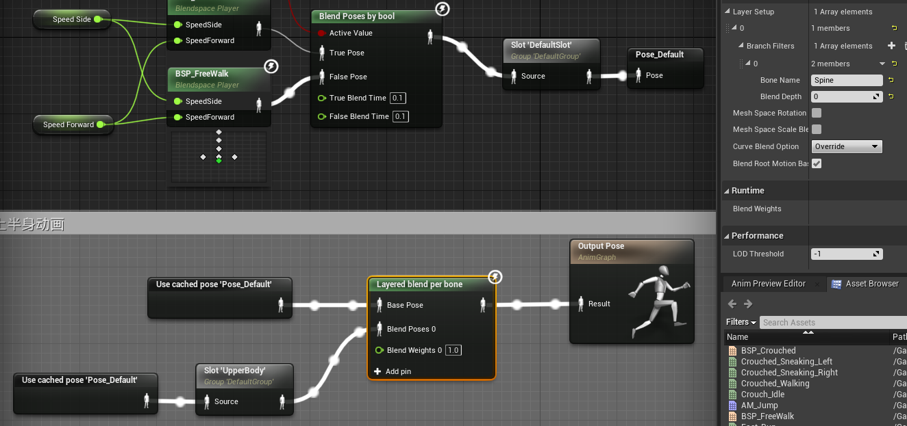

# NPC角色
+ 简单的寻路  
在`AIController`中,这里是AI_Human,调用`AIMoveTo`  
需要添加`NavMeshBoundsVolume`  

## 开放世界导航  
项目设置中,勾选 Generate Navigation Only Around Navigation Invokers  

这样就只会在拥有 `NavigationInvokerComponent` 组件的Actor附近产生路径  
需要设置NavMeshBoundsVolume足够大,包围整个场景,但是不会自动生成路径  

在CH_NPC中添加NavigationInvoker  

## 近战
### 装备武器
添加肩部和背部的Socket,在CH_Human中添加两个SceneComponent,分别指定肩部和背部的Socket  
然后导入剑的SkeletalMesh,附在SwordStrap上,设置位移和旋转都是0  
然后勾选Mesh.PauseAnims,暂停动画,调节SwordStrap的位置来匹配动画  
手部同理

按下1时,播放AnimMontage,来装备武器,设置延迟时间,来匹配动画  
`AttachComponentToComponent`  

+ 避免武器突然位移  
Location Rule选择KeepWorld,然后再调用函数 `MoveComponentTo`,位置是0  

### 上半身动画
蒙太奇动画编辑器中,添加 Slot, DefaultGroup.UpperBody  

动画蓝图中,创建 `New Save cached Pose`, 命名 Pose_Default  
将原来的输出姿势,连接到Pose_Default  

创建2个节点 Use cached pose 'Pose_Default',其中一个连接slot'UpperBody',然后进入 `Layered Blend Per Bone`, 输出最终姿势  
设置 LayerSetup, 添加 BoneName: Spine,即上半身的根骨骼  

