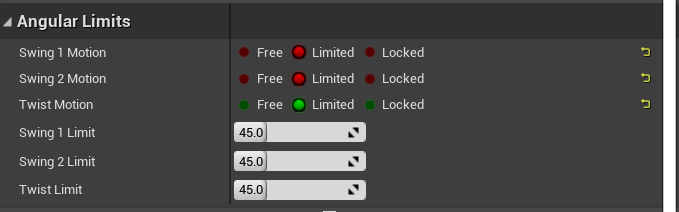

# 近战
+ 敌人一直看着玩家  
暂时通过在Tick中设置旋转实现,使用 `FindLookAtRotation`  

+ 按下鼠标中键锁定敌人  
通过球形检测最近的敌人,然后调用上面的逻辑  

+ 攻击时,检测最近的敌人,平滑的转向他  
`MultiSphereTraceForObjects` 检测附近的所有敌人,然后选择最近的  
如果有的话,通过 `MoveComponentTo` 平滑的转向敌人  
位置就是当前位置,旋转通过 `FindLookAtRotation` 获取  

+ 骨骼碰撞  
通过物理资源实现,在内容浏览器中,右键创建 `PhysicalAsset`  

>+ 防止玩家阻挡相机  
设置CapsuleComponent,Mesh的碰撞,ignore Camera  

+ 血液贴花  
可以直接搜索 `DecalActor` 放入场景中查看贴花,设置 DecalMaterial  

自制血液贴花: M_Decal_Blood  
Material Domain: Deferred Decal  
Blend Mode: Translucent  

添加`SubUV_Function`结点,取一张大图中的小图  
SubImage: 将图片分成m*n块  
Frame: 取其中第几块  

`SpawnDecalAtLocation`,在指定位置生成贴花  

+ 平滑转向目标  
通过Tick中 `FindLookAtRotation` + SetActorRatation实现  
`RInterpTo`: 专门适合旋转的平滑转向,考虑到了那个方向转动角度最小,使用普通的Lerp会有绕一大圈的可能  

## Ragdoll 布娃娃  
死亡动画快掉到地上时开启效果较好  
```
// Collision Presets中对应的选项
Mesh->SetCollisionProfileName: Ragdoll
Mesh->SetSimulatePhysics: true
// 这里不能直接设置Actor无碰撞,否则会掉下地面
CapsuleComponent->SetCollisionEnabled: false
```


### 调节效果
避免不自然的效果,如手脚过分扭曲  
在`PhysicsAsset`编辑器中,Show Constraints,类似关节活动的角度  
可以通过Simulate按钮查看效果,可以只查看选中的,shift+右键可以拖动查看  


3个值代表3个旋转轴,可以先固定2个,配合模拟选中的关节,只看一个轴的效果,调节范围  


### 武器模拟物理,自然掉落
SetCollisionEnabled: Physics Only  
SetCollisionProfileName: BlockAll  
SetSimulatedPhysics: true  

注意 `AnimNotifyState::Received_NotifyEnd`即使动画被切换也会触发  
