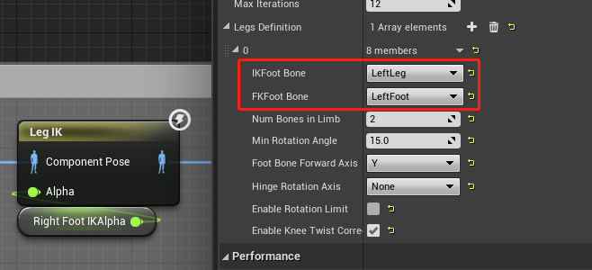

# 脚部IK
两种节点可以实现: `LegIK`, `TwoBoneIK`  
推荐 `LegIK`  

## LegIK

设置膝盖和脚踝两根骨骼,然后Alpha值在[0,1]有效,增大时腿部抬高  

+ 思路:  
在两只脚的水平位置,分别由人物半高向下做射线检测  
两只脚地面的高差就是脚部要偏移的量  

因为LegIK只能向上抬高,无法降低  
所以需要计算高差,降低根骨骼,然后较低的脚不做IK,较高的脚做IK  

降低根骨骼通过 `Transform(Modify)Bone` 实现  
IK的Alpha值为 高差/最大抬腿高度,最大抬腿告诉是通过设置Alpha为1时,目测出来的  
Bone.png)
