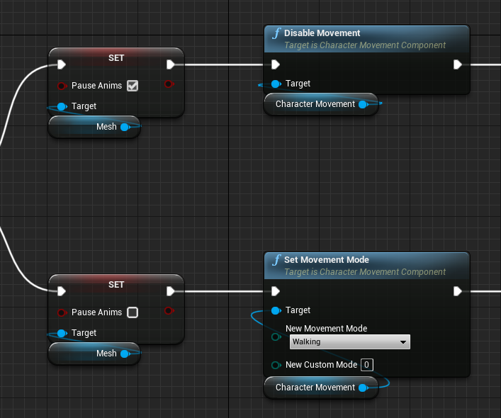
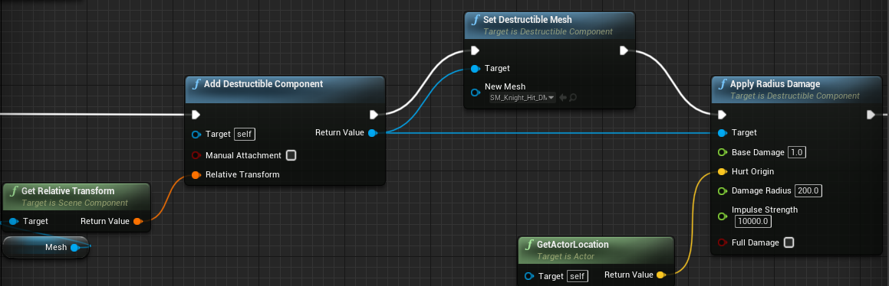

# 弓箭
+ 箭头拖尾线  
将FX放在SK下面,在BeginPlay中调用`BeginTrails`  

+ 爆炸桶,破碎模型  
Plugins中,勾选 `Apex Destruction`, 重启  
StaticMesh右键创建DM  
`DestructibleComponent::ApplyRadiusDamage`可实现爆炸破碎  

+ 冰冻效果,打爆炸成碎块  

通过可破坏物DM实现人物炸碎效果  

