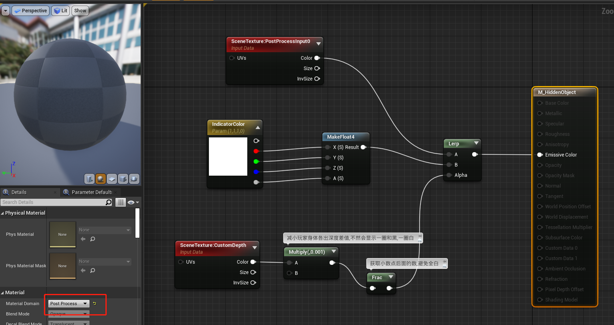
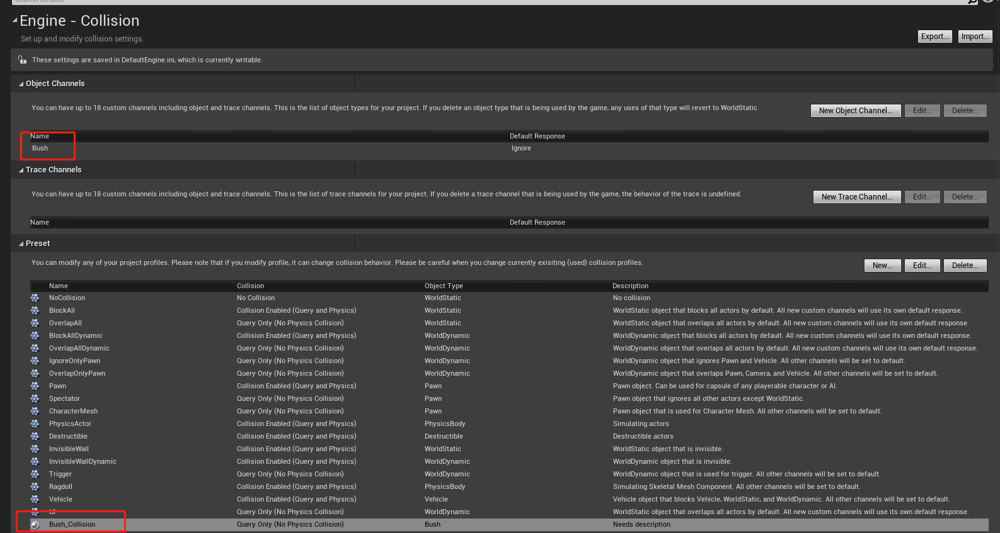

# 玩家躲在草丛中
## 创建隐身材质
使用深度缓存和后期处理实现  

+ 设置Mesh深度缓存  
讲一个玩家的Mesh放入场景中,属性设置Rendering中,勾选RenderCustomDepthPass  

预览: 主窗口中,Lit替换为Buffer Visualization -> Custom Depth  

+ 创建材质  

+ 后期处理体积  
向场景中拖入PostProcessVolume  
设置 RenderingFeatures -> PostProcessMaterials,数组中添加创建的材质  

## 碰撞检测
+ 创建草丛碰撞通道,可能需要重启  
  

设置草的碰撞类型,并勾选接触事件,玩家添加BoxCollision,可以附在头上,这样蹲下才隐身  
注意碰撞通道需要两边都设置为Bush才能检测到  

通过 Mesh->SetRenderCustomDepth 切换隐身状态  
