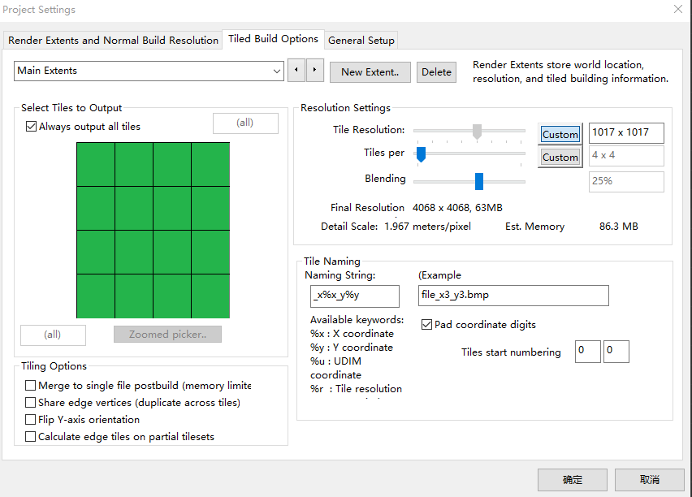
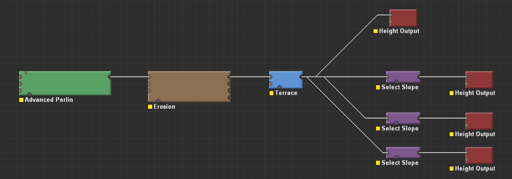
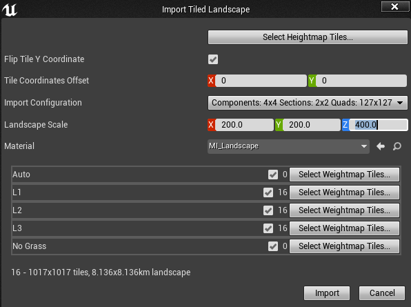
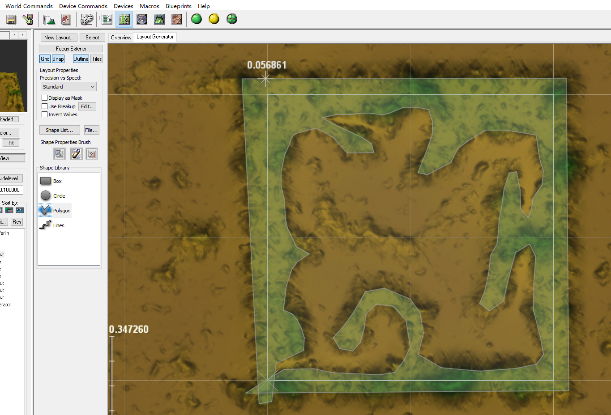

# 分块地形 TiledLandscape
需要World Machine专业版,以存入网盘  

+ World Machine 设置  
World Extents and Resolution -> Tiled Build Options    
地形需要设置Tiled是几乘几的,就是说有几块,这里是4x4  
分辨率必须是特定的值,这里是1017,不然UE无法导入  

+ 导出  
正常的高度输出,会自动添加文件名后缀,如_x0_y0, _x1_y2, ...  
输出前添加几个SelectSlope节点,设置不同的斜度区间,输出为png格式,作为高度图  

点击工具栏绿色的 Tiled Build 按钮,就会自动保存文件,需要几分钟  

+ 导入UE4  
需要新建文件夹下新建地图,勾选Ennable World Composition  
然后Levels窗口中,可点击下拉菜单import tiled landscape  
这里对文件名,分辨率都有要求,可以看到最下面是8km * 8km  

导入会提示NoGrass层失败,没有关系  

全部导入后,还需要选中所有的Level,点击Load,然后就能在场景中看到了  

场景中的分界线,可以通过将光设置为Movable隐藏  

问题: 发现山丘边界处有小的缝隙  

# 地形分布
用于自定义形成较高的区域,用于区域划分,地图边界遮挡  

World Machine中添加Layout Generator节点,连接到Advanced Perlin  
在Layout View,Layout Generator视图下,可以看到地形  
选择Polygon工具,绘制多边形,然后右键点击中间位置就能出现自己绘制图形  
设置图形的高度,坡度,然后就形成了地形分布,可以切换3D View查看效果  

## 导入UE4
前面的子Level需要先卸载,再删除  
导入新的子Level后,需要从新加载主关卡,然后再加载子关卡  

### 可视范围 
如果距离远的地方看不到,是因为子关卡的Streaming Distance比较小  
可以在Levels的Summon World Composition按钮中看到分层  
创建新层,设置更大的距离,然后选中所有层,右键AssignToLayer,刚刚创建的新层  
