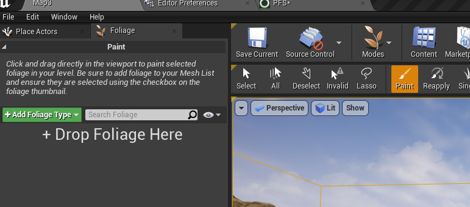

# 程序树
有些类似草,也可以添加岩石  

+ 编辑器设置 Procedural Foliage, 勾选  

+ 创建 Foliage Type  
可以在 Modes->Foliage 中创建,拖入树的mesh即可  
即 StaticMeshFoliage  

一些属性:  
Ground Slope Angle: 生成的坡度范围  
Average Spread Distance: 密度  
Procedural Scale: 缩放范围  

+ 创建 Procedural Foliage Spawner  
FoliageTypes 数组添加上面创建的  

+ 场景中添加 ProceduralFoliageVolume  
指定 FoliageSpawner,点击 Resimulate 按钮创建树叶  

+ 可以在场景中添加 ExponentialHeightFog  
